===============
Getting started
===============

This section presents all the information the user should know to make the best
use of |TOOL|.
The scope of |TOOL| is presented along with its features. Details about the
available functionalities are provided to guide users in setting up a geometry
layout, assigning properties to its regions, and exporting the layout in the
TDT format, used by *DRAGON5* for *MOC* calculations.

Scope
-----

In the context of enabling neutronics experts to perform analyses on the
different parts of the core of a nuclear reactor, a detailed geometry layout,
describing how fuel pins are positioned, the subdivision of the layout into
specific regions of calculus and the assignment of properties to the single
regions are required.

Among the different available analyses, we have:

  - the *Method of Characteristics* (*MoC*), a deterministic approach for
    evaluating the neutron flux over the regions of a fuel assembly.
  - the *Collision Probability Method* (*CPM*), a probabilistic approach that
    focuses on determining the probability of neutron collisions within spatial
    regions.

The `DRAGON5 <http://merlin.polymtl.ca/version5.htm>`_ lattice code offers
several calculation modules focusing on solution techniques for the neutron
transport equation :cite:`dragon5-ug`.
In particular, the *SALT* module enables the tracking of neutrons by solving
the transport equation on the basis of a 2D representation of the geometry
layout to study (i.e. a surface geometry). The two type of analyses mentioned
above are both supported by *SALT*.

Having a proper description of the geometry layout to analyse is essential to
perform tracking calculations in *DRAGON5*.
Geometries for fuel assemblies are typically structured in terms of repeated
fuel pin cells to form specific patterns, or lattices, on a Cartesian grid or
a hexagonal one (as in fast reactors).
DRAGON5 can natively handle the generation of simple geometry layouts by means
of the *GEO* module; to perform a tracking they need to be translated into a
description file by the *G2S* module.
However, complex layouts in reactors, require to rely on boolean operations
among geometrical shapes that are offered by *Constructive Solid Geometry*
(*CSG*) tools.
So far, several applications have been developed to address the generation of
surface geometries, among the main ones we can cite *SALOMON* and *ALAMOS*.

*SALOMON* is a Python2-based application that exploits the *GEOM* module of
*SALOME* to construct a geometric description file in the *APOLLO2* format
for its TDT solver. It relies on input files with a specific structure
containing the description of the lattice's geometry layout in terms of cells
and materials associated to each region of the lattice.

*ALAMOS* is GUI-based application developed for APOLLO3 that exploits the
Python libraries offered by the *SALOME* platform :cite:`tomatis2022`. In
particular, it makes use of the *MEDCoupling* module of *SALOME* to build the
geometries and apply meshes to them; it also allows users to assign material
property maps to the regions of the geometry.

While the *ALAMOS* can handle any kind of complex geometry layout, *SALOMON*
can only deal with lattices made by cartesian-type cells, thus greatly limiting
its application.
In addition, *SALOMON* does not provide any support to the construction of
surface geometries by exploiting the most common boolean operations, which,
instead, are supported by *ALAMOS*.
On the other hand, *ALAMOS*, despite being a more complete tool with respect
to *SALOMON*, does not have an open-source distribution.

|TOOL| was developed with the purpose of offering an open-source alternative to
*ALAMOS*; the idea was to include all the functionalities needed to assemble
complex geometry layouts made of:

  - regions, intended as any geometrical surface defined by a closed set of
    edges;
  - the properties (e.g. materials, etc.) assigned to each region.

Similarly to *SALOMON*, |TOOL| geometry building functionalities relies on the
APIs of the *GEOM* module of the `SALOME <https://www.salome-platform.org/>`_
platform, an open-source environment offering 2D/3D CAD modelling capabilities.
However, contrary to *SALOMON*, |TOOL| exploit these APIs to support users even
in the construction of lattices made of hexagonal cells and not only of
cartesian ones.
Operations among geometrical shapes, such as **transformation** (e.g.
translation, rotation, etc.) and **boolean** ones (e.g. cuts, partitioning,
etc.) are also supported; the same goes for applying specific **symmetry**
operations to the lattice according to the type of its cells.
Depending on the cell types, the following symmetries are handled:

  - *Cartesian* - half, quarter and eighth sections.
  - *Hexagonal* - third, sixth and twelfth symmetries.

|TOOL| does not only exploits the geometrical functionalities offered by the
*GEOM* module of *SALOME*; it also relies on its graphical user interface
(*GUI* module) to visualize each geometrical object built with |TOOL| in the
3D viewer of *SALOME*. In addition, users can exploit the geometry building
functionalities offered by the *GEOM* module directly by assembling custom
layouts for cells and lattices and providing them to the instances of the
|TOOL| classes.

Tracking analyses in *DRAGON5* relies on a the description file of the geometry
to analyse: |TOOL| allows the collection of the required information from the
built lattice layout, so that its surface geometry representation can be
exported to a *.dat* file in the format *APOLLO2* requires for its *TDT* solver.

Geometry Definition
-------------------

Lattices are typically made of repeated cells based on a set of geometric
shapes. From basic geometric shapes to cells up to lattices, all implements
the same functionalities to apply **transformation** and **visualizations**
operations. The former deal with the rotating and translating the object in the
XYZ space, the latter with displaying the object in the SALOME 3D viewer.
In |TOOL|, classes provide their own implementation of these operations.

From a hierarchical perspective, we can say that the lowest step in the process
of generating a surface geometry layout is represented by the *surfaces*.
The available cells are, in fact, based on a characteristic surface, either a
rectangle or a hexagon or a generic one. In addition, circle surfaces can be
added to the cell's basic layout. Lastly, lattices are made by repeated cells
of the same basic type to form a pattern. These can be included within a box
being a cell itself.

In the following, the three level of implementation for surfaces, cells and
lattices are discussed. Snippets of Python scripts are provided to show how
to use |TOOL| functionalities.

Surfaces Definition
^^^^^^^^^^^^^^^^^^^

|TOOL| comes with classes to quickly build specific surfaces in *SALOME*.
In the *Object-Oriented Programming* (*OOP*) view, they all inherit from the
same superclass :py:class:`Surface<glow.geometry_layouts.geometries.Surface>`,
which is an abstract class characterised by both abstract and concrete methods.
They are the following ones:

  - class :py:class:`Circle<glow.geometry_layouts.geometries.Circle>` that
    addresses circular surfaces.
  - class :py:class:`Hexagon<glow.geometry_layouts.geometries.Hexagon>` that
    addresses hexagonal surfaces.
  - class :py:class:`Rectangle<glow.geometry_layouts.geometries.Rectangle>`
    that addresses rectangular surfaces.
  - class :py:class:`GenericSurface<glow.geometry_layouts.geometries.GenericSurface>`
    that addresses any 2D surface created in *SALOME*.

Depending on the specific type of surface, its instantiation requires to specify
the centre of the surface and its characteristic dimensions (i.e. radius for a
circle, width and height for a rectangle, the edge length for a hexagon).
Classes are implemented with default values (i.e. 1.0) for the characteristic
dimensions.
When an object of the :py:class:`Surface<glow.geometry_layouts.geometries.Surface>`
subclasses is instantiated, the GEOM objects for the vertices, the edges and
the corresponding face are automatically built. In this way, the surface can
be shown in the SALOME viewer soon after the initialization.

The following code snippet shows how to instantiate and display a geometric
surface (hexagonal case).

.. code-block:: python

  from glow.geometry_layouts.geometries import Hexagon

  surface = Hexagon(center=(1.0, 1.0, 0.0), edge_length=2.0)
  surface.show_face()

The shape shown in the following image can be obtained by running the code in
a Python script or directly from the Python console of *SALOME*.

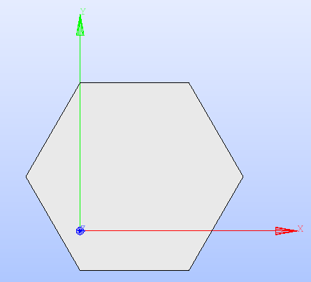

   Hexagon displayed in the *SALOME* viewer.

**Transformation** operations can be applied by calling the methods for rotating
and translating the surface, declared in the base class
:py:class:`Surface<glow.geometry_layouts.geometries.Surface>`, and accessible
for any of its subclasses.
The method :py:meth:`rotate()<glow.geometry_layouts.geometries.Surface.rotate>`
requires the rotation angle, in degrees, while the method
:py:meth:`translate()<glow.geometry_layouts.geometries.Surface.translate>`
needs the new XYZ coordinates of the centre of the surface.
For the hexagonal surface declared above, the code instructions are the
following:

.. code-block:: python

  surface.rotate(90)
  surface.translate((0.0, 0.0, 0.0))
  surface.show_face()

By applying these methods, the resulting shape is the following one.

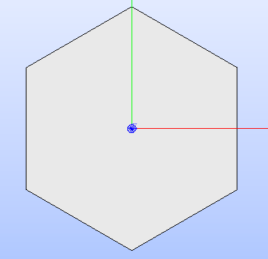

   Hexagon after applying rotation and traslation operations, as shown in the
   *SALOME* viewer.

The GEOM face object that is characteristic of the specific subclass of
:py:class:`Surface<glow.geometry_layouts.geometries.Surface>` can be updated
directly from *SALOME* by calling the method
:py:meth:`update_from_face()<glow.geometry_layouts.geometries.Surface.update_from_face>`
whose implementation is specific for each of the subclasses of
:py:class:`Surface<glow.geometry_layouts.geometries.Surface>`.
This method receives as parameter a GEOM face object and updates its attributes
describing the characteristics of the shape.
A check is implemented to prevent the provision of any non-face objects or ones
that do not correspond to the characteristic shape of each subclass.

Cell Definition
^^^^^^^^^^^^^^^

|TOOL| comes with classes to build cells having either a hexagonal or a
rectangular characteristic surface.
The module :py:mod:`glow.geometry_layouts.cells` provides the base abstract
class :py:class:`Cell<glow.geometry_layouts.cells.Cell>` to represent a cell
described in terms of a given object of the subclasses of the
:py:class:`Surface<glow.geometry_layouts.geometries.Surface>` base class.
The subclasses of :py:class:`Cell<glow.geometry_layouts.cells.Cell>` are the
following ones:

  - class :py:class:`RectCell<glow.geometry_layouts.cells.RectCell>` that
    addresses rectangular cells.
  - class :py:class:`HexCell<glow.geometry_layouts.cells.HexCell>` that
    addresses hexagonal cells.
  - class :py:class:`GenericCell<glow.geometry_layouts.cells.GenericCell>`
    that addresses cells characterised by any 2D surface created in *SALOME*.

When instantiating any of the aforementioned sublasses, the corresponding surface
is built starting either from the provided geometric characteristics or from
the *GEOM* object directly.

The following code snippet shows how to instantiate the different type of cells
available in |TOOL|.

.. code-block:: python

  from glow.geometry_layouts.cells import GenericCell, HexCell, RectCell

  hex_cell = HexCell(
      center=(0.0, 0.0, 0.0),
      edge_length=1.0,
      name='HexCell')

  rect_cell = RectCell(
      center=(0.0, 0.0, 0.0),
      height_x_width=(1.0, 2.0),
      rounded_corners=[(1, 0.1), (3, 0.1)],
      name='RectCell')

  gnrc_cell = GenericCell(shape=surface)

For a rectangular cell, the ``rounded_corners`` parameter indicates the index
of the corner of the rectangle and the associated curvature radius to generate
a rectangle with rounded corners.
For a :py:class:`GenericCell<glow.geometry_layouts.cells.GenericCell>`, the
instantiation requires to specify a *GEOM* object (either a face or a compound)
representing its geometric shape.

In |TOOL|, the geometry layout of any type of cell is described according to
two distinct types, which can be shown by calling a specific method:

  - the **technological geometry**, which is the one delimiting the different
    cell's regions in terms of the materials;
  - the **sectorized geometry**, which further subdivides the cell's regions of
    the first one into sectors. Their number is directly tied to the type of
    cell.

The class :py:class:`Cell<glow.geometry_layouts.cells.Cell>` declares attributes
and methods common to all its subclasses. Regarding the methods, both concrete
and abstract ones are present: the former are common to all subclasses, the
latter require an implementation specific to the type of cell.

Concrete methods cover the following functionalities:

  - displaying the cell's geometry layout in the *SALOME* viewer;
  - addition and removal of circles within the cell's boundaries;
  - transformation operations for rotating and translating the cell's
    characteristic *GEOM* elements;
  - sectorization operation of the cell's surface;
  - setting up the properties associated to one or all the regions of the cell;
  - inspection of the information related to a specific region of the cell
    that has been selected in the *SALOME* viewer;
  - updating the cell's geometry layout with a *GEOM* object built by
    exploiting the *GEOM* functions directly;
  - restoring the cell's state to its original one, both in terms of geometry
    and properties associated to its regions.

In the following, all the corresponding methods are detailed.

Displaying the Cell's Geometry Layout
"""""""""""""""""""""""""""""""""""""

The cell's geometry layout can be displayed in the *SALOME* viewer by calling
the method :py:meth:`show()<glow.geometry_layouts.cells.Cell.show>`. Depending
on its parameters, it builds and displays the regions of the cell, defined as
a list of objects of the dataclass :py:class:`Region<glow.geometry_layouts.cells.Region>`
which stores both the geometric information about a generic region of the cell
(e.g. its *GEOM* face object) and the values for each of the associated property
types.

Regions are built and shown according to either the technological or the sectorized
geometry. This parameter is provided to the
method :py:meth:`show()<glow.geometry_layouts.cells.Cell.show>` as an element
of the enumeration :py:class:`GeometryType<glow.support.types.GeometryType>`.
A colorset can be applied to regions according to the type of property to show,
declared as an element of the enumeration
:py:class:`PropertyType<glow.support.types.PropertyType>`. If no values for the
indicated type of property have been declared in any of the cell's regions, an
exception is raised.

The following code snippet shows how to display the regions of the cell's
technological geometry (:py:attr:`GeometryType.TECHNOLOGICAL<glow.support.types.GeometryType.TECHNOLOGICAL>`)
with a colorset in terms of the property type
:py:attr:`PropertyType.MATERIAL<glow.support.types.PropertyType.MATERIAL>`.

.. code-block:: python

  hex_cell.show(
      property_type_to_show=PropertyType.MATERIAL,
      geometry_type_to_show=GeometryType.TECHNOLOGICAL
  )

Regions are added to the *Object Browser* in *SALOME* as children of the cell
they belong to. If not displayed automatically (it can happen when running a
new *SALOME* instance with a script), they can be shown by selecting the
"*Show Only Children*" item in the contextual menu for the cell (see
:numref:`show-children`).

.. _show-children:
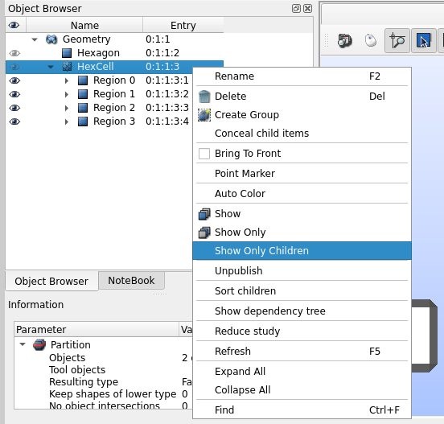

   How to display the regions associated to a cell in *SALOME*.

The geometry layout resulting from the aforementioned code is shown in the
figure below.

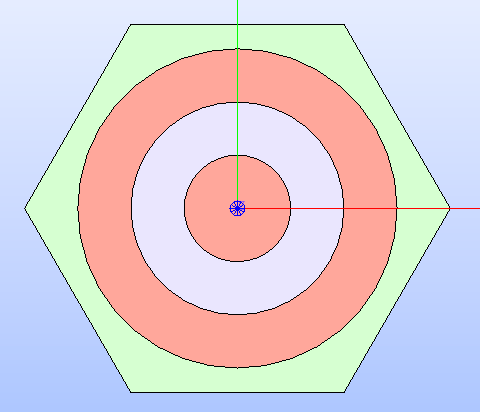

   Hexagonal cell's technological geometry with the :py:attr:`MATERIAL<glow.support.types.PropertyType.MATERIAL>`
   colorset.

If the method :py:meth:`show()<glow.geometry_layouts.cells.Cell.show>` is called
without specifying any parameter, the default geometry shown is the TECHNOLOGICAL
one without any colorset.
If specifying :py:attr:`GeometryType.SECTORIZED<glow.support.types.GeometryType.SECTORIZED>`
as the geometry to show, regions are build over the sectorized layout.

Circles Addition and Removal
""""""""""""""""""""""""""""

Typically, fuel pin cells, having either a cartesian or a hexagonal geometry,
are characterised by several concentric circles to represent the different
regions of a cell, each having its own properties.
In general, circles can be placed either in the cell's centre or in any other
point within its boundaries.

In |TOOL|, the method :py:meth:`add_circle()<glow.geometry_layouts.cells.Cell.add_circle>`
allows to position a circle, with a specified radius, inside the cell. The
addition is performed only if the circle passes a check based on the
characteristic dimensions of the cell's base surface.
Given the circle's characteristics, a *GEOM* face object is built in the given
position, if any is specified; otherwise the circle is added in the cell centre.
In any case, a partition operation between the cell face and the new circle is
performed resulting in a geometric surface that comprises both faces.

The following code snippet shows how to add circles in specific positions within
a hexagonal cell.

.. code-block:: python

  hex_cell.add_circle(radius=0.5)
  hex_cell.add_circle(radius=0.1, position=(0.2, 0.2, 0.0))
  hex_cell.show()

The following figure shows the result of adding a circle in the circle's centre
and in a specific position after calling the method
:py:meth:`show()<glow.geometry_layouts.cells.Cell.show>` that updates the
*SALOME* viewer with the current state of the cell's geometry layout.

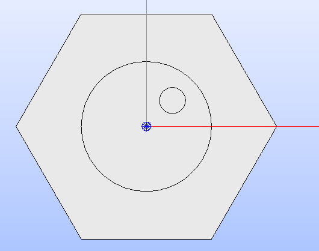

   Hexagonal cell's geometry layout after adding two circles to its
   technological geometry.

Calling the method :py:meth:`add_circle()<glow.geometry_layouts.cells.Cell.add_circle>`
updates the technological geometry of the cell. The same goes for the method
:py:meth:`remove_circle()<glow.geometry_layouts.cells.Cell.remove_circle>`.

When any property type (e.g. a material) has been assigned to the cell's region
where the circle is added, the regions resulting from partitioning the cell with
the circle inherit the properties of the overlapped regions (see
:numref:`prop-regions`).

.. _prop-regions:
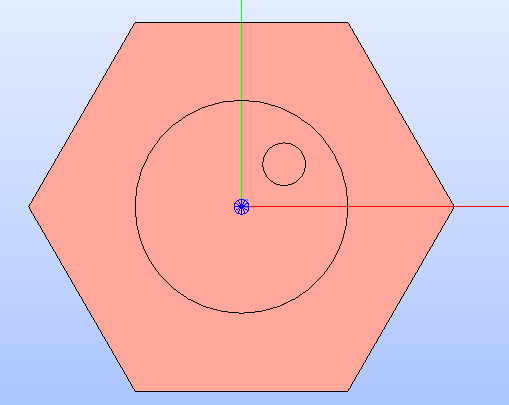

   Hexagonal cell's technological geometry shown with a properties colorset;
   the added circles have the same property of the overlapped region.

If the added circle is cell-centred, then it also inherits the sectorization
options of the overlapped centred region (see :numref:`sect-regions`).

.. _sect-regions:
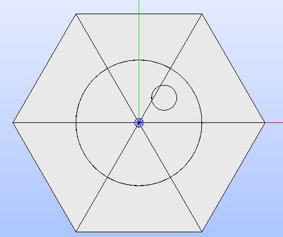

   Hexagonal cell's sectorized geometry; only the cell-centred circle is
   subdivided in six regions as the the overlapped region.

When removing a circular region having any property type or sectorization option
associated, the region resulting after its removal keeps the same values of the
original overlapped region.

Transformation Operations
"""""""""""""""""""""""""

Transformation operations can be applied by calling the methods for rotating
and translating the cell's geometric elements, i.e. the GEOM objects
representing the technological and sectorized geometry and the regions.
The method :py:meth:`rotate()<glow.geometry_layouts.cells.Cell.rotate>`
requires the rotation angle, in degrees, while the method
:py:meth:`translate()<glow.geometry_layouts.cells.Cell.translate>`
needs the new XYZ coordinates of the centre of the cell.
While the former operates on the same instance, the latter returns a deep copy
of original instance positioned in the new centre.
For a hexagonal cell, the code instructions for rotating and translating the
cell are the following:

.. code-block:: python

  hex_cell.rotate(90)
  new_cell = hex_cell.translate((1.0, 1.0, 0.0))
  new_cell.show()

Sectorization Operation
"""""""""""""""""""""""

Other than the technological geometry, cells can be displayed also in terms of
the sectorized one.
This type of geometry consists in subdividing the cell's regions of the
technological geometry in a number of sectors which is specific for the type of
cell. Subclasses of :py:class:`Cell<glow.geometry_layouts.cells.Cell>` declares
the available number of sectors for a same region of the technological geometry,
as well as the starting angle from which the subdivision starts.
We can have the following values:

  - :py:class:`HexCell<glow.geometry_layouts.cells.HexCell>` - either `1` or `6`
    for the number of sectors, while `0` or `30` for the starting angle.
  - :py:class:`RectCell<glow.geometry_layouts.cells.RectCell>` - admitted number
    of sectors are `1`, `4`, `8` and `16`, while the corresponding angles are
    `0` and `45.0` for a subdivision in four sectors, `0` and `22.5` for a
    subdivision in eight sectors, `0` for a subdivision in one or sixteen
    sectors.

Rectangular cells have also the option to apply a *windmill* sectorization for
the farthest region from the cell's centre in case this region is subdivided in
eight sectors.

The method :py:meth:`sectorize()<glow.geometry_layouts.cells.Cell.sectorize>` of
the base class :py:class:`Cell<glow.geometry_layouts.cells.Cell>` is abstract,
meaning that each of the subclasses for a cell provide their own configuration.
The logic for subdividing the regions in sectors is common to all subclasses.

The following code snippet shows how to apply a sectorization, with windmill
option enabled, for a cartesian cell having two cell-centred circles.

.. code-block:: python

  rect_cell.sectorize([1, 4, 8], [0, 45, 22.5], windmill=True)
  rect_cell.show(geometry_type_to_show=GeometryType.SECTORIZED)

Elements in the two lists provided to the method
:py:meth:`sectorize()<glow.geometry_layouts.cells.RectCell.sectorize>` are
associated to the regions from the closest to the farthest one from the cell's
centre.
The following figure shows the result after applying the indicated sectorization.

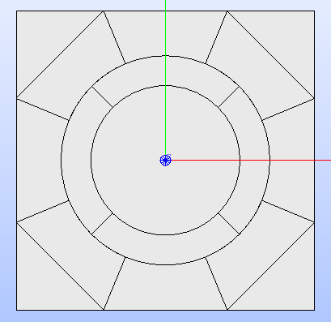

   Cartesian cell after applying the sectorization operation. The number of
   subdivisions of the cell's regions matches the order in which sectorization
   numbers are provided to the method.

.. _set-cell-prop:
Setting Up the Cell's Regions Properties
""""""""""""""""""""""""""""""""""""""""

Cells' regions can be displayed by applying a colorset that depends on the type
of property to show, as item of the :py:class:`PropertyType<glow.support.types.PropertyType>`
enumeration.
To set values for a specific property type, users can rely on two methods:

  - :py:meth:`set_properties()<glow.geometry_layouts.cells.Cell.set_properties>`,
    which allows users to set values for different types of properties for all
    the regions of the cell's technological geometry.
    The convention for declaring the values of a property is from the closest
    to the farthest region.
  - :py:meth:`set_region_property()<glow.geometry_layouts.cells.Cell.set_region_property>`,
    which allows to set a value for the indicated type of property of a single
    cell's region; this can be either the one currently selected in the
    *SALOME* viewer or the one provided as parameter to the method.

The following code snippet shows how to apply values for the
:py:attr:`PropertyType.MATERIAL<glow.support.types.PropertyType.MATERIAL>`, the
only one currently implemented.

.. code-block:: python

  rect_cell.set_properties(
      {PropertyType.MATERIAL: ['GAP', 'FUEL', 'COOLANT']}
  )
  rect_cell.add_circle(0.1)
  rect_cell.set_region_property(
      PropertyType.MATERIAL,
      'MAT',
      Circle(radius=0.1).face
  )
  rect_cell.show(PropertyType.MATERIAL)

In particular, given a cartesian cell with two cell-centred circles, the first
used method allows to set the values all together.
A new circular region is then added and the corresponding face used to identify
the region in the cell to assign the property to. From within the *SALOME*
viewer, the region can be provided by simply selecting it and calling the method
from the integrated Python console.
In any case, the cell's geometry layout with the :py:attr:`MATERIAL<glow.support.types.PropertyType.MATERIAL>`
colorset is shown in the following figure.

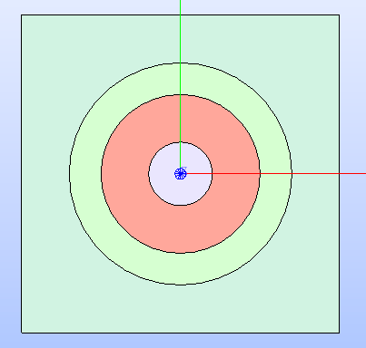

   Cartesian cell after setting up the values for the properties shown with the
   corresponding colorset.

Regions Inspection
""""""""""""""""""

When the regions of the cell's technological or sectorized geometry are displayed
in the *SALOME* viewer, information about a selected region including the assigned
properties can be inspected.
To do so, the method :py:meth:`get_regions_info()<glow.geometry_layouts.cells.Cell.get_regions_info>`
can be called directly in the Python console of *SALOME* from an object
of any of the subclasses of :py:class:`Cell<glow.geometry_layouts.cells.Cell>`.
If no region, or more than one, is selected when calling the method, an exception
is raised. The available information, that is printed in the Python console,
includes the name of the cell's region, the value for each of the assigned
type of properties (see :numref:`reg-info`).

.. _reg-info:
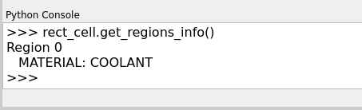

   Information about a selected region of the cell; its name and values for its
   assigned properties are printed.

Updating the Cell's Geometry Layout
"""""""""""""""""""""""""""""""""""

The methods of the class :py:class:`Cell<glow.geometry_layouts.cells.Cell>`
allow to characterise the cell in terms of both its geometry layout and the
properties. However, given a base shape, which derives from the specific
subclass, users can characterise the geometry only by adding or removing circles.
To support any customization of the cell's geometry, while keeping the base
shape the same, two methods are provided:

  - :py:meth:`update_geometry()<glow.geometry_layouts.cells.Cell.update_geometry>`,
    which allows to update the type of geometry (either the technological or the
    sectorized one) displayed in the *SALOME* viewer with the *GEOM* object
    currently selected.
  - :py:meth:`update_geometry_from_face()<glow.geometry_layouts.cells.Cell.update_geometry_from_face>`,
    which allows to update the indicated type of geometry with a given *GEOM*
    object.

In both cases, the result is a new layout for the technological or the sectorized
geometry. In the former case, the provided geometry is analysed to extract all
the edges: circles and arc of circles are detected to update an internal list;
segment-type edges are instead applied all together on the basic shape of the
cell with a partition operation.
If any properties were assigned, the new regions inherit them; the same goes for
the sectorization options.

The following code snippet shows how the cell's technological geometry could
be updated with a non-standard geometry built by overlapping two hexagonal
shapes with different dimensions.

.. code-block:: python

  hex_1 = Hexagon(edge_length=1)
  hex_2 = Hexagon(edge_length=1.5)

  shape = make_partition([hex_2.face], [hex_1.face], ShapeType.COMPOUND)

  hex_cell = HexCell()
  hex_cell.update_geometry_from_face(GeometryType.TECHNOLOGICAL, shape)
  hex_cell.show()

The function :py:func:`make_partition()<glow.interface.geom_interface.make_partition>`
cuts a list of shapes (in the first argument) with those provided in the list
as second argument; the resulting type of shape is indicated as third argument.
After applying the built geometry to the cell, the result can be displayed in
the *SALOME* viewer (see :numref:`updated-cell`).

.. _updated-cell:
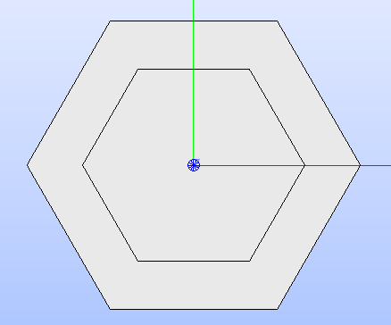

   Hexagonal cell's layout after updating its technological geometry.

Restoring Cell's State
""""""""""""""""""""""

There could be cases where users need to reset the cell's geometry layout and
the properties associated to its regions.
The method :py:meth:`restore()<glow.geometry_layouts.cells.Cell.restore>`
satisfies this need by restoring the cell's technological layout to the its
base shape without any inner circle.
The sectorized layout is removed, whereas properties and sectorization options
are re-initialized with default values.

Lattice Definition
^^^^^^^^^^^^^^^^^^

|TOOL| comes with classes to build lattices characterised by either hexagonal
or cartesian cells.
The module :py:mod:`glow.geometry_layouts.lattices` provides the class
:py:class:`Lattice<glow.geometry_layouts.lattices.Lattice>` to describe any
kind of lattice of cells.
The type of lattice is determined by the type of the cells, which must all be
of the same type, identified by an item of the enumeration
:py:class:`CellType<glow.support.types.CellType>`. This is automatically set
at instantiation time or when adding cells to the lattice.

A :py:class:`Lattice<glow.geometry_layouts.lattices.Lattice>` instance can be
instantiated either without any cell or by providing a list of objects of the
subclasses of :py:class:`Lattice<glow.geometry_layouts.cells.Cell>`.

In |TOOL|, the logic behind the construction of a lattice relies on the *layer*
concept: when a new cell, or a group of cells is added to the lattice, which
can happen either at instantiation time or when calling the corresponding
methods, the cells are associated to a specific layer (either a new layer or
an existing one).
The attribute :py:attr:`layers<glow.geometry_layouts.lattices.Lattice.layers>`
serves this purpose, as it is a list of lists of
:py:class:`Lattice<glow.geometry_layouts.cells.Cell>` objects in which cells
are assigned to a specific inner list according to an index indicating the
layer.
This is especially useful when dealing with lattices made by superimposing
cells with different dimensions.

The following code snippet shows how to instantiate a lattice with different
type of cells available in |TOOL|.

.. code-block:: python

  from glow.geometry_layouts.cells import HexCell, RectCell
  from glow.geometry_layouts.lattices import Lattice

  hex_cell = HexCell()
  rect_cell = RectCell()

  cart_lattice = Lattice(
      cells=[
          rect_cell.translate((0.5, 0.5, 0.0)),
          rect_cell.translate((-0.5, 0.5, 0.0)),
          rect_cell.translate((-0.5, -0.5, 0.0)),
          rect_cell.translate((0.5, -0.5, 0.0)),
      ],
      name="Cartesian Lattice",
      center=(0.0, 0.0, 0.0),
      boxes_thick=[0.075, 0.075]
  )
  lattice = Lattice()
  hex_lattice = Lattice([hex_cell])

The three examples show different instantiations; in particular, we have:

  - a cartesian lattice built from a list of cells positioned to recreate a
    2x2 pattern; by specifying the ``boxes_thick`` parameter, the built lattice
    is enclosed within a rectangular box made by two layers of given thicknesses.
  - a lattice built without any cell. The lattice's methods for adding cells
    need to be called to define its geometry layout.
  - a hexagonal lattice built from a single cell which represents its central
    cell.

Similarly to the cells, the two types of geometry layout, the technological and
the sectorized ones, applies to a lattice. In this case, we have that:

  - the **technological geometry** is the one presenting the cells according to
    the different regions delimited in terms of the materials;
  - the **sectorized geometry** is the one in which the cells are further
    subdivided into sectors.

The :py:class:`Lattice<glow.geometry_layouts.lattices.Lattice>` public methods
cover the following functionalities:

  - building the lattice's regions, as elements of the dataclass
    :py:class:`Region<glow.geometry_layouts.cells.Region>`, according either
    to the technological or the sectorized type of geometry of the cells in the
    lattice;
  - displaying the lattice's geometry layout in the *SALOME* viewer;
  - adding a single cell or a group of the same one organised in one or more
    rings around the lattice's centre;
  - transformation operations for rotating and translating the lattice's cells
    and its characteristic *GEOM* elements;
  - enclosing the lattice in a box declared from the thicknesses of its layers
    or by means of an instance of the subclasses of
    :py:class:`Cell<glow.geometry_layouts.cells.Cell>`;
  - setting up the properties associated to one region of the lattice or to the
    ones of the box;
  - applying a specific type of symmetry in accordance with the type of lattice;
  - setting the type of geometry in accordance with the type of lattice and of
    applied symmetry;
  - inspection of the information related to a specific region of the lattice
    that has been selected in the *SALOME* viewer;
  - restoring a list of cells of the lattice to their original state, both in
    terms of geometry and properties.

Building Lattice's Regions
""""""""""""""""""""""""""

To ease both displaying and exporting the lattice's geometry layout, the method
:py:meth:`build_regions()<glow.geometry_layouts.lattices.Lattice.build_regions>`
is provided. It builds a list of :py:class:`Region<glow.geometry_layouts.cells.Region>`
objects that are representative of the regions in which the lattice is subdivided
when assembling all the cells together with the box, if present.
Cells can be associated to different layers of cells in the lattice: when building
the lattice's regions, all the layers are collapsed into a single layer of cells.
Layers are traversed from the uppest to the lowest one and if cells are overlapped
they are either cut or removed from the lattice. :numref:`overlap` shows the
result of overlapping a cell with others.

.. _overlap:
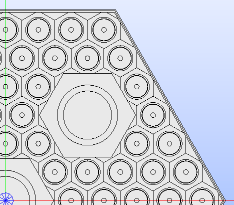

   Hexagonal lattice where a cell overlaps other cells of an inferior layer.

If any symmetry is applied or the lattice is enclosed in a box, the compound
of assembled cells is further processed. For each *GEOM* face object extracted
from the compound resulting from this series of operations, a
:py:class:`Region<glow.geometry_layouts.cells.Region>` object is built.
The properties assignment is performed by finding the corresponding region among
the ones in the lattice's cells.

According to the type of geometry of the cells that is provided to the method
:py:meth:`build_regions()<glow.geometry_layouts.lattices.Lattice.build_regions>`,
the resulting regions describe either the technological or the sectorized
geometry.

Displaying the Lattice's Geometry Layout
""""""""""""""""""""""""""""""""""""""""

The lattice's geometry layout can be displayed in the *SALOME* viewer by calling
the method :py:meth:`show()<glow.geometry_layouts.lattices.Lattice.show>`.
Depending on its parameters, it builds and displays the regions of the cell by
internally calling the method :py:meth:`build_regions()<glow.geometry_layouts.lattices.Lattice.build_regions>`.

Regions are built and shown according to either the technological or the
sectorized geometry by specifying it as parameter of the method. This parameter
is an element of the enumeration :py:class:`GeometryType<glow.support.types.GeometryType>`.
A colorset can also be applied to regions according to the type of property to
show as an element of the enumeration
:py:class:`PropertyType<glow.support.types.PropertyType>`. If no values for the
indicated type of property have been declared in any of the regions in the
lattice, an exception is raised.
Regions sharing the same values for the indicated type of property will have
the same colour.
In *SALOME*, built regions are added to the *Object Browser* as children of
the lattice the belong to.

The following code snippet shows how to display the regions of the lattice's
technological geometry (:py:attr:`GeometryType.TECHNOLOGICAL<glow.support.types.GeometryType.TECHNOLOGICAL>`)
with a colorset in terms of the property type
:py:attr:`PropertyType.MATERIAL<glow.support.types.PropertyType.MATERIAL>`.

.. code-block:: python

  cart_lattice.show(
      property_type_to_show=PropertyType.MATERIAL,
      geometry_type_to_show=GeometryType.TECHNOLOGICAL
  )

The geometry layout resulting from the aforementioned code is shown in the
figure below.

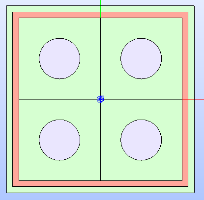

   Cartesian lattice's technological geometry with the :py:attr:`MATERIAL<glow.support.types.PropertyType.MATERIAL>`
   colorset.

The same considerations on the parameters done for the method
:py:meth:`show()<glow.geometry_layouts.cells.Cell.show>` of the subclasses of
:py:class:`Cell<glow.geometry_layouts.cells.Cell>` are valid for the lattice
as well.

Adding cell(s)
""""""""""""""

The layout of a lattice, in terms of its cells, can be build directly when
instantiating an object of :py:class:`Lattice<glow.geometry_layouts.lattices.Lattice>`
by providing a list of :py:class:`Cell<glow.geometry_layouts.cells.Cell>`
subclasses.
In addition to this approach, some methods are present to ease the lattice's
construction, especially when several identical cells need to be added. They
are the following ones:

  - :py:meth:`add_cell()<glow.geometry_layouts.lattices.Lattice.add_cell>`,
    which allows to add a single cell at an indicated position;
  - :py:meth:`add_ring_of_cells()<glow.geometry_layouts.lattices.Lattice.add_ring_of_cells>`,
    which allows to add a ring of the same cell at the indicated ring index;
  - :py:meth:`add_rings_of_cells()<glow.geometry_layouts.lattices.Lattice.add_rings_of_cells>`,
    which allows to add the indicated number of rings of the same cell, starting
    from the current ring index occupied by cells.

The method :py:meth:`add_cell()<glow.geometry_layouts.lattices.Lattice.add_cell>`
adds the cell to the specified position, if any is provided, otherwise the cell
is placed in the lattice's centre. It is important to note that any cell added
with this method is included in a new *layer*, i.e. a new sub-list is created
for the attribute :py:attr:`layers<glow.geometry_layouts.lattices.Lattice.layers>`
and the cell added to it.

When dealing with cell-centred lattices, the layout can be considered as made
by several rings occupied by a number of cells that increases with the ring
index. The two methods :py:meth:`add_ring_of_cells()<glow.geometry_layouts.lattices.Lattice.add_ring_of_cells>`
and :py:meth:`add_rings_of_cells()<glow.geometry_layouts.lattices.Lattice.add_rings_of_cells>`
provide a quick way for adding one or more rings of cells. The former adds the
cells at the given ring index while the latter adds the indicated number of
rings of cells starting from the maximum value of ring index currently present
in the lattice.
Users should also note that, while the former method allows users to specify
the *layer* to which the ring of cells is added (by providing its index), the
latter always add the rings of cells to a new *layer*.

All the aforementioned methods do not allow to mix cells with different types
(i.e. with different item of the enumeration :py:class:`CellType<glow.support.types.CellType>`);
this ensures that all cells have either a cartesian type or a hexagonal one.

The following code snippet shows the different ways to add cells to a lattice.

.. code-block:: python

  cell = HexCell()
  lattice = Lattice([cell])

  lattice.add_ring_of_cells(cell, 1)
  lattice.add_rings_of_cells(hex_cell, 2)
  lattice.add_cell(hex_cell, (1.5, 1.5, 0.0))
  lattice.show()

The lattice's geometry layout resulting from adding hexagonal cells using the
three methods is shown in :numref:`lattice-add`.

.. _lattice-add:
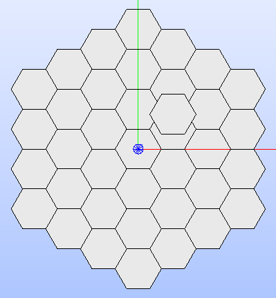

   Hexagonal lattice built by applying the three methods for adding cells.

Transformation Operations
"""""""""""""""""""""""""

Transformation operations can be applied by calling the methods for rotating
and translating the lattice's geometric elements, i.e. the *GEOM* compound objects
representing its full and partial (if any symmetry is applied) geometry layout,
the contained cells, including the box, if present, and all the regions.
The method :py:meth:`rotate()<glow.geometry_layouts.lattices.Lattice.rotate>`
requires the rotation angle, in degrees, while the method
:py:meth:`translate()<glow.geometry_layouts.lattices.Lattice.translate>`
needs the new XYZ coordinates of the centre of the lattice.
Users should note that both methods operate on the same instance and the result
of the transformation is directly shown in the *SALOME* viewer.

Enclose the Lattice in a Box
""""""""""""""""""""""""""""

In nuclear reactors, fuel assemblies can be framed in a metallic box. To
replicate exactly the same kind of layouts, |TOOL| allows to insert a lattice
within a box.
A box is an instance of the subclasses of :py:class:`Cell<glow.geometry_layouts.cells.Cell>`
which can be built either from the thicknesses of its layers or by instantiating
the corresponding :py:class:`Cell<glow.geometry_layouts.cells.Cell>` object
directly.
The former case relies on the method :py:meth:`build_lattice_box()<glow.geometry_layouts.lattices.Lattice.build_lattice_box>`,
which, given the type of lattice (i.e. hexagonal or cartesian), automatically
instantiates a :py:class:`Cell<glow.geometry_layouts.cells.Cell>` object built
by overlapping as many rectangles or hexagons as the number of the indicated
thicknesses of the layers.
The provided values can be all positive, meaning that layers are built so that
the borders of the first layer touch the ones of the farthest ring of cells,
for a cartesian case or their vertices, for a hexagonal case (see
:numref:`box-pos`)
The method also allows the first value in the list of thicknesses to be
negative: this case replicates a situation where the first layer of the box
cuts the farthest ring of cells (see :numref:`box-neg`).

The following code snippet show how to build a box for the lattice using the
method :py:meth:`build_lattice_box()<glow.geometry_layouts.lattices.Lattice.build_lattice_box>`
with the first layer thickness either being positive or negative.

.. code-block:: python

  lattice.build_lattice_box([0.1, 0.1])
  lattice.show()

  lattice.build_lattice_box([-0.1, 0.1])
  lattice.show()

The result of applying both method calls separately is shown in :numref:`box-pos`
and in :numref:`box-neg` respectively as applied to a hexagonal lattice.

.. _box-pos:
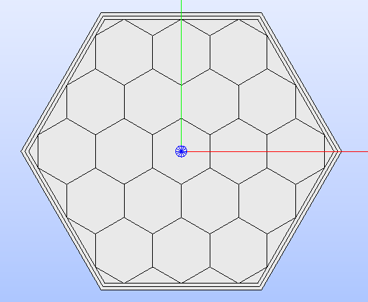

   Hexagonal lattice framed in a box with all positive thicknesses for the
   layers.

.. _box-neg:
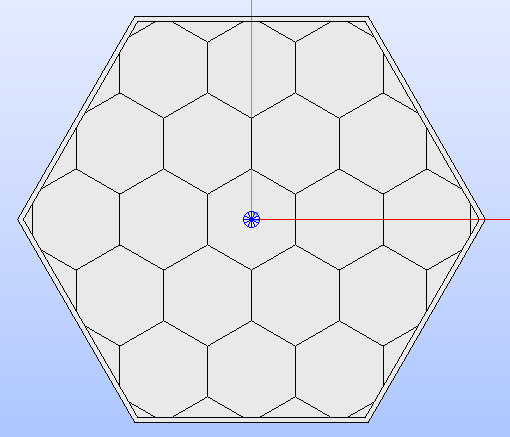

   Hexagonal lattice framed in a box with a negative thickness for the first
   layer. The box cuts the farthest ring of cells.

The lattice's box can also be declared by setting the corresponding property
:py:attr:`lattice_box<glow.geometry_layouts.lattices.Lattice.lattice_box>` with
an object of the subclasses of :py:class:`Cell<glow.geometry_layouts.cells.Cell>`.
The setter of the property requires the cell's centre to coincide with that of
the lattice, otherwise an exception is raised.
Both :py:class:`Cell<glow.geometry_layouts.cells.Cell>` objects or ``None`` are
valid inputs for the setter. The latter can be used to remove any box previously
set.

Both ways of setting a box lead to the same result: the *GEOM* compound object
representing the lattice's geometry layout is updated by assembling the cells
with the one of the box, eventually cutting the farthest ring of cells.

Setting Up Properties
"""""""""""""""""""""

Similarly to cells, also the regions of a lattice can be displayed by applying
a colorset that depends on the type of property to show, as item of the
:py:class:`PropertyType<glow.support.types.PropertyType>` enumeration.

There are different ways for users to set values for a specific property type
of a region of the lattice.
If the region belongs to any cell, the methods previously described (see
:ref:`set-cell-prop`) for a :py:class:`Cell<glow.geometry_layouts.cells.Cell>`
object remains valid, provided they are applied to the correct instance stored
in the attribute :py:attr:`layers<glow.geometry_layouts.lattices.Lattice.layers>`.

In addition, users can rely on the following methods of the class
:py:class:`Lattice<glow.geometry_layouts.lattices.Lattice>`:

  - :py:meth:`set_region_property()<glow.geometry_layouts.lattices.Lattice.set_region_property>`,
    which allows to set a value for the indicated type of property of a single
    lattice's region; this can be either the one currently selected in the
    *SALOME* viewer or the one provided as parameter to the method.
  - :py:meth:`set_lattice_box_properties()<glow.geometry_layouts.lattices.Lattice.set_lattice_box_properties>`,
    which allows users to set values for different types of properties for all
    the regions of the :py:class:`Cell<glow.geometry_layouts.cells.Cell>`
    instance, which is the box that encloses the lattice.
    The convention for declaring the values of a property is always the same,
    i.e. from the closest to the farthest region.
    Users should note that for hexagonal boxes, the number of values to provide
    is always equal to that of the layers plus one. The reason is that the
    first value in the list is associated to the regions between the cells and
    the first layer of the box.

The following code snippet shows the different ways to apply values for the
:py:attr:`PropertyType.MATERIAL<glow.support.types.PropertyType.MATERIAL>`,
i.e. either to all the cells or to an indicated region or to the regions of
the lattice's box.

.. code-block:: python

  # Build the lattice geometry layout
  cell = HexCell()
  cell.rotate(90)
  lattice = Lattice([cell])
  lattice.add_ring_of_cells(cell, 1)
  lattice.build_lattice_box([0.1])
  # The same value for the 'MATERIAL' property is assigned to all the cells
  for layer in lattice.layers:
      for layer_cell in layer:
          layer_cell.set_properties(
              {PropertyType.MATERIAL: ['COOLANT']}
          )
  # A different value for the 'MATERIAL' property is assigned to the central
  # cell
  lattice.set_region_property(PropertyType.MATERIAL, 'GAP', cell.face)
  # Values for the 'MATERIAL' property are assigned to the box's regions
  lattice.set_lattice_box_properties(
      {PropertyType.MATERIAL: ['COOLANT', 'METAL']}
  )
  lattice.show(PropertyType.MATERIAL)

The resulting lattice's geometry layout with the :py:attr:`MATERIAL<glow.support.types.PropertyType.MATERIAL>`
colorset is shown in the following figure.

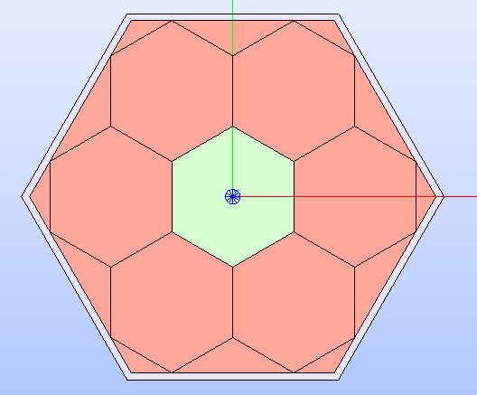

   Lattice after setting up the values for a type of property. It is shown
   with the corresponding colorset.

Applying Symmetries
"""""""""""""""""""

Tracking analyses on a full geometry layout of a fuel assembly can be
computationally expensive, in particular if containing lots of rings of cells.
To speed up the calculations, users can rely on symmetries to reduce the
geometric domain of calculus.
|TOOL| supports the application of different types of symmetries according to
the type of cells in the lattice; in particular, we can have:

  - Full, half, quarter, and eighth symmetries for a cartesian lattice;
  - Full, third, sixth and twelfth symmetries for a hexagonal lattice.

The method :py:meth:`apply_symmetry()<glow.geometry_layouts.lattices.Lattice.apply_symmetry>`
allows users to apply the indicated type of symmetry as item of the enumeration
:py:class:`SymmetryType<glow.support.types.SymmetryType>`.
Since |TOOL| considers that only specific types of symmetry are allowed for
each type of lattice, an exception is raised if the user tries to apply an
invalid symmetry for the current lattice.
Independently from the type of symmetry, the method
:py:meth:`apply_symmetry()<glow.geometry_layouts.lattices.Lattice.apply_symmetry>`
automatically performs *cut* operations on the *GEOM* compound object of the
lattice so that the remaining part describes the requested symmetry.

The operation of applying a symmetry is performed independently on the presence
of a box, for cartesian lattices.
For hexagonal lattices, however, |TOOL| requires that the lattice is framed in
a box. This is because the resulting geometry layout cannot be tracked by the
*SALT* module of *DRAGON5* if the shape is not triangular or rectangular.

The following code snippet shows different applications of a symmetry type
for a cartesian and a hexagonal lattice.

.. code-block:: python

  rect_lattice.apply_symmetry(SymmetryType.QUARTER)
  hex_lattice.apply_symmetry(SymmetryType.TWELFTH)

When calling the method :py:meth:`apply_symmetry()<glow.geometry_layouts.lattices.Lattice.apply_symmetry>`,
the geometry layout of the lattice is automatically updated and displayed in
the *SALOME* viewer (if the method is called from its Python console).
:numref:`quarter-symm` and :numref:`twelfth-symm` show the results of applying
a :py:attr:`QUARTER<glow.support.types.SymmetryType.QUARTER>` and a
:py:attr:`TWELFTH<glow.support.types.SymmetryType.TWELFTH>` symmetry to a
cartesian and a hexagonal lattice, respectively.

.. _quarter-symm:
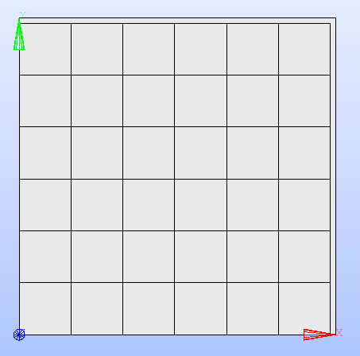

   Cartesian lattice after applying the :py:attr:`QUARTER<glow.support.types.SymmetryType.QUARTER>`
   type of symmetry.

.. _twelfth-symm:
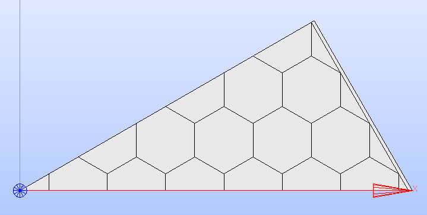

   Hexagonal lattice after applying the :py:attr:`TWELFTH<glow.support.types.SymmetryType.TWELFTH>`
   type of symmetry.

Users should note that |TOOL| does not recognize if the layout of cells
guarantees to replicate the full layout when any valid symmetry is applied.
It is up to the user to apply a symmetry that can be representative for the
specific layout of the lattice.

Setting the Lattice's Type of Geometry
""""""""""""""""""""""""""""""""""""""

The *SALT* module of *DRAGON5* identifies each type of geometry layout of the
lattice with a specific index value. In the TDT file, this is identified by
the *typgeo* value.
The definition of the *typgeo* is tied to both the geometry layout (considering
either a full or a partial one, after applying a symmetry), the type of BCs and
the type of tracking used in *SALT*.
User should note that specific values of *typgeo* are also associated to the
two different types of tracking allowed by the *SALT* module of *DRAGON5*.
In particular, we have that:

  - values for *typgeo* of `1` and `2` are associated to a *TISO* type of
    tracking, which indicates a uniform tracking;
  - values for *typgeo* greater that `2` are associated to a *TSPC* type of
    tracking, which indicates a cyclic tracking.

The items of the enumeration :py:class:`LatticeGeometryType<glow.support.types.LatticeGeometryType>`
identify the different *typgeo* values available in |TOOL|.
When a :py:class:`Lattice<glow.geometry_layouts.lattices.Lattice>` class is
instantiated, a default value for the property :py:attr:`type_geo<glow.geometry_layouts.lattices.Lattice.type_geo>`
is assigned according to the number and the type of cells.
Users can assign a value to this property directly, provided it is valid for
the lattice's geometry layout. This means that values specific for a type of
lattice and symmetry cannot be applied if not matching the current state of the
lattice.
For any values of *typgeo* involving BCs of type *translation*, the assignement
is performed only if the lattice is either made by a single cell or if enclosed
in a box.

|TOOL| provides also the method :py:meth:`set_type_geo()<glow.geometry_layouts.lattices.Lattice.set_type_geo>`
to set the item of the enumeration
:py:class:`LatticeGeometryType<glow.support.types.LatticeGeometryType>`.

The following code snippet shows different applications of the property
:py:attr:`type_geo<glow.geometry_layouts.lattices.Lattice.type_geo>`.

.. code-block:: python

  rect_lattice.type_geo = LatticeGeometryType.RECTANGLE_TRAN
  hex_lattice.set_type_geo(LatticeGeometryType.SA60)

Setting the value for the property does not result in any change in the lattice's
geometry layout. It influences the information written in the output TDT file
in terms of the BCs section, as this is strictly related to the *typgeo*.

Regions Inspection
""""""""""""""""""

When the regions of the lattice's technological or sectorized geometry are
displayed in the *SALOME* viewer, information about a selected region
including the assigned properties can be inspected.
The method :py:meth:`get_regions_info()<glow.geometry_layouts.lattices.Lattice.get_regions_info>`
can be called directly in the Python console of *SALOME* from an object
of :py:class:`Lattice<glow.geometry_layouts.lattices.Lattice>`.
If no region, or more than one, is selected when calling the method, an exception
is raised. The available information, that is printed in the Python console,
includes the name of the lattice's region and the value for each of the assigned
type of properties.

Restoring Lattice's Cells
"""""""""""""""""""""""""

Similarly to the class :py:class:`Cell<glow.geometry_layouts.cells.Cell>`, also
the class :py:class:`Lattice<glow.geometry_layouts.lattices.Lattice>` offers
a *restore* functionality.
The method :py:meth:`restore_cells()<glow.geometry_layouts.lattices.Lattice.restore_cells>`
allows users to restore the geometry layout of a group of cells of the lattice
by removing any circular region, while also setting the properties accordingly
with the provided ones.
If any cells have no centered circular regions, the *restore* operation is not
performed for those specific cells.
In addition, users can specify if the operation should be ignored for those
cells whose circular regions have not been cut, e.g. following a cell that
overlaps another one (see :numref:`overlap`).

This method can work in conjuction with the function
:py:func:`get_changed_cells()<glow.geometry_layouts.lattices.get_changed_cells>`
to retrieve any cells whose geometry layout has been modified so to restore
them easily.

The following code snippet shows the case of a hexagonal lattice where a
central cell overlaps those of the layer below it. The *restore* operation
is applied to all the overlapped cells resulting in the lattice's geometry
layout of :numref:`restored-cells`.

.. code-block:: python

  # Build the lattice geometry layout
  cell = HexCell()
  cell.add_circle(0.2)
  cell.add_circle(0.3)
  cell.add_circle(0.4)
  cell.rotate(90)
  cell.set_properties({PropertyType.MATERIAL: ['MAT_1', 'MAT_2', 'MAT_3', 'MAT_4']})
  lattice = Lattice([])
  lattice.add_ring_of_cells(cell, 2)
  # A cell with greater dimensions is added in the lattice centre, overlapping
  # those of the layer below
  central_cell = HexCell(edge_length=1.5)
  central_cell.rotate(90)
  central_cell.set_properties({PropertyType.MATERIAL: ['MAT_4']})
  lattice.add_cell(central_cell, ())
  # Assemble all the layers
  lattice.build_regions()
  # Restore the overlapped cells
  lattice.restore_cells(
      get_changed_cells(lattice),
      {PropertyType.MATERIAL: 'MAT_4'},
      ignore_not_cut=False
  )
  lattice.show(PropertyType.MATERIAL)

.. _restored-cells:
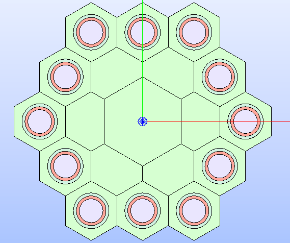

   Hexagonal lattice's technological geometry showing the result of restoring
   the overlapped cells. The geometry layout is displayed with the
   :py:attr:`MATERIAL<glow.support.types.PropertyType.MATERIAL>` colorset.

Lattice Analysis and Export
---------------------------

The goal of |TOOL| is to provide a tool for allowing neutronics experts to
build geometry layouts and export the surface geometry representation to a
file for performing tracking analyses with the *SALT* module of *DRAGON5*.
The generated file is in the format *APOLLO2* requires for its *TDT* solver.

To enforce this need, |TOOL| comes with a functionality for extracting the
needed information about the geometry and generate the output *TDT*-format
file.

After having built the lattice's geometry layout with a
:py:class:`Lattice<glow.geometry_layouts.lattices.Lattice>` instance, users
can run the export process by calling the function
:py:func:`analyse_and_generate_tdt<glow.main.analyse_and_generate_tdt>`
which analyses the lattice first, then generates the output *TDT*-format file
with the extracted information.
This function operates on the provided :py:class:`Lattice<glow.geometry_layouts.lattices.Lattice>`
instance on the basis of specific configuration options defined in the dataclass
:py:class:`TdtSetup<glow.main.TdtSetup>`.
The available settings include:

  - the type of geometry layout of the cells, as item of the enumeration
    :py:class:`GeometryType<glow.support.types.GeometryType>`;
  - the type of property associated to the lattice's regions, as item of the
    enumeration :py:class:`PropertyType<glow.support.types.PropertyType>`;
  - the value of the *albedo*, indicating how much reflective the BCs are,
    i.e. the ratio of exiting to entering neutrons. This attribute can assume
    values between `0.0` (no reflection) and `1.0` (full reflection) for a
    :py:attr:`ISOTROPIC<glow.support.types.LatticeGeometryType.ISOTROPIC>`
    type of geometry of the lattice. If nothing is provided, a default value
    that corresponds to the lattice's geometry type is adopted (i.e. `0.0` for
    :py:attr:`ISOTROPIC<glow.support.types.LatticeGeometryType.ISOTROPIC>`
    geometry layouts, `1.0` for the others).

The values set in the given :py:class:`TdtSetup<glow.main.TdtSetup>` instance
drives the analysis step in which the needed geometric data is extracted from
the lattice.
The first step consists in determining the lattice's *GEOM* compound object
to analyse; this is selected on the basis of the :py:class:`GeometryType<glow.support.types.GeometryType>`
and on the applied :py:class:`SymmetryType<glow.support.types.SymmetryType>`.
Each :py:class:`Region<glow.geometry_layouts.cells.Region>` object, which
corresponds to the regions of the lattice compound, is associated with its value
for the :py:class:`PropertyType<glow.support.types.PropertyType>` the lattice
is analysed for. In addition, an index is attributed to each regions to ensure
its identification.
The *GEOM* edge objects are then extracted and associated with the corresponding
regions so that each edge, identified with another index, corresponds to either
two or one region. Those associated to two regions are internal edges, shared
by two adjacent regions, whereas those associated with one region only are
border edges.
Lastly, the indices of the border edges are associated to a boundary, whose
type (as item of the enumeration :py:class:`BoundaryType<glow.support.types.BoundaryType>`)
and geometric data are determined on the basis of the
:py:class:`LatticeGeometryType<glow.support.types.LatticeGeometryType>` and the
applied :py:class:`SymmetryType<glow.support.types.SymmetryType>`.

:numref:`tdt-types` provides the association between
:py:class:`LatticeGeometryType<glow.support.types.LatticeGeometryType>` and
:py:class:`BoundaryType<glow.support.types.BoundaryType>` for the two type of
cells with the various symmetries available in |TOOL|.
The first group of coloumns *LatticeGeometryType*-*BoundaryType* indicates the
values for which a uniform tracking (i.e. *TISO*) should be performed in *SALT*;
the second group refers to values which correspond to a cyclic tracking (i.e.
*TSPC*).
An :py:attr:`ISOTROPIC<glow.support.types.LatticeGeometryType.ISOTROPIC>` type
of geometry does not correspond to any BC, whereas those having two types of
BCs applies a :py:attr:`ROTATION<glow.support.types.BoundaryType.ROTATION>`
on the internal boundaries and a :py:attr:`TRANSLATION<glow.support.types.BoundaryType.TRANSLATION>`
on the external ones (see :numref:`tran-rota`).

.. _tdt-types:
.. table:: Available combinations for *TISO* and *TSPC* cases.
   :widths: auto
   :align: center

   +----------+--------------+---------------------+----------------------+---------------------+----------------------+
   | CellType | SymmetryType | LatticeGeometryType | BoundaryType         | LatticeGeometryType | BoundaryType         |
   +==========+==============+=====================+======================+=====================+======================+
   |          | FULL         | ISOTROPIC           |          /           | HEXAGON_TRAN        | TRANSLATION          |
   |          +--------------+---------------------+----------------------+---------------------+----------------------+
   |          | THIRD        | ROTATION            | TRANSLATION/ROTATION | R120                | TRANSLATION/ROTATION |
   |          +--------------+---------------------+----------------------+---------------------+----------------------+
   |  HEX     |              | SYMMETRIES_TWO      | AXIAL_SYMMETRY       | SA60                | AXIAL_SYMMETRY       |
   |          | SIXTH        +---------------------+----------------------+---------------------+----------------------+
   |          |              | ROTATION            | TRANSLATION/ROTATION | RA60                | TRANSLATION/ROTATION |
   |          +--------------+---------------------+----------------------+---------------------+----------------------+
   |          | TWELFTH      | SYMMETRIES_TWO      | AXIAL_SYMMETRY       | S30                 | AXIAL_SYMMETRY       |
   +----------+--------------+---------------------+----------------------+---------------------+----------------------+
   |          |              |                     |                      | RECTANGLE_TRAN      | TRANSLATION          |
   |          | FULL         | ISOTROPIC           |          /           +---------------------+----------------------+
   |          |              |                     |                      | RECTANGLE_SYM       | AXIAL_SYMMETRY       |
   |          +--------------+---------------------+----------------------+---------------------+----------------------+
   |  RECT    | HALF         | SYMMETRIES_TWO      | AXIAL_SYMMETRY       | RECTANGLE_SYM       | AXIAL_SYMMETRY       |
   |          +--------------+---------------------+----------------------+---------------------+----------------------+
   |          | QUARTER      | SYMMETRIES_TWO      | AXIAL_SYMMETRY       | RECTANGLE_SYM       | AXIAL_SYMMETRY       |
   |          +--------------+---------------------+----------------------+---------------------+----------------------+
   |          | EIGHTH       | SYMMETRIES_TWO      | AXIAL_SYMMETRY       | RECTANGLE_EIGHTH    | AXIAL_SYMMETRY       |
   +----------+--------------+---------------------+----------------------+---------------------+----------------------+

.. _tran-rota:
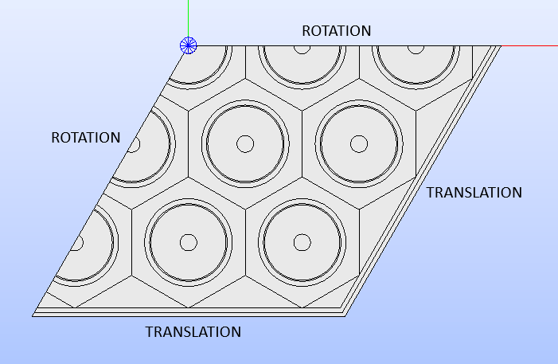

   Showing to which boundaries the :py:attr:`ROTATION<glow.support.types.BoundaryType.ROTATION>`
   and :py:attr:`TRANSLATION<glow.support.types.BoundaryType.TRANSLATION>` BC
   types are assigned to.

Given all the geometric data extracted from the lattice, the output file is
generated. Its structure consists of five sections, that are:

  - the *header* section, providing information about the type of geometry
    (*typgeo* value), the number of *folds* (*nbfold* value), which is
    consistent with the *typgeo*, the number of *nodes* (i.e. the regions),
    the number of *elements* (i.e. the edges).
  - the *regions* section, providing a list of indices attributed to the
    regions in the lattice. It also contains the definition of the *macros* to
    indicate subvolumes of the assembly.
  - the *edges* section, providing the geometric information about all the edges
    in the geometry layout, as well as the indices of the regions they belong
    to.
  - the *boundary conditions* section, providing information about the BC types
    and the indices of the edges that belong to each boundary.
  - the *property* section, indicating the index of each value of the considered
    property type (e.g. the :py:attr:`MATERIAL<glow.support.types.PropertyType.MATERIAL>`
    one). The order in which values are present respects that of the regions.

Usage
-----

|TOOL| can be used directly by writing down a Python script that exploits the
provided classes and methods to:

- assemble the geometry;
- assign properties to regions;
- visualize the result in the *SALOME* 3D viewer;
- perform the geometry analysis and the output *TDT* file generation.

To run this script, users can:

- provide it as argument when running *SALOME*;

    .. code-block:: bash

      salome my_script.py

- load it directly from within the *SALOME* application.

In addition, since *SALOME* comes with an embedded Python console, users can
import the |TOOL| modules and exploit its functionalities directly.

To see some of the |TOOL| functionalities in action, please refer to the script
files present in the ``test/examples`` folder: they are intended to show few
case studies and how they are managed in |TOOL|.
For further information about the available classes and methods, please refer
to the :doc:`api_guide` section.
