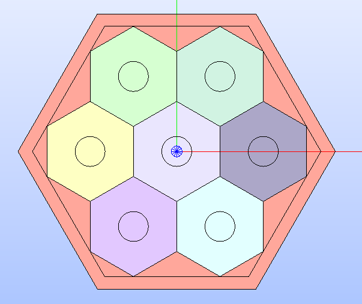
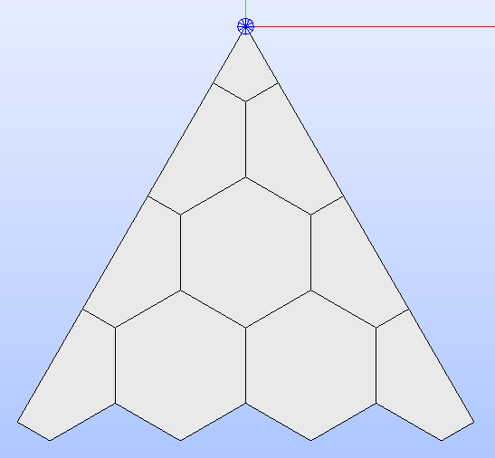

===============
Getting started
===============

This chapter presents all the information the user needs to make the best
use of |TOOL|.
Section :ref:`geom-def` provides details about the available functionalities
for setting up a geometry layout and displaying it in the 3D viewer of *SALOME*.
Section :ref:`layout-export` provides information about the process that
|TOOL| automatically performs to generate the output *.dat* file containing
the description of the geometry layout.
In both sections, the available functionalities for building and exporting a
geometry layout are described with code snippets showing their usage. Images
are also provided to graphically present the results when displayed in the 3D
viewer of *SALOME*.
Lastly, section :ref:`usage` gives indications about how to include the
functionalities of |TOOL| in a Python script and how to run the script in the
*SALOME* environment.

.. _geom-def:

Geometry Definition
-------------------

From a topological point of view, |TOOL| enables the construction of geometry
layouts by exploiting several entities of the *GEOM* module of *SALOME*.
The full list of *GEOM* entities is the following:

  - *vertex*, which is a point in the XYZ space;
  - *edge*, which can be classified as *segment*, *arc of circle* or *circle*;
  - *wire*, a closed set of edges;
  - *face*, a 2D area made from one or two *wires*;
  - *shell*, made from a group of *faces*;
  - *solid*, a 3D object made from a group of *shells*;
  - *compound*, a container grouping together several *GEOM* entities.

|TOOL| relies on most of the above-mentioned topological entities to assemble
the geometry layouts and visualise them in the 3D viewer of *SALOME*.
The module :py:mod:`geom_entities<glow.interface.geom_entities>` provides
dedicated wrapper classes acting as an interface towards the topological entities
of the *GEOM* module that are used in |TOOL|.
All the layouts that can be built in |TOOL| inherit from one of these wrapper
classes, which all derive from the :py:class:`GeomWrapper<glow.interface.geom_entities.GeomWrapper>`
abstract class.
This class has been implemented so that attribute access is delegated to the
underlying wrapped *GEOM* object (identified as ``GEOM_Object``).
This design choice allow for its subclasses to behave like the ``GEOM_Object``
they refer to. As a result, these classes can be used with any *GEOM* function
directly without the need for the user to provide the corresponding
``GEOM_Object``.
In addition, the :py:class:`GeomWrapper<glow.interface.geom_entities.GeomWrapper>`
class overloads the following arithmetic operators to easily perform Boolean
operations between instances of this class:

  - ``+`` (``__add__``) performs a fuse (union) of two shapes.
  - ``-`` (``__sub__``) performs a cut (difference) of one shape with another
    one.
  - ``*`` (``__mul__``) produces the common (intersection) part of two shapes.
  - ``/`` (``__truediv__``) perform a partition operation where the first
    ``GEOM_Object`` is subdivided in sub shapes by given shape objects.
  - ``//`` (``__floordiv__``) perform a partition operation where the
    resulting shape is the combination of all the shapes after being
    partitioned.

These operators call the corresponding wrapper functions of the *GEOM* ones
provided in the :py:mod:`geom_interface<glow.interface.geom_interface>` module
that perform the Boolean operations. In addition to these functions, the module
also contains functions for building the *GEOM* topological entities and applying
operations to them (e.g., Euclidean transformations).

In |TOOL|, the base class from which all the classes identifying any layout
derive from is the :py:class:`Layout<glow.geometry_layouts.layouts.Layout>`
class. It provides the characteristic data and behaviour (in terms of methods)
every layout object should have. In particular, instance methods for applying
Euclidean transformations, displaying and updating the corresponding
``GEOM_Object`` are declared but left empty. Subclasses of
:py:class:`Layout<glow.geometry_layouts.layouts.Layout>`, which represent
geometric objects describing the layout of cells and lattices, provide
dedicated implementations for these methods. The available common methods are:

  - :py:meth:`rotate()<glow.geometry_layouts.layouts.Layout.rotate>`. It rotates
    the layout by a given angle (in degrees) around the given axis, if any
    is provided, otherwise around the central perpendicular axis.
  - :py:meth:`scale()<glow.geometry_layouts.layouts.Layout.scale>`. It scales
    the layout by a given factor from a given vertex or the layout's centre,
    if not provided.
  - :py:meth:`show()<glow.geometry_layouts.layouts.Layout.show>`. It displays
    the ``GEOM_Object`` the instance refers to in the 3D viewer of *SALOME*
    according to specific settings.
  - :py:meth:`translate()<glow.geometry_layouts.layouts.Layout.translate>`. It
    translates the layout in the XYZ space so that its centre coincides with
    the point identified by the given coordinates.
  - :py:meth:`update()<glow.geometry_layouts.layouts.Layout.update>`. It allows
    to update the ``GEOM_Object`` the instance refers to with a new one. The
    object to update with is given in terms of objects of the
    :py:class:`Face<glow.interface.geom_entities.Face>` and
    :py:class:`Compound<glow.interface.geom_entities.Compound>` classes.

The following classes are direct children of :py:class:`Layout<glow.geometry_layouts.layouts.Layout>`:

  - :py:class:`Surface<glow.geometry_layouts.geometries.Surface>`. It represents
    the base class for all the geometric shapes used in |TOOL| to describe the
    surfaces a geometry layout is made of. In geometric terms, it describes
    a 2D surface, and, for this reason, it also derives from the
    :py:class:`Face<glow.interface.geom_entities.Face>` wrapper class.
    Dedicated classes to easily build specific geometric shapes (i.e. circles,
    rectangles and hexagons) are children of this class.
  - :py:class:`Region<glow.geometry_layouts.layouts.Region>`. It represents
    any 2D surface that is filled by a set of properties, like the material.
    This class inherits also from the :py:class:`Face<glow.interface.geom_entities.Face>`
    wrapper class.
  - :py:class:`Fillable<glow.geometry_layouts.fillable_layouts.Fillable>`. It
    represents any geometry layout that can be filled with several regions,
    each associated to a set of properties. It is an *abstract* class that
    inherits from the :py:class:`Compound<glow.interface.geom_entities.Compound>`
    wrapper class since it groups several *GEOM* faces together.

The building concept adopted in |TOOL| to describe any geometry layout of cells
and lattices is based on the *layers* idea. *Layers* are meant to represent the
layout as a hierarchical tree where the *leaves* are constituted by
:py:class:`Region<glow.geometry_layouts.layouts.Region>` instances, while the
*nodes* are given by instances of the :py:class:`Fillable<glow.geometry_layouts.fillable_layouts.Fillable>`
subclasses.
Each subclass of :py:class:`Fillable<glow.geometry_layouts.fillable_layouts.Fillable>`
(i.e. *cells* and *lattices*) implements the *layers* concept. This means that,
as an example, a *cell* can represent a *node* in the hierarchical tree of a
*lattice*, but the same can be said for a *lattice*, when included in the tree
of a *cell* that describes an assembly.
The :py:class:`Fillable<glow.geometry_layouts.fillable_layouts.Fillable>`
subclasses provide methods for inserting *regions* or other *fillable* objects
into the layout's ordered layer structure. The insertion order determines each
object's position in the hierarchical tree, where the layer index defines its
rendering priority within the layout. Consequently, objects added earlier are
placed in lower layers, while objects added later occupy progressively higher
layers. The most recently inserted elements therefore appear at the top of the
layout's Z-ordering. In this sense, the *layer* abstraction provides a mean
for imposing an ordering of geometric objects along a conceptual Z-axis (even
if the resulting layout is always 2D), ensuring proper handling of overlapping
shapes based solely on insertion order.

When geometry layouts are displayed or exported, their hierarchical tree is
traversed from the highest filled layer down to the lowest (i.e. from top to
bottom). During this traversal, any *region* or *fillable* located in a lower
layer that is overlapped by an element in a higher layer is either clipped
(if partially overlapped) or removed entirely (if fully covered).

The placement of *region* or *fillable* objects within a geometry layout relies
on Euclidean geometric transformations, such as translation and rotation.
Assembling the entire layout resulting from collapsing the layers is based on
Boolean operations (i.e. intersection, cut and partitioning).

In |TOOL|, the geometry layout of :py:class:`Fillable<glow.geometry_layouts.fillable_layouts.Fillable>`
objects (i.e. cells and lattices) is described in terms of:

  - the **technological geometry**, in which *regions* delineate areas each
    associated with a specific material;
  - the **sectorised geometry**, which further subdivides the regions of the
    technological geometry into sectors and circular areas. This refined
    geometry is typically used to capture flux gradients arising from geometric
    heterogeneities. The *GEOM* compound of edge objects resulting from the
    refinement is stored in a dictionary associating the compound to the type
    of geometry.

:py:class:`Fillable<glow.geometry_layouts.fillable_layouts.Fillable>` objects
can be displayed in the 3D viewer of *SALOME* in terms of one of the
aforementioned types of geometry. This is performed automatically by traversing
the hierarchical tree to collect all the corresponding geometry layouts.

|TOOL| allows users to display the *regions* of a geometry layout according to
a colour map associated to a specific property type. Given the hierarchical
structure of a *fillable*, its layers are traversal to collect all the
:py:class:`Region<glow.geometry_layouts.layouts.Region>` objects coming for
the current *fillable* and from those representing the *nodes* of the layout's
tree.
Each :py:class:`Region<glow.geometry_layouts.layouts.Region>` instance associates
its *GEOM* face (part of the technological geometry layout) with a colour that
corresponds to the value of the property type to be visualised in the 3D viewer
of *SALOME*.

Users can assign values (as a string) for the type of properties available from
the :py:class:`PropertyType<glow.support.types.PropertyType>` enumeration to any
:py:class:`Region<glow.geometry_layouts.layouts.Region>` object. These property
types include:

  - :py:class:`MATERIAL<glow.support.types.PropertyType.MATERIAL>`, to indicate
    the name of the material.
  - :py:class:`MACRO<glow.support.types.PropertyType.MACRO>`, to indicate the
    name of the macro. Adjacent *regions* can be grouped together in a *macro
    region* to enable support for the *multicell surfacic approximation* in
    *DRAGON5*.

Information about the :py:class:`MATERIAL<glow.support.types.PropertyType.MATERIAL>`
property, in terms of its assigned values and indices for the *regions*, is
always included in the output file when the geometry is exported.
The names and indices of the *macro regions* are included only if indicated by
the user (see :ref:`layout-export`).

The specific classes associated to *cells* and *lattices*, which can be used to
model assemblies, and even the entire core, are the following ones:

  - :py:class:`Cell<glow.geometry_layouts.cells.Cell>`. It represents a generic
    cell that is not based on a pre-defined characteristic shape, which is
    provided at its initialisation.
  - :py:class:`CartesianCell<glow.geometry_layouts.cells.CartesianCell>`. It
    represents a Cartesian cell, i.e. one having a rectangular surface as its
    characteristic shape.
  - :py:class:`HexCell<glow.geometry_layouts.cells.HexCell>`. It represents
    a hexagonal cell, i.e. one having a hexagonal surface as its characteristic
    shape.
  - :py:class:`Lattice<glow.geometry_layouts.lattices.Lattice>`. It represents
    a generic lattice that do not follow a specific pattern.
  - :py:class:`CartesianLattice<glow.geometry_layouts.lattices.CartesianLattice>`.
    It represents a Cartesian lattice made of cells arranged according to a
    rectangular grid.
  - :py:class:`HexLattice<glow.geometry_layouts.lattices.HexLattice>`. It
    represents a hexagonal lattice where cells are arranged on a hexagonal
    grid.

All the aforementioned classes inherit from the :py:class:`Fillable<glow.geometry_layouts.fillable_layouts.Fillable>`
class, which means that they all share the same common methods devoted to the
management of the hierarchical tree, the addition of layout objects, the
application of Euclidean transformations and symmetry operations, and to
displaying the geometry layout in the 3D viewer of *SALOME*.
In addition, they are based on a characteristic shape (i.e. an object of the
:py:class:`Surface<glow.geometry_layouts.geometries.Surface>` subclasses) which,
depending on the layout type, is a rectangular or a hexagonal surface, or a
generic surface derived from the borders of the layout.

In the following, the different layout objects are discussed and their public
methods are detailed.

Surfaces Definition
^^^^^^^^^^^^^^^^^^^

|TOOL| comes with classes to quickly build specific *surfaces*, identified by
*GEOM* faces, in *SALOME*.
In the *Object-Oriented Programming* (*OOP*) view, the types of *surface* that
are available in |TOOL| inherit from the same superclass
:py:class:`Surface<glow.geometry_layouts.geometries.Surface>`, which represents
a generic 2D shape in *SALOME*.
Subclasses of :py:class:`Surface<glow.geometry_layouts.geometries.Surface>`
are present in |TOOL| to build specific-type surfaces. They are the following:

  - class :py:class:`Circle<glow.geometry_layouts.geometries.Circle>` for
    circular surfaces.
  - class :py:class:`Hexagon<glow.geometry_layouts.geometries.Hexagon>` for
    hexagonal surfaces.
  - class :py:class:`Rectangle<glow.geometry_layouts.geometries.Rectangle>`
    for rectangular surfaces.

Depending on the specific type of surface, the instantiation requires to specify
the centre of the surface and its characteristic dimensions (i.e. radius for a
circle, width and height for a rectangle, the edge length for a hexagon) or the
2D shape and the centre directly (:py:class:`Surface<glow.geometry_layouts.geometries.Surface>`
case).
Classes are implemented with default values for the characteristic dimensions.
When an object of the :py:class:`Surface<glow.geometry_layouts.geometries.Surface>`
subclasses is instantiated, the *GEOM* objects that concur in the creation of
the corresponding face are automatically built. In this way, the surface can
be shown in the *SALOME* 3D viewer right after the initialization by means of
the method :py:meth:`show()<glow.geometry_layouts.geometries.Surface.show>`.

The following code snippet shows how to instantiate and display the geometric
surface for the hexagonal case.

.. code-block:: python

  from glow.geometry_layouts.geometries import Hexagon

  surface = Hexagon(center=(1.0, 1.0, 0.0), edge_length=2.0)
  surface.show()

:numref:`hex-shape` shows the graphical result obtained by running the above
code in a Python script or directly from the Python console of *SALOME*.

.. _hex-shape:
.. figure:: images/hexagon.png
   :alt: Hexagon in SALOME
   :width: 400px
   :align: center

   Hexagon displayed in the *SALOME* 3D viewer.

As mentioned in :ref:`geom-def`, Euclidean transformations are common to all
classes of |TOOL| that inherit from :py:class:`Layout<glow.geometry_layouts.layout.Layout>`.
The :py:class:`Surface<glow.geometry_layouts.geometries.Surface>` class provides
a specific implementation for these methods that is shared by all its subclasses.
In particular, the :py:meth:`rotate()<glow.geometry_layouts.geometries.Surface.rotate>`,
:py:meth:`translate()<glow.geometry_layouts.geometries.Surface.translate>` and
:py:meth:`scale()<glow.geometry_layouts.geometries.Surface.scale>` methods
apply a rotation, translation and scaling, respectively, to the *GEOM* elements
of the :py:class:`Surface<glow.geometry_layouts.geometries.Surface>` instance.

For the hexagonal surface declared above, the code instructions are the
following:

.. code-block:: python

  surface.rotate(90)
  surface.translate((0.0, 0.0, 0.0))
  surface.scale(0.5)
  surface.show()

By applying these methods, the resulting *GEOM* face is shown in :numref:`hex-transf`,
and compared with the original shape.

.. _hex-transf:
.. figure:: images/hexagon_rot_transl_scaled.png
   :alt: Hexagon rotated, translated and scaled in SALOME
   :width: 400px
   :align: center

   Hexagon before and after applying rotation, traslation and scaling operations.

The *GEOM* face that is specific of the subclass of
:py:class:`Surface<glow.geometry_layouts.geometries.Surface>` can be directly
modified within *SALOME* and the modified *GEOM* face applied to the
:py:class:`Surface<glow.geometry_layouts.geometries.Surface>` subclass object
by calling the method :py:meth:`update()<glow.geometry_layouts.geometries.Surface.update>`.
The implementation of this method is specific for each of the subclasses of
:py:class:`Surface<glow.geometry_layouts.geometries.Surface>`. In general, the
method receives as parameter a *GEOM* face and updates the instance attributes
of :py:class:`Surface<glow.geometry_layouts.geometries.Surface>` accordingly.
A check ensures that only *GEOM* faces are provided, and that the given *GEOM*
face corresponds to the characteristic surface the
:py:class:`Surface<glow.geometry_layouts.geometries.Surface>` class refers to.

Region Definition
^^^^^^^^^^^^^^^^^

In |TOOL|, the geometry layouts are described as a hierarchical tree in which
the *regions* are the *leaves*.
The class that implements the *region* concept is :py:class:`Region<glow.geometry_layouts.layouts.Region>`.
This class represents any 2D shape bounded by one or two edges that is filled
by a set of properties, e.g. the material. Properties are expressed as a
dictionary of items of the :py:class:`PropertyType<glow.support.types.PropertyType>`
enumeration vs the corresponding names.
As any other geometric object in |TOOL|, the :py:class:`Region<glow.geometry_layouts.layouts.Region>`
class inherits from a subclass of the :py:class:`GeomWrapper<glow.interface.geom_entities.GeomWrapper>`,
specifically the :py:class:`Face<glow.interface.geom_entities.Face>` one.
This guarantees that :py:class:`Region<glow.geometry_layouts.layouts.Region>`
instances behave like the corresponding *GEOM* face objects when used with
*GEOM* functions.
As mentioned in :ref:`geom-def`, the :py:class:`Region<glow.geometry_layouts.layouts.Region>`
is a subclass of :py:class:`Layout<glow.geometry_layouts.layouts.Layout>`,
meaning it provides the implementation for all the methods handling Euclidean
transformations, displaying and updating the region.
In addition, to enable the visualisation of the regions of a layout according
to a property type colour map, :py:class:`Region<glow.geometry_layouts.layouts.Region>`
objects come with a dedicated ``color`` attribute and methods for setting
(:py:meth:`set_region_color()<glow.geometry_layouts.Region.set_region_color>`)
and resetting (:py:meth:`reset_region_color()<glow.geometry_layouts.Region.reset_region_color>`)
the colour according to which it is displayed in the 3D viewer of *SALOME*.
When the region's colour is reset, it is assigned the default RGB colour used
by *SALOME*, which corresponds to a light grey.
The :py:class:`Region<glow.geometry_layouts.layouts.Region>` class comes also
with the :py:meth:`clone()<glow.geometry_layouts.Region.clone>` method for
producing a copy of the instance that is completely independent from the source
instance, but has the same properties and colour.

The Boolean algebra provided by overloading the arithmetic operators of Python
in the :py:class:`GeomWrapper<glow.interface.geom_entities.GeomWrapper>` class
is complemented in the :py:class:`Region<glow.geometry_layouts.layouts.Region>`
class by providing specific implementations for the following operators:

  - ``+`` (``__add__``) fuses the *GEOM* faces of one or more *regions* while
    keeping the same properties. Both *regions* must have the same values for
    the properties.
  - ``*`` (``__mul__``) produces the common (intersection) part of the *GEOM*
    faces of two *regions* while keeping the same properties of the region that
    intersects the first one.

The instantiation of a :py:class:`Region<glow.geometry_layouts.layouts.Region>`
object is based on a *GEOM* face, but it also accepts an instance of the
:py:class:`Surface<glow.geometry_layouts.geometries.Surface>` class as it
accesses to the wrapped *GEOM* face.
The following snippet shows the creation of two *regions* with dedicated
properties, the assignment of a colour and their visualisation in the 3D
viewer. The association of colours to *regions* according to the values of a
given :py:class:`PropertyType<glow.support.types.PropertyType>` is performed
by means of the :py:func:`associate_colors_to_regions()<glow.geometry_layouts.layouts.associate_colors_to_regions>`.
:numref:`regions-bool` shows the result of applying the Boolean operations,
identified by the arithmetic operators, to the two *regions*.

.. code-block:: python

    from glow import *

    # Instantiation of the two regions
    r1 = Region(
      Hexagon(), "R1", {PropertyType.MATERIAL: "MAT1"}
    )
    r2 = Region(
      Hexagon(center=(1,1,0), edge_length=2.0),
      "R2",
      {PropertyType.MATERIAL: "MAT2"}
    )

    # Get the common part
    r3 = r2 * r1
    r3.name = "R3"
    # Clone the first region and set its material to be
    # the one of the second region
    r4 = r1.clone()
    r4.name = "R4"
    r4.properties[PropertyType.MATERIAL] = "MAT2"
    # Fuse the second and fourth regions
    r5 = r2 + r4
    r5.name = "R5"
    # Associate colours to the regions according to the material
    regions = [r1, r2, r3, r4, r5]
    associate_colors_to_regions(PropertyType.MATERIAL, regions)
    for region in regions:
      set_color_face(region.geom_obj, region.color)

    # Display all the regions
    r1.show()
    r2.show()
    r3.show()
    r4.show()
    r5.show()

.. _regions-bool:
.. figure:: images/regions_algebra.png
   :alt: Boolean algebra between regions.
   :width: 600px
   :align: center

   Region resulting from fusing (on the left) and intersecting (on the right)
   two *regions*.

Fillable Definition
^^^^^^^^^^^^^^^^^^^

According to the hierarchical tree logic adopted in |TOOL|, classes that inherit
from the :py:class:`Fillable<glow.geometry_layouts.fillable_layouts.Fillable>`
class are the *nodes* in the tree, as they represent a container for other
*nodes* or *leaves*. The superimposition of multiple *layers* filled with
either :py:class:`Region<glow.geometry_layouts.layouts.Region>` or other
:py:class:`Fillable<glow.geometry_layouts.fillable_layouts.Fillable>` objects
recreates the hierarchical structure.

:py:class:`Fillable<glow.geometry_layouts.fillable_layouts.Fillable>` inherits
from the :py:class:`Compound<glow.interface.geom_entities.Compound>` wrapper
class, as it represents a collection of *GEOM* faces. In addition, it can be
used as argument of the *GEOM* functions directly, as it behaves like the
corresponding *GEOM* compound object when used with *GEOM* functions.
As mentioned in :ref:`geom-def`, :py:class:`Fillable<glow.geometry_layouts.fillable_layouts.Fillable>`
is a subclass of :py:class:`Layout<glow.geometry_layouts.layouts.Layout>`,
meaning it provides the implementation for all the methods handling Euclidean
transformations, displaying and updating the layout it refers to.

The class :py:class:`Fillable<glow.geometry_layouts.fillable_layouts.Fillable>`
declares attributes and methods common to all its subclasses.
Public methods cover the following functionalities:

  - adding a new *region* or *fillable* to the geometry layout;
  - applying a specific symmetry type to the geometry layout;
  - cloning the instance;
  - getting the compound of edges that corresponds to a given item of the
    :py:class:`GeometryType<glow.support.types.GeometryType>` enumeration;
  - getting the :py:class:`Region<glow.geometry_layouts.layouts.Region>` objects
    the geometry layout (either full or the one corresponding to a specific
    symmetry) is made of;
  - printing information about a *region*, either given or selected from the
    *SALOME* GUI;
  - restoring the geometry layout;
  - rotating, scaling and translating the instance;
  - setting the properties of a *region*, either given or selected from the
    *SALOME* GUI;
  - displaying the geometry layout in the 3D viewer;
  - updating the ``GEOM_Object`` the instance refers to;
  - updating the hierarchical structure of the instance.

Adding a new layout
"""""""""""""""""""

The method :py:meth:`add()<glow.geometry_layouts.fillable_layouts.Fillable.add>`
allows for the inclusion of a new :py:class:`Region<glow.geometry_layouts.layouts.Region>`
or :py:class:`Fillable<glow.geometry_layouts.fillable_layouts.Fillable>` object
to the hierarchical tree that describes the technological geometry layout of
the current *fillable*.
Users can provide also the XYZ coordinates at which the object should be placed
at, as well as the index of the *layer* in which the object is added.
A translation is performed, if needed, to place the *layout* object so that its
CDG coincides with the given coordinates. If no position is provided, the
*layout* object is placed in the CDG of the current *fillable*.

The given *layout* object is stored at the last position of the *layer*
identified the given index, if any is provided. This means that the object is
added as last element of the sublist of the :py:attr:`layers<glow.geometry_layouts.fillable_layouts.Fillable.layers>`
attribute the given index corresponds to.
If no index is provided, the *layout* object is added to a new sublist of
:py:attr:`layers<glow.geometry_layouts.fillable_layouts.Fillable.layers>`.

This method simply updates the list of layers of the technological geometry
layout of the current *fillable* with the given *layout* object without
collapsing the *layers* and updating the entire *GEOM* compound object.
To update the hierarchical tree of the *fillable* by cutting overlapping layers,
the method :py:meth:`update_hierarchical_structure()<glow.geometry_layouts.fillable_layouts.Fillable.update_hierarchical_structure>`
should be called. To update and display the *fillable* in the 3D viewer of
*SALOME*, the method :py:meth:`show()<glow.geometry_layouts.fillable_layouts.Fillable.show>`
should be run instead.

The following snippet shows the usage of the method :py:meth:`add()<glow.geometry_layouts.fillable_layouts.Fillable.add>`
when applied to a :py:class:`CartesianCell<glow.geometry_layouts.cells.CartesianCell>`
to include:

  - a circular :py:class:`Region<glow.geometry_layouts.layouts.Region>` object,
    being a *region* of material;
  - a :py:class:`CartesianLattice<glow.geometry_layouts.lattices.CartesianLattice>`
    object, to model an assembly of cells. For the construction of a Cartesian
    lattice, see :ref:`lattice-def`.

Results are shown in :numref:`fillable-add` for both a single cell and an
assembly.

.. code-block:: python

    from glow import *

    # Instantiation of a circular region, a cell and a lattice of cells
    r1 = Region(
      Circle(radius=0.3), "R1", {PropertyType.MATERIAL: "MAT1"}
    )
    cell = CartesianCell(base_props={PropertyType.MATERIAL: "MAT2"})
    cell.add(r1)
    lattice = CartesianLattice()
    lattice.add_rings_of_cells(cell, 3)

    # Instantiate the cell representing the assembly
    assembly = CartesianCell(
      width_height=tuple(i+1 for i in lattice.dimensions),
      base_props={PropertyType.MATERIAL: "MAT2"}
    )
    # Add the lattice to the assembly cell
    assembly.add(lattice)

.. _fillable-add:
.. figure:: images/fillable_add.png
   :alt: Applying add() method to fillable objects.
   :width: 600px
   :align: center

   Technological geometry layout after adding a single :py:class:`Region<glow.geometry_layouts.layouts.Region>`
   (on the left) and a *fillable* :py:class:`CartesianLattice<glow.geometry_layouts.lattices.CartesianLattice>`
   (on the right).

.. _fillable-symm:

Applying a symmetry
"""""""""""""""""""

Solving the Boltzmann transport equation on a full geometry layout can be
computationally expensive, in particular if very complex.
To speed up the calculations, users can rely on cuts to extract parts out of
the existing layout, thereby isolating the minimum portion of the geometry
required to describe the entire pattern.
|TOOL| supports the application of specific types of symmetries to any *fillable*
object that inherits from :py:class:`Fillable<glow.geometry_layouts.fillable_layouts.Fillable>`.

The method :py:meth:`apply_symmetry()<glow.geometry_layouts.fillable_layouts.Fillable.apply_symmetry>`
allows users to apply a symmetry type by indicating an item of the enumeration
:py:class:`SymmetryType<glow.support.types.SymmetryType>`.
According to the type, the 2D shape that identifies the symmetry is derived and
stored in the :py:attr:`symmetry_map<glow.geometry_layouts.fillable_layouts.Fillable.symmetry_map>`
instance attribute; this is a dictionary associating to each :py:class:`SymmetryType<glow.support.types.SymmetryType>`
element the corresponding :py:class:`Surface<glow.geometry_layouts.geometries.Surface>`
instance.
The indicated symmetry type is saved in the :py:attr:`state<glow.geometry_layouts.fillable_layouts.Fillable.state>`
attribute and applied when the current *fillable* is displayed in the 3D viewer
or exported to file in the *TDT*-compatible format.
In both cases, a *common* operation is performed between the :py:class:`Region<glow.geometry_layouts.layouts.Region>`
objects identifying the entire geometry layout and the shape of the symmetry.
Only the *regions* and parts of them that are in common are kept and either
displayed or exported.

The method :py:meth:`apply_symmetry()<glow.geometry_layouts.fillable_layouts.Fillable.apply_symmetry>`
only supports a set of :py:class:`SymmetryType<glow.support.types.SymmetryType>`
elements that are common to all *fillable* objects. These types are the
following ones:

  - :py:attr:`FULL<glow.support.types.SymmetryType.FULL>`: the characteristic
    shape of the entire layout is stored.
  - :py:attr:`HALF<glow.support.types.SymmetryType.HALF>`: a rectangular shape
    representing half of the entire layout is stored.
  - :py:attr:`QUARTER<glow.support.types.SymmetryType.QUARTER>`: a rectangular
    shape representing one quarter of the entire layout.

Subclasses of :py:class:`Fillable<glow.geometry_layouts.fillable_layouts.Fillable>`
provide the implementation to handle type-specific symmetries (see
:ref:`cell-symm`).

The following code snippet shows the application of a :py:attr:`QUARTER<glow.support.types.SymmetryType.QUARTER>`
symmetry type for a Cartesian assembly. The result is shown in :numref:`quarter-symm`.

.. code-block:: python

  assembly.apply_symmetry(SymmetryType.QUARTER)

.. _quarter-symm:
.. figure:: images/lattice_qsym.png
   :alt: Cartesian lattice after applying a quarter symmetry
   :width: 400px
   :align: center

   Cartesian lattice after applying the :py:attr:`QUARTER<glow.support.types.SymmetryType.QUARTER>`
   type of symmetry.

Users should note that even if called from the *SALOME* Python console, the
method :py:meth:`apply_symmetry()<glow.geometry_layouts.fillable_layouts.Fillable.apply_symmetry>`
does not automatically update and display the portion of the geometry layout
that corresponds to the applied symmetry. To display the new layout, the method
:py:meth:`show()<glow.geometry_layouts.fillable_layouts.Fillable.show>` must
always be called.
In addition, the last applied symmetry is not used when the current
:py:class:`Fillable<glow.geometry_layouts.fillable_layouts.Fillable>` object
is exported. It is up to the user to indicate the symmetry type to the function
exporting the layout (see :ref:`layout-export`).

Cloning the *fillable* instance
"""""""""""""""""""""""""""""""

The :py:class:`Fillable<glow.geometry_layouts.fillable_layouts.Fillable>` class
comes with the :py:meth:`clone()<glow.geometry_layouts.fillable_layouts.Fillable.clone>`
method for producing a copy of the current instance that is completely
independent from the source instance. In Python terms, this means making a
*deep* copy. This allows the mutable attributes (e.g., lists and dictionaries)
of a cloned *fillable* to be unlinked from the source *fillable*. This means
that modifications to a mutable attribute in one *fillable* are not also
performed in the corresponding attribute of the other *fillable*.

Getting the geometry type edges
"""""""""""""""""""""""""""""""

As mentioned in :ref:`geom-def`, :py:class:`Fillable<glow.geometry_layouts.fillable_layouts.Fillable>`
objects are described in terms of the *technological geometry*, collecting the
*regions* each associated to a material, and the *sectorised geometry*, which
represents the refinement of the former geometry layout.

The :py:class:`Fillable<glow.geometry_layouts.fillable_layouts.Fillable>` class
stores the refined geometry layout as a :py:class:`Compound<glow.interface.geom_entities.Compound>`
object collecting the edges that subdivide the *regions* resulting by applying
a sectorisation (see :ref:`sectorisation`).

Since a :py:class:`Fillable<glow.geometry_layouts.fillable_layouts.Fillable>`
object possesses a hierarchical structure, when displaying the root *fillable*
in terms of the *sectorised geometry* (see :ref:`show`), the :py:class:`Compound<glow.interface.geom_entities.Compound>`
objects identifying the *sectorised geometry* of all the *fillables* in the
hierarchy tree of the current istance are retrieved.
The method :py:meth:`get_geometry_map()<glow.geometry_layouts.fillable_layouts.Fillable.get_geometry_map>`
iterates over all the tree to collect all the *sectorised geometries* in a single
:py:class:`Compound<glow.interface.geom_entities.Compound>` object of edges.
This method is useful for updating the :py:attr:`geometry_maps<glow.geometry_layouts.fillable_layouts.Fillable.geometry_maps>`,
a dictionary associating for each element of the :py:class:`GeometryType<glow.support.types.GeometryType>`
the corresponding :py:class:`Compound<glow.interface.geom_entities.Compound>`
object of edges. Currently, it can stores only the edges of the *sectorised
geometry*.

The following snippet shows how to update the compound of edges corresponding
to the :py:attr:`SECTORIZED<glow.support.types.GeometryType.SECTORIZED>` type
of geometry when a sectorisation has already been applied to a
:py:class:`Cell<glow.geometry_layouts.cells.Cell>` instance.

.. code-block:: python

  # Collect the refined geometry of the cells and join it with the mesh
  # by performing a partition
  assembly.geometry_maps[GeometryType.SECTORIZED] = \
      assembly.get_geometry_map(GeometryType.SECTORIZED) // wrap_shape(mesh)

  # Show the resulting refined layout with the 'MATERIAL' colour map
  assembly.show(PropertyType.MATERIAL, GeometryType.SECTORIZED)

For a deeper insight, please refer to the :ref:`symmetry-example` use case in
the :ref:`tutorials` section (see :numref:`assembly-refined` for the resulting
refined geometry).

Getting the regions
"""""""""""""""""""

In |TOOL|, objects of the :py:class:`Region<glow.geometry_layouts.layouts.Region>`
class represent the *leaves* of the hierarchical tree of a *fillable* object.
When an instance of the :py:class:`Fillable<glow.geometry_layouts.fillable_layouts.Fillable>`
subclasses is either displayed or exported, |TOOL| automatically retrieves the
*regions* of the technological geometry.
The methods :py:meth:`get_regions()<glow.geometry_layouts.fillable_layouts.Fillable.get_regions>`
and :py:meth:`get_regions_with_symmetry()<glow.geometry_layouts.fillable_layouts.Fillable.get_regions_with_symmetry>`
serve to this purpose.
The former method iterates over all the *layers* of the current *fillable* to
collect and return all the :py:class:`Region<glow.geometry_layouts.layouts.Region>`
objects that describe the technological geometry layout.
The *regions* are collected directly from the current *fillable* and by
recursively calling the :py:meth:`get_regions()<glow.geometry_layouts.fillable_layouts.Fillable.get_regions>`
method for all the :py:class:`Fillable<glow.geometry_layouts.fillable_layouts.Fillable>`
objects in the hierarchy.

The method :py:meth:`get_regions_with_symmetry()<glow.geometry_layouts.fillable_layouts.Fillable.get_regions_with_symmetry>`
similarly retrieves the *regions* of the technological geometry, with the
difference that only those in common with the shape of the indicated symmetry
type are returned.

Printing regions information
""""""""""""""""""""""""""""

When the geometry layout of a *fillable* is displayed in the 3D viewer of
*SALOME*, |TOOL| retrieves and adds to the *SALOME* study the *GEOM* face of
all the :py:class:`Region<glow.geometry_layouts.layouts.Region>` objects
that identify the technological geometry.

Users can obtain information about the :py:class:`Region<glow.geometry_layouts.layouts.Region>`
object that corresponds to either the given *GEOM* face or the one currently
selected in the 3D viewer.
The method :py:meth:`print_region_info()<glow.geometry_layouts.fillable_layouts.Fillable.print_region_info>`,
when called directly in the Python console of *SALOME*, prints the following
data (see :numref:`reg-info`):

  - the tree representation of the hierarchical structure up to the target
    :py:class:`Region<glow.geometry_layouts.layouts.Region>` object;
  - the code to retrieve the target :py:class:`Region<glow.geometry_layouts.layouts.Region>`
    object directly from the hierarchical tree of the current *fillable*;
  - the values for each of the :py:class:`PropertyType<glow.support.types.PropertyType>`
    items associated to the target :py:class:`Region<glow.geometry_layouts.layouts.Region>`
    object.

.. _reg-info:
.. figure:: images/region_info.png
   :alt: Information about a selected region of the cell
   :width: 800px
   :align: center

   Information about the :py:class:`Region<glow.geometry_layouts.layouts.Region>`
   object that corresponds to the *GEOM* face of the *fillable* currently
   selected in the 3D viewer of *SALOME*.

Restoring the geometry layout
"""""""""""""""""""""""""""""

There could be cases in which users need to reset the technological geometry
of a *fillable* by removing all the *regions* and clearing all the properties
(see :ref:`tutorial-overlap`).
The :py:meth:`restore()<glow.geometry_layouts.fillable_layouts.Fillable.restore>`
method addresses this need by clearing the :py:attr:`layers<glow.geometry_layouts.fillable_layouts.Fillable.layers>`
attribute from any :py:class:`Region<glow.geometry_layouts.layouts.Region>`
and :py:class:`Fillable<glow.geometry_layouts.fillable_layouts.Fillable>` object
previously stored.
In addition, any symmetry and geometry types mappings (i.e. the
:py:attr:`symmetry_map<glow.geometry_layouts.fillable_layouts.Fillable.symmetry_map>`
and the :py:attr:`geometry_maps<glow.geometry_layouts.fillable_layouts.Fillable.geometry_maps>`
attributes) are completely cleared.

A *GEOM* face object is built from the shape of the technological geometry of
the *fillable* to restore; the :py:attr:`layers<glow.geometry_layouts.fillable_layouts.Fillable.layers>`
and the :py:attr:`regions<glow.geometry_layouts.fillable_layouts.Fillable.regions>`
attributes are filled only with the :py:class:`Region<glow.geometry_layouts.layouts.Region>`
object built from this *GEOM* face. However,no properties are associated to
this new *region*.

Applying Euclidean transformations
""""""""""""""""""""""""""""""""""

As mentioned in :ref:`geom-def`, Euclidean transformations are common to all
classes of |TOOL| that inherit from :py:class:`Layout<glow.geometry_layouts.layout.Layout>`.
The :py:class:`Fillable<glow.geometry_layouts.fillable_layouts.Fillable>` class
provides a specific implementation for these methods that is shared by all its
subclasses.

In particular, the :py:meth:`rotate()<glow.geometry_layouts.fillable_layouts.Fillable.rotate>`,
:py:meth:`translate()<glow.geometry_layouts.geometries.fillable_layouts.Fillable.translate>`
and :py:meth:`scale()<glow.geometry_layouts.geometries.fillable_layouts.Fillable.scale>`
methods apply a rotation, translation and scaling, respectively, to the following
elements:

  - the py:class:`Region<glow.geometry_layouts.layouts.Region>` and
    py:class:`Fillable<glow.geometry_layouts.fillable_layouts.Fillable>` objects
    stored in the :py:attr:`layers<glow.geometry_layouts.fillable_layouts.Fillable.layers>`
    attribute;
  - the ``GEOM_Object`` the current *fillable* refers to;
  - the :py:class:`Compound<glow.interface.geom_entities.Compound>` objects
    of the :py:attr:`geometry_maps<glow.geometry_layouts.fillable_layouts.Fillable.geometry_maps>`
    attribute;
  - the :py:class:`Face<glow.interface.geom_entities.Face>` objects of the
    :py:attr:`symmetry_map<glow.geometry_layouts.fillable_layouts.Fillable.symmetry_map>`
    attribute.

Users should note that even if called from the *SALOME* Python console, the
methods applying the Euclidean transformations does not automatically display
the updated geometry layout. To do so, the method :py:meth:`show()<glow.geometry_layouts.fillable_layouts.Fillable.show>`
must always be called.

Setting properties
""""""""""""""""""

Values for the elements of the :py:class:`PropertyType<glow.support.types.PropertyType>`
enumeration are associated to the :py:class:`Region<glow.geometry_layouts.layouts.Region>`
objects that constitute a *fillable*.
In |TOOL|, properties are assigned directly when instantianting a
:py:class:`Region<glow.geometry_layouts.layouts.Region>` object, a
:py:class:`Cell<glow.geometry_layouts.cells.Cell>` one or any of its subclasses.
In case of a :py:class:`Cell<glow.geometry_layouts.cells.Cell>`, properties are
assigned to the :py:class:`Region<glow.geometry_layouts.layouts.Region>` object
built from the characteristic shape of the cell.

To set or update the value for a specific property type of a :py:class:`Region<glow.geometry_layouts.layouts.Region>`
object belonging to the hierarchical tree of the current *fillable*, the method
:py:meth:`set_region_properties()<glow.geometry_layouts.fillable_layouts.Fillable.set_region_properties>`
is available for all subclasses of :py:class:`Fillable<glow.geometry_layouts.fillable_layouts.Fillable>`.
This method allows users to set values for the indicated property types for
the :py:class:`Region<glow.geometry_layouts.layouts.Region>` object of the
*fillable* whose *GEOM* face is provided as input. If none is given, the *GEOM*
face currently selected in the 3D viewer is considered.
The whole hierarchical tree of the *fillable* is traversed to find the
:py:class:`Region<glow.geometry_layouts.layouts.Region>` object that matches
the *GEOM* face. If found, the corresponding :py:attr:`properties<glow.geometry_layouts.layouts.Region.properties>`
attribute is updated.

The following code snippet shows how to set values for the
:py:attr:`MATERIAL<glow.support.types.PropertyType.MATERIAL>` type of property
to a circular *region* whose properties was not defined at its instantiation.
For the construction of a Cartesian cell, see :ref:`cell-def`.

.. code-block:: python

  # Build the cell's geometry layout by adding two circular regions
  cell = CartesianCell(
      name="Cartesian cell", base_props={PropertyType.MATERIAL: "MAT_1"}
  )
  for radius, mat in zip([0.4, 0.3], ["MAT_2", "MAT_3"]):
      cell.add(
          Region(
            Circle(radius=radius), properties={PropertyType.MATERIAL: mat}
          )
      )
  # Add a new circular region without any property
  circle = Circle(radius=0.2)
  cell.add(Region(circle))
  # Set the circular region properties
  cell.set_region_properties(
      {PropertyType.MATERIAL: "MAT_4"}, circle
  )
  # Display the cell
  cell.show(PropertyType.MATERIAL)

In particular, materials are assigned to the characteristic shape of the Cartesian
cell and to the *regions* directly.
A new circular *region* is then added, and the corresponding
:py:class:`Circle<glow.geometry_layouts.geometries.Circle>` instance is used to
identify the *region* of the cell whose material property needed to be assigned.
From within the *SALOME* 3D viewer, the *region* can be provided by simply
selecting the corresponding *GEOM* face and calling the method from the
integrated Python console.
In any case, the cell's geometry layout with the :py:attr:`MATERIAL<glow.support.types.PropertyType.MATERIAL>`
colour map is shown in :numref:`cell-after-props`.

.. _cell-after-props:
.. figure:: images/cell_properties.png
   :alt: Cartesian cell after setting up the properties
   :width: 400px
   :align: center

   Cartesian cell after setting up values for the :py:attr:`MATERIAL<glow.support.types.PropertyType.MATERIAL>`
   property type for each region. It is shown with a colour map highlighting
   the different values assigned to the cell's *regions*.

The following example shows how to set the :py:attr:`MACRO<glow.support.types.PropertyType.MACRO>`
property to the regions of a hexagonal assembly, modelled as a :py:class:`HexCell<glow.geometry_layouts.cells.HexCell>`
containing a :py:class:`HexLattice<glow.geometry_layouts.lattices.HexLattice>`.
For details about the construction of a lattice of cells, please refer to
:ref:`lattice-def`.

.. code-block:: python

    from glow import *

    # Build the lattice geometry layout
    hex_cell = HexCell()
    hex_cell.add(Region(Circle(radius=0.3)))
    hex_cell.rotate(90)
    lattice = HexLattice([hex_cell])
    lattice.add_ring_of_cells(hex_cell, 1)
    # Build the assembly so that it is slightly greater than the lattice
    assembly = HexCell(side=1.1*lattice.dimensions[0])
    assembly.add(Region(Hexagon(edge_length=lattice.dimensions[0])))
    assembly.add(lattice)
    assembly.update_hierarchical_structure()
    # Assign the 'MACRO' property so that the box layer and the background has
    # the same value, whereas each cell of the lattice has a different value
    assembly.set_region_properties(
        {PropertyType.MACRO: "MAC_001"},
        assembly.layers[0][0]
    )
    # Loop through the regions of the background of the assembly
    for region in assembly.layers[1]:
        assembly.set_region_properties(
            {PropertyType.MACRO: "MAC_001"}, region
        )

    macro_index = 1
    # Loop through the layers of the lattice, and through those of each cell
    for layer in assembly.layers[2][0].layers:
        for cell in layer:
            # Increment the macro index for each cell
            macro_index += 1
            for cell_layer in cell.layers:
                for cell_region in cell_layer:
                    cell_region.properties = \
                        {PropertyType.MACRO: "MAC_00" + str(macro_index)}

    # Show the assembly regions according to the 'MACRO' colour map
    assembly.show(PropertyType.MACRO)

The resulting geometry layout of the assembly with the :py:attr:`MACRO<glow.support.types.PropertyType.MACRO>`
colour map is shown in :numref:`assembly-set-props`.

.. _assembly-set-props:

   Assembly after setting up the values for the :py:attr:`MACRO<glow.support.types.PropertyType.MACRO>`
   type of property. It is shown with the corresponding colour map.

.. _show:

Displaying the geometry layout
""""""""""""""""""""""""""""""

The geometry layout of any of the :py:class:`Fillable<glow.geometry_layouts.fillable_layouts.Fillable>`
subclasses can be displayed in the 3D viewer of *SALOME* by calling the method
:py:meth:`show()<glow.geometry_layouts.fillable_layouts.Fillable.show>`.
This method erases all the previously shown *GEOM* objects from the view, and
removes the *GEOM* compound that corresponds to the technological geometry
layout of the current *fillable*. Its hierarchical tree is then updated, if
needed, to cut any overlapping layer still not handled.
The ``GEOM_Object`` (i.e. a *GEOM* compound) that corresponds to the
technological geometry layout of the current *fillable* is added to the
*SALOME study* and displayed in the 3D viewer.

In addition, the method retrieves the :py:class:`Region<glow.geometry_layouts.layouts.Region>`
objects (which are representative of the technological geometry layout), and,
if necessary, applies the *common* operation with the currently active type of
symmetry.
The *GEOM* face of each *region* is added to the *SALOME study* and included in
the *Object Browser* as children of the ``GEOM_Object`` of the *fillable*.
If not displayed automatically, these *GEOM* faces can be shown all at once by
selecting the "*Show Only Children*" item in the contextual menu (see
:numref:`show-children`).

.. _show-children:
.. figure:: images/cell_show_children.png
   :alt: How to display the cell's regions in SALOME
   :width: 400px
   :align: center

   How to display the *regions* associated to a cell in *SALOME*.

The :py:meth:`show()<glow.geometry_layouts.fillable_layouts.Fillable.show>`
method displays the *regions* according to a colour map based on the values
assigned to each *region* for the provided element of the enumeration
:py:class:`PropertyType<glow.support.types.PropertyType>`.
The RGB colours of the map are randomly generated and uniquely associated
to the values of the indicated element of :py:class:`PropertyType<glow.support.types.PropertyType>`
that each *region* stores in the :py:attr:`properties<glow.geometry_layouts.layouts.Region.properties>`
attribute.
If no property type is provided, the *regions* are displayed with a default colour.

By default, the :py:meth:`show()<glow.geometry_layouts.fillable_layouts.Fillable.show>`
method displays the *regions* of the technological geometry. If a different item
of the :py:class:`GeometryType<glow.support.types.GeometryType>` enumeration is
given (i.e. the :py:attr:`SECTORIZED<glow.support.types.GeometryType.SECTORIZED>`
one), the method also shows the :py:class:`Compound<glow.interface.geom_entities.Compound>`
of edges of the refined geometry.
This :py:class:`Compound<glow.interface.geom_entities.Compound>` object is
retrieved from the refined geometry layouts of all the *fillable* objects in
the hierarchical tree of the current one, extracting the common part with the
shape of the symmetry currently applied, if needed.
The resulting *GEOM* compound is added to the *SALOM study*, and, in the *Object
Browser*, appears as a child of the ``GEOM_Object`` of the *fillable*.

The following code snippet shows how to display the refined geometry layout of
a :py:class:`HexCell<glow.geometry_layouts.cells.HexCell>` instance by applying
a colour map according to the :py:attr:`MATERIAL<glow.support.types.PropertyType.MATERIAL>`
property type. :numref:`cell-mat` presents the resulting geometry layout as
displayed in the 3D viewer of *SALOME*.

.. code-block:: python

  hex_cell.show(PropertyType.MATERIAL, GeometryType.SECTORIZED)

.. _cell-mat:
.. figure:: images/cell_sect_col.png
   :alt: Cell's sectorised geometry with MATERIAL colour map
   :width: 400px
   :align: center

   Refined geometry layout of a hexagonal cell. Regions are displayed according
   to the :py:attr:`MATERIAL<glow.support.types.PropertyType.MATERIAL>` colour
   map.

By default, the :py:meth:`show()<glow.geometry_layouts.fillable_layouts.Fillable.show>`
method automatically displays the *GEOM* faces of all the
:py:class:`Region<glow.geometry_layouts.layouts.Region>` objects of the *fillable*.
If specified differently by providing a boolean flag with value ``False``, this
method only adds the *GEOM* faces for the *regions* and the *GEOM* compound of
edges of the refined geometry layout to the *SALOME study* without triggering
their visualisation in the 3D viewer.
This setting can be used to avoid overheads when geometry layouts characterised
by many *GEOM* face objects are shown in *SALOME*.

Updating the ``GEOM_Object``
""""""""""""""""""""""""""""

The method :py:meth:`update()<glow.geometry_layouts.fillable_layouts.Fillable.update>`
allows users to update the ``GEOM_Object`` of the :py:class:`Fillable<glow.geometry_layouts.fillable_layouts.Fillable>`
instance with another ``GEOM_Object`` provided in terms of a
:py:class:`Compound<glow.interface.geom_entities.Compound>` or a
:py:class:`Face<glow.interface.geom_entities.Face>` object.
This method also updates the centre of the layout (i.e. the
:py:attr:`o<glow.geometry_layouts.fillable_layouts.Fillable.o>` attribute) and
any :py:class:`Compound<glow.interface.geom_entities.Compound>` object of edges
associated to a :py:class:`GeometryType<glow.support.types.GeometryType>` item.

Users should note that this method does not update the *regions* and *fillables*
stored in the :py:attr:`layers<glow.geometry_layouts.fillable_layouts.Fillable.layers>`
attribute accordingly with the updated ``GEOM_Object``.

Updating the hierarchical tree
""""""""""""""""""""""""""""""

As described in :ref:`geom-def`, the building concept of |TOOL| is based on the
*layers* logic to model the hierarchical tree of a *fillable*.
Whenever objects of the :py:class:`Fillable<glow.geometry_layouts.fillable_layouts.Fillable>`
subclasses are displayed in the 3D viewer of *SALOME* or exported to file in
the *TDT*-compatible format, the method :py:meth:`update_hierarchical_structure()<glow.geometry_layouts.fillable_layouts.Fillable.update_hierarchical_structure>`
is automatically called.

This method traverses the entire hierarchical tree in reverse order to handle
any *region* and *fillable* of a layer that is overlapped by a layer in a higher
position along the conceptual Z-axis brought by the :py:attr:`layers<glow.geometry_layouts.fillable_layouts.Fillable.layers>`
attribute.
During this traversal, any *region* or *fillable* that is overlapped by a higher
layer is either clipped (if partially overlapped) or removed entirely from the
hierarchical tree (if fully covered).

This operation is skipped and the method exits without changes if there is no
need to update the layers of the *fillable*. This happens if the
:py:attr:`is_update_needed<glow.geometry_layouts.layouts.LayoutState.is_update_needed>`
value of the :py:attr:`state<glow.geometry_layouts.fillable_layouts.Fillable.state>`
attribute is ``False``.

The operation of assembling all the layers requires that each *node* in the
hierarchical tree is up-to-date. This means that each :py:class:`Fillable<glow.geometry_layouts.fillable_layouts.Fillable>`
object found in the :py:attr:`layers<glow.geometry_layouts.fillable_layouts.Fillable.layers>`
attribute is further processed by recursively calling this method to update its
hierarchical structure.

Lastly, the ``GEOM_Object`` representative of the current *fillable* is updated
by collecting in a *GEOM* compound all the :py:class:`Region<glow.geometry_layouts.layouts.Region>`
objects retrieved from each layer.

To simplify the hierarchical tree, a ``True`` value can be provided to the
:py:meth:`update_hierarchical_structure()<glow.geometry_layouts.fillable_layouts.Fillable.update_hierarchical_structure>`
method. If so, the hierarchical tree of the *fillable* is collapsed and its
layers reduced to a sigle layer collecting all the :py:class:`Region<glow.geometry_layouts.layouts.Region>`
objects of the *fillable*.
Users should note that any previously stored :py:class:`Fillable<glow.geometry_layouts.fillable_layouts.Fillable>`
object is completely removed from the hierarchical tree and substituted with its
:py:class:`Region<glow.geometry_layouts.layouts.Region>` objects.

.. _cell-def:

Cell Definition
^^^^^^^^^^^^^^^

|TOOL| comes with classes to build cells having a generic, a hexagonal or a
rectangular characteristic *surface*.
According to the hierarchical tree logic, cells are the *nodes* as they inherit
from the :py:class:`Fillable<glow.geometry_layouts.fillable_layouts.Fillable>`
abstract class.
The module :py:mod:`glow.geometry_layouts.cells` provides the base class
:py:class:`Cell<glow.geometry_layouts.cells.Cell>`, which represents a cell
characterised by a generic 2D shape, described from a
:py:class:`Surface<glow.geometry_layouts.geometries.Surface>` instance, or any
of its subclasses.

The subclasses of :py:class:`Cell<glow.geometry_layouts.cells.Cell>` are the
following ones:

  - class :py:class:`CartesianCell<glow.geometry_layouts.cells.CartesianCell>`
    for representing rectangular cells.
  - class :py:class:`HexCell<glow.geometry_layouts.cells.HexCell>` for
    representing hexagonal cells.

When instantiating any of the aforementioned subclasses, the corresponding
instance of the :py:class:`Surface<glow.geometry_layouts.geometries.Surface>`
subclasses is built from the characteristic dimensions.
For the generic :py:class:`Cell<glow.geometry_layouts.cells.Cell>` class, the
initialisation is done from any 2D shape.
The following code snippet shows how to instantiate the different type of cells
available in |TOOL|.

.. code-block:: python

  from glow.geometry_layouts.cells import CartesianCell, Cell, HexCell

  rect_cell = CartesianCell(
      center=(0.0, 0.0, 0.0),
      width_height=(1.0, 2.0),
      rounded_corners=[(1, 0.1), (3, 0.1)],
      base_props={PropertyType.MATERIAL: "MAT"},
      name='RectCell'
  )

  hex_cell = HexCell(
      center=(0.0, 0.0, 0.0),
      side=2.0,
      base_props={PropertyType.MATERIAL: "MAT"},
      name='HexCell'
  )

  gnrc_cell = Cell(
    shape=surface,
    base_props={PropertyType.MATERIAL: "MAT"}
  )

For a Cartesian cell, the ``rounded_corners`` parameter indicates the index
of the corner of the rectangle and the associated curvature radius to generate
a rectangle with rounded corners.
The ``base_props`` parameter allows to indicate the name of the properties that
are associated to the characteristic shape of the cell. After the initialisation,
the hierarchical tree of the cell contains a single :py:class:`Region<glow.geometry_layouts.layouts.Region>`
object made from the *GEOM* face of the characteristic shape and the specified
properties.

The classes for representing a cell in a geometry layout, besides inheriting
attributes and methods from the :py:class:`Fillable<glow.geometry_layouts.fillable_layouts.Fillable>`
superclass, declare a public method for handling the sectorisation operation.
In addition, each provides its own implementation for deriving the shape of the
symmetry according to the cell-specific symmetry types.

.. _sectorisation:

Sectorization Operation
"""""""""""""""""""""""

As mentioned in :ref:`geom-def`, the geometry layout of a :py:class:`Fillable<glow.geometry_layouts.fillable_layouts.Fillable>`,
and, consequently, any :py:class:`Cell<glow.geometry_layouts.cells.Cell>`
and its subclasses instances, can be refined by subdividing the *regions* of
the technological geometry into a specified number of sectors.
:py:class:`Cell<glow.geometry_layouts.cells.Cell>` and its subclasses share
the same internal implementation for handling the sectorisation operation by
deriving the *GEOM* compound of edges identifying the sectors (see
:py:meth:`sectorize()<glow.geometry_layouts.cells.Cell.sectorize>`).
In addition, the :py:meth:`sectorize()<glow.geometry_layouts.cells.CartesianCell.sectorize>`
method for the :py:class:`CartesianCell<glow.geometry_layouts.cells.CartesianCell>`
class has the option of applying the *windmill* sectorization to the region
farthest from the cell's centre, provided that the *region* is subdivided into
eight or sixteen sectors.

The sectorisation operation is configured by providing two lists to the
:py:meth:`sectorize()<glow.geometry_layouts.cells.Cell.sectorize>` method, one
containing the number of sectors into which each cell-centred region has to be
split, the other the angle (in degrees) the subdivision should start from wrt
the X-axis. The order of the elements in the two lists follows the outwards
direction from the cell's centre.
The :py:meth:`sectorize()<glow.geometry_layouts.cells.CartesianCell.sectorize>`
method for a Cartesian cell also accepts the ``windmill`` parameter, a Boolean
flag indicating whether the wings of the *windmill* sectorization are derived.

The *GEOM* edges describing the sectorization are built so that they propagate
radially from the centre of the cell.
The result of the intersection between each region and the subdivision edges
is collected in a :py:class:`Compound<glow.interface.geom_entities.Compound>`
object and stored as entry in the :py:attr:`geometry_maps<glow.geometry_layouts.fillable_layouts.Fillable.geometry_maps>`
dictionary for the :py:attr:`SECTORIZED<glow.support.types.GeometryType.SECTORIZED>`
type of geometry.

The following code snippet shows how to apply a sectorization, with ``windmill``
option enabled, for a Cartesian cell having two cell-centred circles.
:numref:`cart-cell-sect` shows the result after applying the indicated sectorization.

.. code-block:: python

  rect_cell.sectorize([1, 4, 8], [0, 45, 22.5], windmill=True)
  rect_cell.show(GeometryType.SECTORIZED)

.. _cart-cell-sect:
.. figure:: images/cell_sectorize.png
   :alt: Cartesian cell after its sectorization
   :width: 400px
   :align: center

   Cartesian cell after applying the sectorization operation.

.. _cell-symm:

Applying cell's type-specific symmetries
""""""""""""""""""""""""""""""""""""""""

As mentioned in the :ref:`fillable-symm` section, the method :py:meth:`apply_symmetry<glow.geometry_layouts.fillable_layouts.Fillable.apply_symmetry>`
by default supports the construction of the shape of the symmetry associated to
the :py:attr:`FULL<glow.support.types.SymmetryType.FULL>`, :py:attr:`HALF<glow.support.types.SymmetryType.HALF>`
and :py:attr:`QUARTER<glow.support.types.SymmetryType.QUARTER>` types.

In addition to the aforementioned common symmetry types, the
:py:class:`CartesianCell<glow.geometry_layouts.cells.CartesianCell>` class
supports the following ones:

  - :py:attr:`EIGHTH<glow.support.types.SymmetryType.EIGHTH>`: a right triangular
    shape representing one eighth of the entire cell;
  - :py:attr:`DIAG<glow.support.types.SymmetryType.DIAG>`: a right triangular
    shape representing a half of the entire cell cut along the diagonal of its
    characteristic shape.

The :py:class:`HexCell<glow.geometry_layouts.cells.HexCell>` class, besides the
common symmetry types, supports also the following ones:

  - :py:attr:`THIRD<glow.support.types.SymmetryType.THIRD>`: a parallelogram
    representing one third of the entire cell;
  - :py:attr:`SIXTH<glow.support.types.SymmetryType.SIXTH>`: a regular triangular
    shape representing one sixth of the entire cell;
  - :py:attr:`TWELFTH<glow.support.types.SymmetryType.TWELFTH>`: a right triangular
    shape representing one twelfth of the entire cell.

Independently from the cell type, the result is the construction of a 2D shape
used to derive the :py:class:`Region<glow.geometry_layouts.layouts.Region>`
objects in common with the shape of the symmetry. For more details, please
refer to the :ref:`fillable-symm` section.

:numref:`quarter-symm` and :numref:`twelfth-symm` show the results of applying
a :py:attr:`QUARTER<glow.support.types.SymmetryType.QUARTER>` and a
:py:attr:`TWELFTH<glow.support.types.SymmetryType.TWELFTH>` symmetry to a
Cartesian and a hexagonal assembly, respectively.

.. _twelfth-symm:
.. figure:: images/lattice_twsym.png
   :alt: Hexagonal assembly after applying a twelfth symmetry
   :width: 400px
   :align: center

   Hexagonal assembly after applying the :py:attr:`TWELFTH<glow.support.types.SymmetryType.TWELFTH>`
   type of symmetry.

.. _lattice-def:

Lattice Definition
^^^^^^^^^^^^^^^^^^

|TOOL| comes with classes to build lattices according to a generic, a Cartesian
and a hexagonal pattern of the cells.
According to the hierarchical tree logic, cells are the *nodes* as they inherit
from the :py:class:`Fillable<glow.geometry_layouts.fillable_layouts.Fillable>`
abstract class.
The module :py:mod:`glow.geometry_layouts.lattices` provides the base class
:py:class:`Lattice<glow.geometry_layouts.lattices.Lattice>` to represent any
lattice made of cells without the need to follow a specific pattern. For this
reason, this class can be used to model a portion of a generic lattice assembled
by positioning the cells at the indicated coordinates.

Subclasses of :py:class:`Lattice<glow.geometry_layouts.lattices.Lattice>` present
type-specific patterns:

  - class :py:class:`CartesianLattice<glow.geometry_layouts.lattices.CartesianLattice>`
    for representing a Cartesian pattern of cells.
  - class :py:class:`HexLattice<glow.geometry_layouts.lattices.HexLattice>`
    for representing a hexagonal pattern of cells.

The :py:class:`Lattice<glow.geometry_layouts.lattices.Lattice>` class and its
subclasses can be instantiated either with or without providing a list of
:py:class:`Cell<glow.geometry_layouts.cells.Cell>` objects.
The method :py:meth:`add()<glow.geometry_layouts.fillable_layouts.Fillable.add>`
inherited from the :py:class:`Fillable<glow.geometry_layouts.fillable_layouts.Fillable>`
superclass can be used to include the cells. Dedicated methods for adding one
or more rings of cells at once are present as well (see :ref:`add-cells`).

The following code snippet shows how to instantiate the different type of lattice
available in |TOOL|.

.. code-block:: python

  from glow.geometry_layouts.cells import CartesianCell, HexCell
  from glow.geometry_layouts.lattices import CartesianLattice, Lattice, HexLattice

  hex_cell = HexCell()
  rect_cell = CartesianCell()

  # Lattice instantiation by providing all the Cartesian cells at once
  cart_cells = []
  cells_centres = [
      (0.5, 0.5, 0.0), (-0.5, 0.5, 0.0), (-0.5, -0.5, 0.0), (0.5, -0.5, 0.0)
  ]
  for xyz in cells_centres:
      # Clone and translate the original cell
      cell = rect_cell.clone()
      cell.translate(xyz)
      cart_cells.append(cell)
  cart_lattice = Lattice(
      cells=cart_cells,
      center=(0.0, 0.0, 0.0),
      name="Cartesian Lattice"
  )
  # Lattice instantiation without any cell
  lattice = CartesianLattice()
  # Lattice instantiation with a hexagonal central cell
  hex_lattice = HexLattice([hex_cell])

The three examples show different instantiations; in particular, we have:

  - a generic lattice built from a list of cells that are properly translated
    to recreate a 2x2 pattern;
  - a Cartesian lattice built without any cell;
  - a hexagonal lattice built from a single cell positioned in the centre of
    the lattice.

When a list of instances of the :py:class:`Cell<glow.geometry_layouts.cells.Cell>`
class, or its subclasses, is provided at the instantiation of the lattice, the
:py:attr:`layers<glow.geometry_layouts.fillable_layouts.Fillable.layers>`
attribute is filled with the list of the given cells, meaning that these cells
occupy the bottom layer of the hierarchical tree of the lattice.
A :py:class:`Surface<glow.geometry_layouts.geometries.Surface>` instance is
then initialised with the 2D shape built from the boundaries of the compound of
the provided cells. Whenever the layout of the lattice changes (e.g., when new
cells are added) the characteristic shape that encloses the lattice is updated.
The characteristic shape for the :py:class:`HexLattice<glow.geometry_layouts.lattices.HexLattice>`
class is a X-oriented hexagon. This means that cells should be rotated by 90°
before being provided when instantiating the lattice or when adding rings of
cells. After finalising the layout, the lattice can still be rotated by any
angle.

The :py:class:`CartesianLattice<glow.geometry_layouts.lattices.CartesianLattice>`
and the :py:class:`HexLattice<glow.geometry_layouts.lattices.HexLattice>`
classes, besides inheriting attributes and methods from the
:py:class:`Fillable<glow.geometry_layouts.fillable_layouts.Fillable>` superclass,
declare two additional public methods for handling the inclusion of one or more
rings of the same cell around the centre of the lattice at once.

.. _add-cells:

Adding cell(s)
""""""""""""""

A lattice geometry layout can be modelled from a :py:class:`Lattice<glow.geometry_layouts.lattices.Lattice>`
instance (or one of its subclasses) by providing a list of :py:class:`Cell<glow.geometry_layouts.cells.Cell>`
objects when instantianting the lattice.
In addition to this approach, it is often useful to contruct a lattice by adding
a single cell, one or more rings of cells. The method :py:meth:`add()<glow.geometry_layouts.fillable_layouts.Fillable.add>`
can be used to include cells one-by-one by providing the XYZ coordinates at which
they have to be positioned. For details about this method, please refer to :ref:`fillable-add`.
In addition to this method that is common to all *fillables*, the
:py:class:`CartesianLattice<glow.geometry_layouts.lattices.CartesianLattice>`
and the :py:class:`HexLattice<glow.geometry_layouts.lattices.HexLattice>`
classes provide their own implementation for adding one or more rings of cells.

Lattices made by Cartesian or hexagonal patterns of cells can be considered as
consisting of several rings, each occupied by an increasing number of cells as
the ring index increases.
The method :py:meth:`add_ring_of_cells()<glow.geometry_layouts.lattices.CartesianLattice.add_ring_of_cells>`
for a :py:class:`CartesianLattice<glow.geometry_layouts.lattices.CartesianLattice>`
iteratively adds the provided :py:class:`Cell<glow.geometry_layouts.cells.Cell>`
object at specific construction points on the borders of a rectangle whose
dimensions are determined by the given ring index.
The method :py:meth:`add_ring_of_cells()<glow.geometry_layouts.lattices.HexLattice.add_ring_of_cells>`
for a :py:class:`HexLattice<glow.geometry_layouts.lattices.HexLattice>` works
similarly, but considering a hexagon as the reference figure for placing the
cells.
Both methods accept as third parameter the index of the layer to which the ring
of cells is added; if none is provided, the cells are added to a new layer.

The method :py:meth:`add_rings_of_cells()<glow.geometry_layouts.lattices.CartesianLattice.add_rings_of_cells>`
for a :py:class:`CartesianLattice<glow.geometry_layouts.lattices.CartesianLattice>`
and :py:meth:`add_rings_of_cells()<glow.geometry_layouts.lattices.HexLattice.add_rings_of_cells>`
for a :py:class:`HexLattice<glow.geometry_layouts.lattices.HexLattice>` allow
users to add an indicated number of rings of cells at once starting from the
given ring index.
Optionally, users can specify the index of the layer to which the rings of cells
are added; if none is provided, the cells are added to a new layer.

The following code snippet shows the different ways to add cells to a lattice.

.. code-block:: python

  # Declare the hexagonal cell rotated by 90° to satisfy the fact that a
  # 'HexLattice' is X-oriented by default
  cell = HexCell()
  cell.rotate(90)
  # Instantiate the lattice with a central cell
  lattice = HexLattice([cell])
  # Add the rings of cells
  lattice.add_ring_of_cells(cell, 1)
  lattice.add_rings_of_cells(cell, 2, 2)
  lattice.add(cell, (1.5, 1.5, 0.0))
  lattice.show()

The lattice's geometry layout resulting from adding hexagonal cells using the
three methods is shown in :numref:`lattice-add`.

.. _lattice-add:
.. figure:: images/lattice_add_cells.png
   :alt: Lattice after adding cells
   :width: 400px
   :align: center

   Hexagonal lattice built by applying the three methods for adding cells.

.. _lattice-symm:

Applying lattice's type-specific symmetries
"""""""""""""""""""""""""""""""""""""""""""

In addition to the common symmetry types that can be applied to a generic
layout (see :ref:`fillable-symm` section), the :py:class:`CartesianLattice<glow.geometry_layouts.lattices.CartesianLattice>`
and the :py:class:`HexLattice<glow.geometry_layouts.lattices.HexLattice>`
classes supports the same symmetry types of the :py:class:`CartesianCell<glow.geometry_layouts.cells.CartesianCell>`
and :py:class:`HexCell<glow.geometry_layouts.cells.HexCell>` classes
respectively, as based on the same characteristic shape. See :ref:`cell-symm`
for the supported types.

Independently from the lattice type, the result is the construction of a 2D
shape used to derive the :py:class:`Region<glow.geometry_layouts.layouts.Region>`
objects in common with the shape of the symmetry. For more details, please
refer to the :ref:`fillable-symm` section.

:numref:`sixth-symm` shows the results of applying a :py:attr:`SIXTH<glow.support.types.SymmetryType.SIXTH>`
symmetry to a hexagonal lattice.

.. _sixth-symm:

   Hexagonal lattice after applying the :py:attr:`SIXTH<glow.support.types.SymmetryType.SIXTH>`
   type of symmetry.

.. _layout-export:

Layout Export
-------------

The aim of |TOOL| is to provide *DRAGON5* users with a tool that allows
them to create geometry layouts not available natively and export the surface
geometry representation to an output *.dat* file having a format similar to
the one used by the *APOLLO2* *TDT* solver.
The *.dat* file can be used directly as input to the *DRAGON5* ``SALT:`` module
for producing tracking information in the *DRAGON5* format.
To meet this requirement, |TOOL| comes with a functionality for extracting the
necessary information about the geometry and generate the output file in the
required format.

Once the geometry layout has been created, users can run the export process by
calling the function :py:func:`export_layout_to_tdt()<glow.main.export_layout_to_tdt>`.
This function first analyses the provided instance of the
:py:class:`Fillable<glow.geometry_layouts.fillable_layouts.Fillable>` subclasses
to extract information about the characteristics of its geometry and the
properties associated to its *regions*. A *TDT* file, whose name is provided as
second parameter, is generated, collecting all this information.

Users can indicate which information about the geometry needs to be extracted
from the layout and the tracking setup on the basis of specific configuration
options defined in the dataclass :py:class:`TdtSetup<glow.main.TdtSetup>`, whose
instance is provided to the :py:func:`export_layout_to_tdt()<glow.main.export_layout_to_tdt>`
function.
The available settings are the following ones:

  - the geometry type of the layout (either the technological or the refined
    geometry), as item of the enumeration :py:class:`GeometryType<glow.support.types.GeometryType>`.
    A value different from the one used to display the layout in the *SALOME*
    3D viewer can be specified.
  - the type of properties, as elements of the :py:class:`PropertyType<glow.support.PropertyType>`
    enumeration, associated to the *regions* of the layout that should be
    included in the *.dat* file.
  - the value for the *albedo* applied to the BCs of the layout. This information
    indicates how much reflective the BCs are, i.e. the ratio of exiting to
    entering neutrons. This attribute can assume values between `0.0` (no
    reflection) and `1.0` (full reflection), with the latter case indicating
    the ``ALBE 1.0`` BC used in DRAGON5 with a uniform tracking (i.e. with
    the :py:attr:`ISOTROPIC<glow.support.types.LayoutGeometryType.ISOTROPIC>`).
    If not specified, the default value corresponding to the layout type is
    adopted, i.e. `1.0` for the :py:attr:`ISOTROPIC<glow.support.types.LayoutGeometryType.ISOTROPIC>`
    case and `0.0` for the other types.
  - the value for the *typgeo* index of the *.dat* file. This value identifies
    the type of layout (in terms of symmetry and BCs) and of tracking (i.e.
    *TSPC* or *TISO*) to apply. Values are expressed in terms of elements of
    the :py:class:`LayoutGeometryType<glow.support.types.LayoutGeometryType>`
    enumeration, and they match the ones expected by the ``SALT:`` module of
    *DRAGON5*.
  - the type of symmetry to consider, as element of the enumeration
    :py:class:`SymmetryType<glow.support.types.SymmetryType>`. The indicated
    symmetry type is applied, if the corresponding shape of the symmetry has
    already been built by calling the :py:meth:`apply_symmetry()<glow.geometry_layouts.fillable_layouts.Fillable.apply_symmetry>`
    method.

The function :py:func:`export_layout_to_tdt()<glow.main.export_layout_to_tdt>`
also support the possibility to export the surface geometry representation for
a custom portion of the provided :py:class:`Fillable<glow.geometry_layouts.fillable_layouts.Fillable>`
instance. This portion, which is *GEOM* compound, is provided as last argument
to the export function.
When providing a portion of the layout, users should note that the configuration
values provided in the :py:class:`TdtSetup<glow.main.TdtSetup>` instance must
match with the indicated *GEOM* compound object. If values that do not match
with the shape of the compound are provided, the validity of the results in
*DRAGON5* cannot be assured.

The analysis step involves the extraction of the geometric data, that is needed
for the generation of the output *TDT* file, from the layout.
The first step consists in determining the :py:class:`Region<glow.geometry_layouts.layouts.Region>`
objects that correspond to the *GEOM* faces the layout to export can be subdivided
into. A traslation of layout, and of its *regions*, is performed, if needed, so
that its lower-left corner coincides with the origin of the XYZ space as this
is needed by *DRAGON5* when processing the geometry layout with the ``SALT:``
module.
In addition, if the :py:attr:`SECTORIZED<glow.support.types.GeometryType.SECTORIZED>`
geometry type is indicated, the :py:class:`Region<glow.geometry_layouts.layouts.Region>`
objects are partitioned according to the edges of the refined geometry.

For each :py:class:`Region<glow.geometry_layouts.layouts.Region>` object, a
:py:class:`FaceData<glow.generator.export_data.FaceData>` object is built and associated
with the property types (:py:class:`PropertyType<glow.support.types.PropertyType>`)
for which the layout is analysed. In addition, an index is assigned to ensure
their identification.
For each *GEOM* edge object of the layout to export, an :py:class:`EdgeData<glow.generator.export_data.EdgeData>`
instance is built storing the :py:class:`FaceData<glow.generator.export_data.FaceData>`
objects of the *regions* that share it. This means that each edge, identified
with another index, has one or two *regions* associated with it.
Edges that are shared by two adjacent *regions* are *internal edges*, while
those associated with only one *region* are *border edges*.

Lastly, :py:class:`glow.generator.export_data.BoundaryData` instances are built
for each border of the layout to export. These instances store the indices of
the corresponding *border edges*, as well as the type of boundary (as item of
the :py:class:`BoundaryType<glow.support.types.BoundaryType>` enumeration) and
its geometric data, both determined on the basis of the indicated
:py:class:`LayoutGeometryType<glow.support.types.LayoutGeometryType>` and the
applied :py:class:`SymmetryType<glow.support.types.SymmetryType>`.

.. only:: html

   :numref:`tdt-types` provides the association between
   :py:class:`LayoutGeometryType<glow.support.types.LayoutGeometryType>` and
   :py:class:`BoundaryType<glow.support.types.BoundaryType>` for the hexagonal
   and Cartesian type of layouts identified by the corresponding cell and lattice
   classes. In case of generic cells and lattices, all the :py:class:`LayoutGeometryType<glow.support.types.LayoutGeometryType>`
   values are valid.
   The first group of columns *LayoutGeometryType*-*BoundaryType* indicates the
   values for which a uniform tracking (i.e. *TISO*) should be performed in
   ``SALT:``; the second group refers to values which correspond to a cyclic
   tracking (i.e. *TSPC*).
   An :py:attr:`ISOTROPIC<glow.support.types.LayoutGeometryType.ISOTROPIC>` type
   does not correspond to any BC, whereas those values that show two types of
   BCs correspond to a geometry layout in which a :py:attr:`ROTATION<glow.support.types.BoundaryType.ROTATION>`
   is applied on the internal boundaries and a :py:attr:`TRANSLATION<glow.support.types.BoundaryType.TRANSLATION>`
   on the external ones (see :numref:`tran-rota`).

.. only:: latex

   The following tables provides the association between
   :py:class:`LayoutGeometryType<glow.support.types.LayoutGeometryType>` and
   :py:class:`BoundaryType<glow.support.types.BoundaryType>` for the hexagonal
   and Cartesian type of layouts identified by the corresponding cell and lattice
   classes. In case of generic cells and lattices, all the :py:class:`LayoutGeometryType<glow.support.types.LayoutGeometryType>`
   values are valid.
   The first table indicates the values for which a uniform tracking (i.e.
   *TISO*) should be performed in ``SALT:``; the second table refers to values
   which correspond to a cyclic tracking (i.e. *TSPC*).
   An :py:attr:`ISOTROPIC<glow.support.types.LayoutGeometryType.ISOTROPIC>` type
   of geometry does not correspond to any BC, whereas those values that show two types of
   BCs correspond to a geometry layout in which a :py:attr:`ROTATION<glow.support.types.BoundaryType.ROTATION>`
   is applied on the internal boundaries and a :py:attr:`TRANSLATION<glow.support.types.BoundaryType.TRANSLATION>`
   on the external ones (see :numref:`tran-rota`).

.. only:: html

   .. _tdt-types:

   .. table:: Available combinations for *TISO* and *TSPC* cases.
      :widths: auto
      :align: center

      +------------+--------------+---------------------+----------------------+---------------------+----------------------+
      | LayoutType | SymmetryType | LayoutGeometryType  | BoundaryType         | LayoutGeometryType  | BoundaryType         |
      +============+==============+=====================+======================+=====================+======================+
      |            | FULL         | ISOTROPIC           |          /           | HEXAGON_TRAN        | TRANSLATION          |
      |            +--------------+---------------------+----------------------+---------------------+----------------------+
      |            | THIRD        | ROTATION            | TRANSLATION/ROTATION | R120                | TRANSLATION/ROTATION |
      |            +--------------+---------------------+----------------------+---------------------+----------------------+
      |  HEX       |              | SYMMETRIES_TWO      | AXIAL_SYMMETRY       | SA60                | AXIAL_SYMMETRY       |
      |            | SIXTH        +---------------------+----------------------+---------------------+----------------------+
      |            |              | ROTATION            | TRANSLATION/ROTATION | RA60                | TRANSLATION/ROTATION |
      |            +--------------+---------------------+----------------------+---------------------+----------------------+
      |            | TWELFTH      | SYMMETRIES_TWO      | AXIAL_SYMMETRY       | S30                 | AXIAL_SYMMETRY       |
      +------------+--------------+---------------------+----------------------+---------------------+----------------------+
      |            |              |                     |                      | RECTANGLE_TRAN      | TRANSLATION          |
      |            | FULL         | ISOTROPIC           |          /           +---------------------+----------------------+
      |            |              |                     |                      | RECTANGLE_SYM       | AXIAL_SYMMETRY       |
      |            +--------------+---------------------+----------------------+---------------------+----------------------+
      |  RECT      | HALF         | SYMMETRIES_TWO      | AXIAL_SYMMETRY       | RECTANGLE_SYM       | AXIAL_SYMMETRY       |
      |            +--------------+---------------------+----------------------+---------------------+----------------------+
      |            | QUARTER      | SYMMETRIES_TWO      | AXIAL_SYMMETRY       | RECTANGLE_SYM       | AXIAL_SYMMETRY       |
      |            +--------------+---------------------+----------------------+---------------------+----------------------+
      |            | EIGHTH       | SYMMETRIES_TWO      | AXIAL_SYMMETRY       | RECTANGLE_EIGHTH    | AXIAL_SYMMETRY       |
      +------------+--------------+---------------------+----------------------+---------------------+----------------------+

.. only:: latex

   .. raw:: latex

      {\small
      \begin{table}[ht]
      \centering
      \begin{tabularx}{.95\textwidth}{|X|X|X|X|}\hline
        \textbf{LayoutType} & \textbf{SymmetryType} & \textbf{LayoutGeometryType} & \textbf{BoundaryType} \\ \hline
        HEX & FULL & ISOTROPIC & N.D.\\ \hline
        HEX & THIRD & ROTATION & TRANSLATION\-ROTATION\\ \hline
        HEX & SIXTH & SYMMETRIES\_TWO & AXIAL\_SYMMETRY\\ \hline
        HEX & SIXTH & ROTATION & TRANSLATION\-ROTATION\\ \hline
        HEX & TWELFTH & SYMMETRIES\_TWO & AXIAL\_SYMMETRY\\ \hline
        RECT & FULL & ISOTROPIC & N.D.\\ \hline
        RECT & HALF & SYMMETRIES\_TWO & AXIAL\_SYMMETRY\\ \hline
        RECT & QUARTER & SYMMETRIES\_TWO & AXIAL\_SYMMETRY\\ \hline
        RECT & EIGHTH & SYMMETRIES\_TWO & AXIAL\_SYMMETRY\\ \hline
      \end{tabularx}
      \caption{Available combinations for \textit{TISO} case}
      \end{table}
      }

      {\small
      \begin{table}[ht]
      \centering
      \begin{tabularx}{.95\textwidth}{|X|X|X|X|}\hline
        \textbf{LayoutType} & \textbf{SymmetryType} & \textbf{LayoutGeometryType} & \textbf{BoundaryType} \\ \hline
        HEX & FULL & HEXAGON\_TRAN & TRANSLATION\\ \hline
        HEX & THIRD & R120 & TRANSLATION\-ROTATION\\ \hline
        HEX & SIXTH & SA60 & AXIAL\_SYMMETRY\\ \hline
        HEX & SIXTH & RA60 & TRANSLATION\-ROTATION\\ \hline
        HEX & TWELFTH & S30 & AXIAL\_SYMMETRY\\ \hline
        RECT & FULL & RECTANGLE\_TRAN & TRANSLATION\\ \hline
        RECT & FULL & RECTANGLE\_SYM & AXIAL\_SYMMETRY\\ \hline
        RECT & HALF & RECTANGLE\_SYM & AXIAL\_SYMMETRY\\ \hline
        RECT & QUARTER & RECTANGLE\_SYM & AXIAL\_SYMMETRY\\ \hline
        RECT & EIGHTH & RECTANGLE\_SYM & AXIAL\_SYMMETRY\\ \hline
      \end{tabularx}
      \caption{Available combinations for \textit{TSPC} case}
      \end{table}
      }

The items of the enumeration :py:class:`LayoutGeometryType<glow.support.types.LayoutGeometryType>`
identify the different values for the *typgeo* index in the *.dat* output file.
The ``SALT:`` module of *DRAGON5* associates one of the two types of tracking
according to the *typgeo* value :cite:`dragon5-ug`:

  - values of `0`, `1` and `2` are associated with a *TISO* tracking type,
    which produces non-cycling tracks distributed uniformally over the domain.
  - values greater that `2` are associated with a *TSPC* tracking type, which
    indicates a cyclic tracking over a closed domain.

The meaning of each items of the enumeration :py:class:`LayoutGeometryType<glow.support.types.LayoutGeometryType>`
is detailed in the following:

  - :py:attr:`ISOTROPIC<glow.support.types.LayoutGeometryType.ISOTROPIC>` to
    represent a layout having an isotropic reflection on its boundaries. It is
    associated with a *TISO* tracking.
  - :py:attr:`SYMMETRIES_TWO<glow.support.types.LayoutGeometryType.SYMMETRIES_TWO>`
    to represent a layout having symmetries of two axis of angle ``pi/n`` (
    :math:`n>0`) on its boundaries. It is associated with a *TISO* tracking.
  - :py:attr:`ROTATION<glow.support.types.LayoutGeometryType.ROTATION>` to
    represent a layout with a rotation of angle ``2*pi/n`` (:math:`n>1`) for
    its boundaries. It is associated with a *TISO* tracking.
  - :py:attr:`RECTANGLE_TRAN<glow.support.types.LayoutGeometryType.RECTANGLE_TRAN>`
    to represent a Cartesian layout having a translation BC on its boundaries.
    It is associated with a *TSPC* tracking.
  - :py:attr:`RECTANGLE_SYM<glow.support.types.LayoutGeometryType.RECTANGLE_SYM>`
    to represent a full, half, or quarter symmetry for a Cartesian layout.
    It is associated with a *TSPC* tracking.
  - :py:attr:`RECTANGLE_EIGHT<glow.support.types.LayoutGeometryType.RECTANGLE_EIGHT>`
    to represent a layout with an eighth symmetry. It is associated with a
    *TSPC* tracking.
  - :py:attr:`SA60<glow.support.types.LayoutGeometryType.SA60>` to represent a
    layout with a sixth symmetry. It is associated with a *TSPC* tracking.
  - :py:attr:`HEXAGON_TRAN<glow.support.types.LayoutGeometryType.HEXAGON_TRAN>`
    to represent a full hexagonal layout having a translation BC on its boundaries.
    It is associated with a *TSPC* tracking.
  - :py:attr:`RA60<glow.support.types.LayoutGeometryType.RA60>` to represent a
    layout with a sixth symmetry with both rotation and translation BCs on its
    boundaries. It is associated with a *TSPC* tracking.
  - :py:attr:`R120<glow.support.types.LayoutGeometryType.R120>` to represent a
    layout with an third symmetry with both rotation and translation BCs on its
    boundaries. It is associated with a *TSPC* tracking.
  - :py:attr:`S30<glow.support.types.LayoutGeometryType.S30>` to represent a
    layout with a twelfth symmetry. It is associated with a *TSPC* tracking.

The different values of BCs that are automatically applied by |TOOL| to the
boundaries of the geometry layout to export are identified by the items of the
enumeration :py:class:`BoundaryType<glow.support.types.BoundaryType>`. Their
meaning and usage is the same as specified in :cite:`dragon5-ug`:

  - :py:attr:`VOID<glow.support.types.BoundaryType.VOID>`, indicating that
    boundaries have zero re-entrant angular flux;
  - :py:attr:`REFL<glow.support.types.BoundaryType.REFL>`, indicating a
    reflective boundary condition;
  - :py:attr:`TRANSLATION<glow.support.types.BoundaryType.TRANSLATION>`,
    indicating that the analysed layout is connected to another one for all its
    boundaries, thus treating an infinite geometry with translation symmetry;
  - :py:attr:`ROTATION<glow.support.types.BoundaryType.ROTATION>`, indicating
    a rotation symmetry;
  - :py:attr:`AXIAL_SYMMETRY<glow.support.types.BoundaryType.AXIAL_SYMMETRY>`,
    indicating a reflection symmetry;
  - :py:attr:`CENTRAL_SYMMETRY<glow.support.types.BoundaryType.CENTRAL_SYMMETRY>`,
    indicating a mirror reflective boundary condition.

.. _tran-rota:
.. figure:: images/lattice_tran_rota.png
   :alt: Assignment of ROTATION and TRANSLATION BC types to boundaries
   :width: 400px
   :align: center

   Showing to which borders the :py:attr:`ROTATION<glow.support.types.BoundaryType.ROTATION>`
   and :py:attr:`TRANSLATION<glow.support.types.BoundaryType.TRANSLATION>` BC
   types are assigned to (:py:attr:`THIRD<glow.support.types.SymmetryType.THIRD>`
   symmetry case).

Given all the geometric data extracted from the layout, the output file is
generated. Its structure consists of five sections, that are:

  - the *header* section, providing information about the type of geometry
    (*typgeo* value), the number of *folds* (*nbfold* value), which is
    consistent with the *typgeo*, the number of *nodes* (i.e. the regions),
    the number of *elements* (i.e. the edges).
  - the *regions* section, providing a list of indices attributed to the
    *regions* in the lattice. It also contains the definition of the *macros*
    to indicate subvolumes of the assembly. Names and indices of the *macros*
    match the assignment of the corresponding :py:attr:`MACRO<glow.support.types.PropertyType.MACRO>`
    type of property to the regions.
  - the *edges* section, providing the geometric information about all the edges
    in the geometry layout, as well as the indices of the regions they belong
    to.
  - the *boundary conditions* section, providing information about the BC types
    and the indices of the edges belonging to each boundary.
  - the *material* section, indicating the index of each value of the
    :py:attr:`MATERIAL<glow.support.types.PropertyType.MATERIAL>` type of
    property. The order in which values are present matches the indices of the
    regions.

.. _usage:

Usage
-----

|TOOL| can be used directly by writing down a Python script where the single
needed modules can be imported; alternatively, users can import all the modules
at once to have them available by setting the following import instruction:

.. code-block:: python

  from glow import *

Given that, classes and methods are directly accessible and users can exploit
them to:

- assemble the geometry layout;
- assign properties to regions;
- visualise the result in the *SALOME* 3D viewer;
- export the geometry layout to a *.dat* file in the *TDT*-compatible format.

To run this script, users can:

- provide it as argument when running *SALOME*;

    .. code-block:: bash

      salome my_script.py

- load it directly from within the *SALOME* application.

In addition, since *SALOME* comes with an embedded Python console, users can
import the |TOOL| modules and exploit its functionalities directly.

The built script can also be executed in *batch mode*, i.e. without running the
*SALOME* GUI, by providing it as argument when running *SALOME* shell
environment:

.. code-block:: bash

  salome shell my_script.py

To see some of the |TOOL| functionalities in action, please refer to the script
files present in the ``tutorials`` folder and described in the :ref:`tutorials`
section.
These examples are intended to show a few case studies and how they are managed
in |TOOL|.
For further information about the available classes and methods, please refer
to the :doc:`api_guide` section.
