===============
Getting started
===============

This chapter presents all the information the user needs to make the best
use of |TOOL|.
Section :ref:`geom-def` provides details about the available functionalities
for setting up a geometry layout and displaying it in the 3D viewer of *SALOME*.
Section :ref:`layout-export` provides information about the process that
|TOOL| automatically performs to generate the output *.dat* file containing
the description of the geometry layout.
In both sections, the available functionalities for building and exporting a
geometry layout are described with code snippets showing their usage. Images
are also provided to graphically present the results when displayed in the 3D
viewer of *SALOME*.
Lastly, section :ref:`usage` gives indications about how to include the
functionalities of |TOOL| in a Python script and how to run the script in the
*SALOME* environment.

.. _geom-def:

Geometry Definition
-------------------

From a topological point of view, |TOOL| enables the construction of geometry
layouts by exploiting several entities of the *GEOM* module of *SALOME*.
The full list of *GEOM* entities is the following:

  - *vertex*, which is a point in the XYZ space;
  - *edge*, which can be classified as *segment*, *arc of circle* or *circle*;
  - *wire*, a closed set of edges;
  - *face*, a 2D area made from one or two *wires*;
  - *shell*, made from a group of *faces*;
  - *solid*, a 3D object made from a group of *shells*;
  - *compound*, a container grouping together several *GEOM* entities.

|TOOL| relies on most of the above-mentioned topological entities to assemble
the geometry layouts and visualise them in the 3D viewer of *SALOME*.
The module :py:mod:`geom_entities<glow.interface.geom_entities>` provides
dedicated wrapper classes acting as an interface towards the topological entities
of the *GEOM* module that are used in |TOOL|.
All the layouts that can be built in |TOOL| inherit from one of these wrapper
classes, which all derive from the :py:class:`GeomWrapper<glow.interface.geom_entities.GeomWrapper>`
abstract class.
This class has been implemented so that attribute access is delegated to the
underlying wrapped *GEOM* object (identified as ``GEOM_Object``).
This design choice allow for its subclasses to behave like the ``GEOM_Object``
they refer to. As a result, these classes can be used with any *GEOM* function
directly without the need for the user to provide the corresponding
``GEOM_Object``.
In addition, the :py:class:`GeomWrapper<glow.interface.geom_entities.GeomWrapper>`
class overloads the following arithmetic operators to easily perform Boolean
operations between instances of this class:

  - ``+`` (``__add__``) performs a fuse (union) of two shapes.
  - ``-`` (``__sub__``) performs a cut (difference) of one shape with another
    one.
  - ``*`` (``__mul__``) produces the common (intersection) part of two shapes.
  - ``/`` (``__truediv__``) perform a partition operation where the first
    ``GEOM_Object`` is subdivided in sub shapes by given shape objects.
  - ``//`` (``__floordiv__``) perform a partition operation where the
    resulting shape is the combination of all the shapes after being
    partitioned.

These operators call the corresponding wrapper functions of the *GEOM* ones
provided in the :py:mod:`geom_interface<glow.interface.geom_interface>` module
that perform the Boolean operations. In addition to these functions, the module
also contains functions for building the *GEOM* topological entities and applying
operations to them (e.g., Euclidean transformations).

In |TOOL|, the base class from which all the classes identifying any layout
derive from is the :py:class:`Layout<glow.geometry_layouts.layouts.Layout>`
class. It provides the characteristic data and behaviour (in terms of methods)
every layout object should have. In particular, instance methods for applying
Euclidean transformations, displaying and updating the corresponding
``GEOM_Object`` are declared but left empty. Subclasses of
:py:class:`Layout<glow.geometry_layouts.layouts.Layout>`, which represent
geometric objects describing the layout of cells and lattices, provide
dedicated implementations for these methods. The available common methods are:

  - :py:meth:`rotate()<glow.geometry_layouts.layouts.Layout.rotate>`. It rotates
    the layout by a given angle (in degrees) around the given axis, if any
    is provided, otherwise around the central perpendicular axis.
  - :py:meth:`scale()<glow.geometry_layouts.layouts.Layout.scale>`. It scales
    the layout by a given factor from a given vertex or the layout's centre,
    if not provided.
  - :py:meth:`show()<glow.geometry_layouts.layouts.Layout.show>`. It displays
    the ``GEOM_Object`` the instance refers to in the 3D viewer of *SALOME*
    according to specific settings.
  - :py:meth:`translate()<glow.geometry_layouts.layouts.Layout.translate>`. It
    translates the layout in the XYZ space so that its centre coincides with
    the point identified by the given coordinates.
  - :py:meth:`update()<glow.geometry_layouts.layouts.Layout.update>`. It allows
    to update the ``GEOM_Object`` the instance refers to with a new one. The
    object to update with is given in terms of objects of the
    :py:class:`Face<glow.interface.geom_entities.Face>` and
    :py:class:`Compound<glow.interface.geom_entities.Compound>` classes.

The following classes are direct children of :py:class:`Layout<glow.geometry_layouts.layouts.Layout>`:

  - :py:class:`Surface<glow.geometry_layouts.geometries.Surface>`. It represents
    the base class for all the geometric shapes used in |TOOL| to describe the
    surfaces a geometry layout is made of. In geometric terms, it describes
    a 2D surface, and, for this reason, it also derives from the
    :py:class:`Face<glow.interface.geom_entities.Face>` wrapper class.
    Dedicated classes to easily build specific geometric shapes (i.e. circles,
    rectangles and hexagons) are children of this class.
  - :py:class:`Region<glow.geometry_layouts.layouts.Region>`. It represents
    any 2D surface that is filled by a set of properties, like the material.
    This class inherits also from the :py:class:`Face<glow.interface.geom_entities.Face>`
    wrapper class.
  - :py:class:`Fillable<glow.geometry_layouts.fillable_layouts.Fillable>`. It
    represents any geometry layout that can be filled with several regions,
    each associated to a set of properties. This class inherits from the
    :py:class:`Compound<glow.interface.geom_entities.Compound>` wrapper class
    since it groups several *GEOM* faces together.

The building concept adopted in |TOOL| to describe any geometry layout of cells
and lattices is based on the *layers* idea. *Layers* are meant to represent the
layout as a hierarchical tree where the *leaves* are constituted by
:py:class:`Region<glow.geometry_layouts.layouts.Region>` instances, while the
*nodes* are given by instances of the :py:class:`Fillable<glow.geometry_layouts.fillable_layouts.Fillable>`
subclasses.
Each subclass of :py:class:`Fillable<glow.geometry_layouts.fillable_layouts.Fillable>`
(i.e. *cells* and *lattices*) implements the *layers* concept. This means that,
as an example, a *cell* can represent a *node* in the hierarchical tree of a
*lattice*, but the same can be said for a *lattice*, when included in the tree
of a *cell* that describes an assembly.
The :py:class:`Fillable<glow.geometry_layouts.fillable_layouts.Fillable>`
subclasses provide methods for inserting *regions* or other *fillable* objects
into the layout's ordered layer structure. The insertion order determines each
object's position in the hierarchical tree, where the layer index defines its
rendering priority within the layout. Consequently, objects added earlier are
placed in lower layers, while objects added later occupy progressively higher
layers. The most recently inserted elements therefore appear at the top of the
layout's Z-ordering. In this sense, the *layer* abstraction provides a mean
for imposing an ordering of geometric objects along a conceptual Z-axis (even
if the resulting layout is always 2D), ensuring proper handling of overlapping
shapes based solely on insertion order.

When geometry layouts are displayed or exported, their hierarchical tree is
traversed from the highest filled layer down to the lowest (i.e. from top to
bottom). During this traversal, any *region* or *fillable* located in a lower
layer that is overlapped by an element in a higher layer is either clipped
(if partially overlapped) or removed entirely (if fully covered).

The placement of *region* or *fillable* objects within a geometry layout relies
on Euclidean geometric transformations, such as translation and rotation.
Assembling the entire layout resulting from collapsing the layers is based on
Boolean operations (i.e. intersection, cut and partitioning).

In |TOOL|, the geometry layout of :py:class:`Fillable<glow.geometry_layouts.fillable_layouts.Fillable>`
objects (i.e. cells and lattices) is described in terms of:

  - the **technological geometry**, in which *regions* delineate areas each
    associated with a specific material;
  - the **sectorised geometry**, which further subdivides the regions of the
    technological geometry into sectors and circular areas. This refined
    geometry is typically used to capture flux gradients arising from geometric
    heterogeneities. The *GEOM* compound of edge objects resulting from the
    refinement is stored in a dictionary associating the compound to the type
    of geometry.

:py:class:`Fillable<glow.geometry_layouts.fillable_layouts.Fillable>` objects
can be displayed in the 3D viewer of *SALOME* in terms of one of the
aforementioned types of geometry. This is performed automatically by traversing
the hierarchical tree to collect all the corresponding geometry layouts.

|TOOL| allow users to display the *regions* of a geometry layout according to
a colour map associated to a specific property type. Given the hierarchical
structure of a *fillable*, its layers are traversal to collect all the
:py:class:`Region<glow.geometry_layouts.layouts.Region>` objects coming for
the current *fillable* and from those representing the *nodes* of the layout's
tree.
Each :py:class:`Region<glow.geometry_layouts.layouts.Region>` instance associates
its *GEOM* face (part of the technological geometry layout) with a colour that
corresponds to the value of the property type to be visualised in the 3D viewer
of *SALOME*.

The specific classes associated to *cells* and *lattices*, which can be used to
model assemblies, and even the entire core, are the following ones:

  - :py:class:`Cell<glow.geometry_layouts.cells.Cell>`. It represents a generic
    cell that is not based on a pre-defined characteristic shape, which is
    provided at its initialisation.
  - :py:class:`CartesianCell<glow.geometry_layouts.cells.CartesianCell>`. It
    represents a Cartesian cell, i.e. one having a rectangular surface as its
    characteristic shape.
  - :py:class:`HexCell<glow.geometry_layouts.cells.HexCell>`. It represents
    a hexagonal cell, i.e. one having a hexagonal surface as its characteristic
    shape.
  - :py:class:`Lattice<glow.geometry_layouts.lattices.Lattice>`. It represents
    a generic lattice that do not follow a specific pattern.
  - :py:class:`CartesianLattice<glow.geometry_layouts.lattices.CartesianLattice>`.
    It represents a Cartesian lattice made of cells arranged according to a
    rectangular grid.
  - :py:class:`HexLattice<glow.geometry_layouts.lattices.HexLattice>`. It
    represents a hexagonal lattice where cells are arranged on a hexagonal
    grid.

All the aforementioned classes inherit from the :py:class:`Fillable<glow.geometry_layouts.fillable_layouts.Fillable>`
class, which means that they all share the same common methods devoted to the
management of the hierarchical tree, the addition of layout objects, the
application of Euclidean transformations and symmetry operations, and to
displaying the geometry layout in the 3D viewer of *SALOME*.
In addition, they are based on a characteristic shape (i.e. an object of the
:py:class:`Surface<glow.geometry_layouts.geometries.Surface>` subclasses) which,
depending on the layout type, is a rectangular or a hexagonal surface, or a
generic surface derived from the borders of the layout.

In the following, the different layout objects are discussed and their public
methods are detailed.

Surfaces Definition
^^^^^^^^^^^^^^^^^^^

|TOOL| comes with classes to quickly build specific *surfaces*, identified by
*GEOM* faces, in *SALOME*.
In the *Object-Oriented Programming* (*OOP*) view, the types of *surface* that
are available in |TOOL| inherit from the same superclass
:py:class:`Surface<glow.geometry_layouts.geometries.Surface>`, which represents
a generic 2D shape in *SALOME*.
Subclasses of :py:class:`Surface<glow.geometry_layouts.geometries.Surface>`
are present in |TOOL| to build specific-type surfaces. They are the following:

  - class :py:class:`Circle<glow.geometry_layouts.geometries.Circle>` for
    circular surfaces.
  - class :py:class:`Hexagon<glow.geometry_layouts.geometries.Hexagon>` for
    hexagonal surfaces.
  - class :py:class:`Rectangle<glow.geometry_layouts.geometries.Rectangle>`
    for rectangular surfaces.

Depending on the specific type of surface, the instantiation requires to specify
the centre of the surface and its characteristic dimensions (i.e. radius for a
circle, width and height for a rectangle, the edge length for a hexagon) or the
2D shape and the centre directly (:py:class:`Surface<glow.geometry_layouts.geometries.Surface>`
case).
Classes are implemented with default values for the characteristic dimensions.
When an object of the :py:class:`Surface<glow.geometry_layouts.geometries.Surface>`
subclasses is instantiated, the *GEOM* objects that concur in the creation of
the corresponding face are automatically built. In this way, the surface can
be shown in the *SALOME* 3D viewer right after the initialization by means of
the method :py:meth:`show()<glow.geometry_layouts.geometries.Surface.show>`.

The following code snippet shows how to instantiate and display the geometric
surface for the hexagonal case.

.. code-block:: python

  from glow.geometry_layouts.geometries import Hexagon

  surface = Hexagon(center=(1.0, 1.0, 0.0), edge_length=2.0)
  surface.show()

:numref:`hex-shape` shows the graphical result obtained by running the above
code in a Python script or directly from the Python console of *SALOME*.

.. _hex-shape:
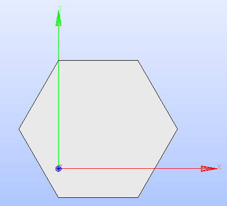

   Hexagon displayed in the *SALOME* 3D viewer.

As mentioned in :ref:`geom-def`, Euclidean transformations are common to all
classes of |TOOL| that inherit from :py:class:`Layout<glow.geometry_layouts.layout.Layout>`.
The :py:class:`Surface<glow.geometry_layouts.geometries.Surface>` class provides
a specific implementation for these methods that is shared by all its subclasses.
In particular, the :py:meth:`rotate()<glow.geometry_layouts.geometries.Surface.rotate>`,
:py:meth:`translate()<glow.geometry_layouts.geometries.Surface.translate>` and
:py:meth:`scale()<glow.geometry_layouts.geometries.Surface.scale>` methods
apply a rotation, translation and scaling, respectively, to the *GEOM* elements
of the :py:class:`Surface<glow.geometry_layouts.geometries.Surface>` instance.

For the hexagonal surface declared above, the code instructions are the
following:

.. code-block:: python

  surface.rotate(90)
  surface.translate((0.0, 0.0, 0.0))
  surface.scale(0.5)
  surface.show()

By applying these methods, the resulting *GEOM* face is shown in :numref:`hex-transf`,
and compared with the original shape.

.. _hex-transf:
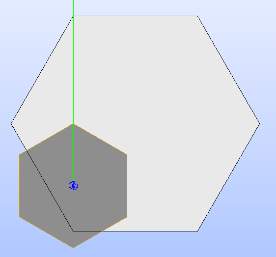

   Hexagon before and after applying rotation, traslation and scaling operations.

The *GEOM* face that is specific of the subclass of
:py:class:`Surface<glow.geometry_layouts.geometries.Surface>` can be directly
modified within *SALOME* and the modified *GEOM* face applied to the
:py:class:`Surface<glow.geometry_layouts.geometries.Surface>` subclass object
by calling the method :py:meth:`update()<glow.geometry_layouts.geometries.Surface.update>`.
The implementation of this method is specific for each of the subclasses of
:py:class:`Surface<glow.geometry_layouts.geometries.Surface>`. In general, the
method receives as parameter a *GEOM* face and updates the instance attributes
of :py:class:`Surface<glow.geometry_layouts.geometries.Surface>` accordingly.
A check ensures that only *GEOM* faces are provided, and that the given *GEOM*
face corresponds to the characteristic surface the
:py:class:`Surface<glow.geometry_layouts.geometries.Surface>` class refers to.

Region Definition
^^^^^^^^^^^^^^^^^

In |TOOL|, the geometry layouts are described as a hierarchical tree in which
the *regions* are the *leaves*.
The class that implements the *region* concept is :py:class:`Region<glow.geometry_layouts.layouts.Region>`.
This class represents any 2D shape bounded by one or two edges that is filled
by a set of properties, e.g. the material. Properties are expressed as a
dictionary of items of the :py:class:`PropertyType<glow.support.types.PropertyType>`
enumeration vs the corresponding names.
As any other geometric object in |TOOL|, the :py:class:`Region<glow.geometry_layouts.layouts.Region>`
class inherits from a subclass of the :py:class:`GeomWrapper<glow.interface.geom_entities.GeomWrapper>`,
specifically the :py:class:`Face<glow.interface.geom_entities.Face>` one.
This guarantees that :py:class:`Region<glow.geometry_layouts.layouts.Region>`
instances behave like the corresponding *GEOM* face objects when used with
*GEOM* functions.
As mentioned in :ref:`geom-def`, the :py:class:`Region<glow.geometry_layouts.layouts.Region>`
is a subclass of :py:class:`Layout<glow.geometry_layouts.layouts.Layout>`,
meaning it provides the implementation for all the methods handling Euclidean
transformations, displaying and updating the region.
In addition, to enable the visualisation of the regions of a layout according
to a property type colour map, :py:class:`Region<glow.geometry_layouts.layouts.Region>`
objects come with a dedicated ``color`` attribute and methods for setting
(:py:meth:`set_region_color()<glow.geometry_layouts.Region.set_region_color>`)
and resetting (:py:meth:`reset_region_color()<glow.geometry_layouts.Region.reset_region_color>`)
the colour according to which it is displayed in the 3D viewer of *SALOME*.
When the region's colour is reset, it is assigned the default RGB colour used
by *SALOME*, which corresponds to a light grey.
The :py:class:`Region<glow.geometry_layouts.layouts.Region>` class comes also
with the :py:meth:`clone()<glow.geometry_layouts.Region.clone>` method for
producing a copy of the instance that is completely independent from the source
instance, but has the same properties and colour.

The Boolean algebra provided by overloading the arithmetic operators of Python
in the :py:class:`GeomWrapper<glow.interface.geom_entities.GeomWrapper>` class
is complemented in the :py:class:`Region<glow.geometry_layouts.layouts.Region>`
class by providing specific implementations for the following operators:

  - ``+`` (``__add__``) fuses the *GEOM* faces of one or more *regions* while
    keeping the same properties. Both *regions* must have the same values for
    the properties.
  - ``*`` (``__mul__``) produces the common (intersection) part of the *GEOM*
    faces of two *regions* while keeping the same properties of the region that
    intersects the first one.

The instantiation of a :py:class:`Region<glow.geometry_layouts.layouts.Region>`
object is based on a *GEOM* face, but it also accepts an instance of the
:py:class:`Surface<glow.geometry_layouts.geometries.Surface>` class as it
accesses to the wrapped *GEOM* face.
The following snippet shows the creation of two *regions* with dedicated
properties, the assignment of a colour and their visualisation in the 3D
viewer. The association of colours to *regions* according to the values of a
given :py:class:`PropertyType<glow.support.types.PropertyType>` is performed
by means of the :py:func:`associate_colors_to_regions()<glow.geometry_layouts.layouts.associate_colors_to_regions>`.
:numref:`regions-bool` shows the result of applying the Boolean operations,
identified by the arithmetic operators, to the two *regions*.

.. code-block:: python

    from glow import *

    # Instantiation of the two regions
    r1 = Region(
      Hexagon(), "R1", {PropertyType.MATERIAL: "MAT1"}
    )
    r2 = Region(
      Hexagon(center=(1,1,0), edge_length=2.0),
      "R2",
      {PropertyType.MATERIAL: "MAT2"}
    )

    # Get the common part
    r3 = r2 * r1
    r3.name = "R3"
    # Clone the first region and set its material to be
    # the one of the second region
    r4 = r1.clone()
    r4.name = "R4"
    r4.properties[PropertyType.MATERIAL] = "MAT2"
    # Fuse the second and fourth regions
    r5 = r2 + r4
    r5.name = "R5"
    # Associate colours to the regions according to the material
    regions = [r1, r2, r3, r4, r5]
    associate_colors_to_regions(PropertyType.MATERIAL, regions)
    for region in regions:
      set_color_face(region.geom_obj, region.color)

    # Display all the regions
    r1.show()
    r2.show()
    r3.show()
    r4.show()
    r5.show()

.. _regions-bool:
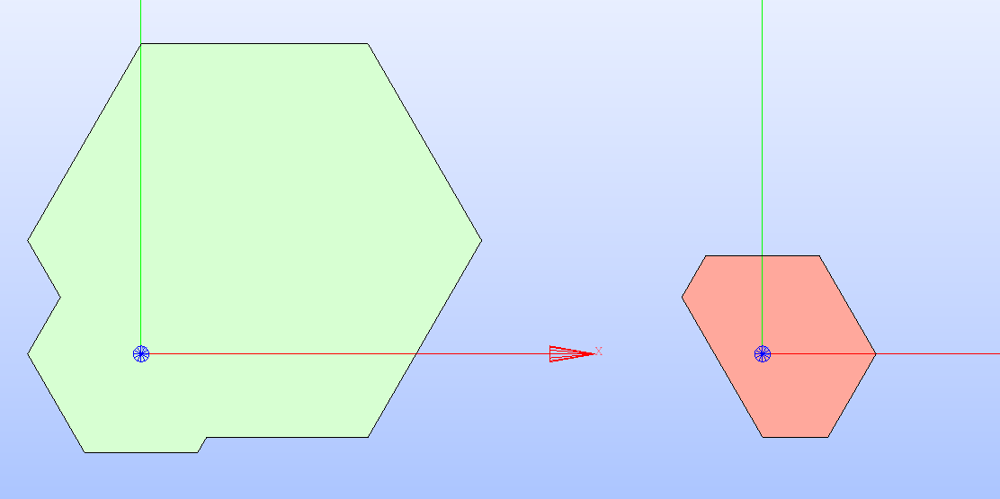

   Region resulting from fusing (on the left) and intersecting (on the right)
   two *regions*.

Fillable Definition
^^^^^^^^^^^^^^^^^^^

According to the hierarchical tree logic adopted in |TOOL|, classes that inherit
from the :py:class:`Fillable<glow.geometry_layouts.fillable_layouts.Fillable>`
class are the *nodes* in the tree, as they represent a container for other
*nodes* or *leaves*. The superimposition of multiple *layers* filled with
either :py:class:`Region<glow.geometry_layouts.layouts.Region>` or other
:py:class:`Fillable<glow.geometry_layouts.fillable_layouts.Fillable>` objects
recreates the hierarchical structure.

:py:class:`Fillable<glow.geometry_layouts.fillable_layouts.Fillable>` inherits
from the :py:class:`Compound<glow.interface.geom_entities.Compound>` wrapper
class, as it represents a collection of *GEOM* faces. In addition, it can be
used as argument of the *GEOM* functions directly, as it behaves like the
corresponding *GEOM* compound object when used with *GEOM* functions.
As mentioned in :ref:`geom-def`, :py:class:`Fillable<glow.geometry_layouts.fillable_layouts.Fillable>`
is a subclass of :py:class:`Layout<glow.geometry_layouts.layouts.Layout>`,
meaning it provides the implementation for all the methods handling Euclidean
transformations, displaying and updating the layout it refers to.

The class :py:class:`Fillable<glow.geometry_layouts.fillable_layouts.Fillable>`
declares attributes and methods common to all its subclasses.
Public methods cover the following functionalities:

  - adding a new *region* or *fillable* to the geometry layout;
  - applying a specific symmetry type to the geometry layout;
  - cloning the instance;
  - getting the compound of edges that corresponds to a given item of the
    :py:class:`GeometryType<glow.support.types.GeometryType>` enumeration;
  - getting the :py:class:`Region<glow.geometry_layouts.layouts.Region>` objects
    the geometry layout (either full or the one corresponding to a specific
    symmetry) is made of;
  - printing information about a *region*, either given or selected from the
    *SALOME* GUI;
  - restoring the geometry layout;
  - rotating, scaling and translating the instance;
  - setting the properties of a *region*, either given or selected from the
    *SALOME* GUI;
  - displaying the geometry layout in the 3D viewer;
  - updating the ``GEOM_Object`` the instance refers to;
  - updating the hierarchical structure of the instance.

Adding a new layout
"""""""""""""""""""

The method :py:meth:`add()<glow.geometry_layouts.fillable_layouts.Fillable.add>`
allows for the inclusion of a new :py:class:`Region<glow.geometry_layouts.layouts.Region>`
or :py:class:`Fillable<glow.geometry_layouts.fillable_layouts.Fillable>` object
to the hierarchical tree that describes the technological geometry layout of
the current *fillable*.
Users can provide also the XYZ coordinates at which the object should be placed
at, as well as the index of the *layer* in which the object is added.
A translation is performed, if needed, to place the *layout* object so that its
CDG coincides with the given coordinates. If no position is provided, the
*layout* object is placed in the CDG of the current *fillable*.

The given *layout* object is stored at the last position of the *layer*
identified the given index, if any is provided. This means that the object is
added as last element of the sublist of the :py:attr:`layers<glow.geometry_layouts.fillable_layouts.Fillable.layers>`
attribute the given index corresponds to.
If no index is provided, the *layout* object is added to a new sublist of
:py:attr:`layers<glow.geometry_layouts.fillable_layouts.Fillable.layers>`.

This method simply updates the list of layers of the technological geometry
layout of the current *fillable* with the given *layout* object without
collapsing the *layers* and updating the entire *GEOM* compound object.
To update the hierarchical tree of the *fillable* by cutting overlapping layers,
the method :py:meth:`update_hierarchical_structure()<glow.geometry_layouts.fillable_layouts.Fillable.update_hierarchical_structure>`
should be called. To update and display the *fillable* in the 3D viewer of
*SALOME*, the method :py:meth:`show()<glow.geometry_layouts.fillable_layouts.Fillable.show>`
should be run instead.

The following snippet shows the usage of the method :py:meth:`add()<glow.geometry_layouts.fillable_layouts.Fillable.add>`
when applied to a :py:class:`CartesianCell<glow.geometry_layouts.cells.CartesianCell>`
to include:

  - a circular :py:class:`Region<glow.geometry_layouts.layouts.Region>` object,
    being a *region* of material;
  - a :py:class:`CartesianLattice<glow.geometry_layouts.lattices.CartesianLattice>`
    object, to model an assembly of cells. For the construction of a Cartesian
    lattice, see :ref:`lattice-def`.

Results are shown in :numref:`fillable-add` for both a single cell and an
assembly.

.. code-block:: python

    from glow import *

    # Instantiation of a circular region, a cell and a lattice of cells
    r1 = Region(
      Circle(radius=0.3), "R1", {PropertyType.MATERIAL: "MAT1"}
    )
    cell = CartesianCell(base_props={PropertyType.MATERIAL: "MAT2"})
    cell.add(r1)
    lattice = CartesianLattice()
    lattice.add_rings_of_cells(cell, 3)

    # Instantiate the cell representing the assembly
    assembly = CartesianCell(
      width_height=tuple(i+1 for i in lattice.dimensions),
      base_props={PropertyType.MATERIAL: "MAT2"}
    )
    # Add the lattice to the assembly cell
    assembly.add(lattice)

.. _fillable-add:
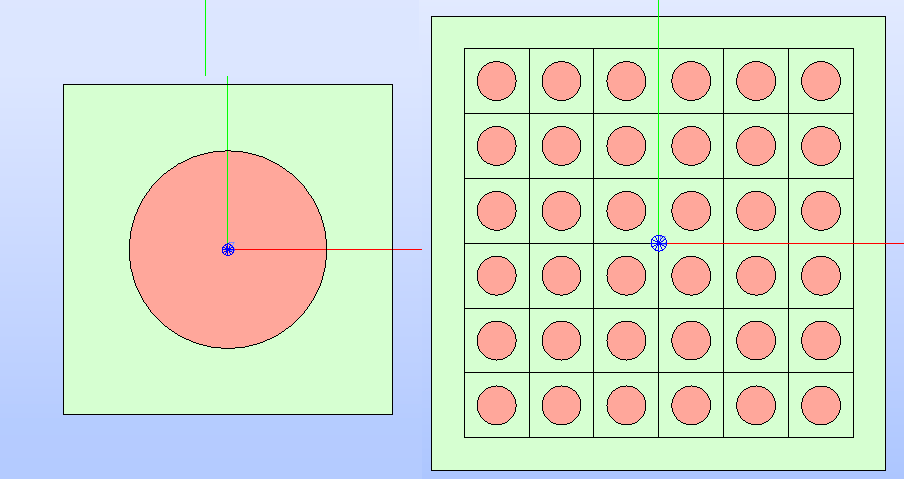

   Technological geometry layout after adding a single :py:class:`Region<glow.geometry_layouts.layouts.Region>`
   (on the left) and a *fillable* :py:class:`CartesianLattice<glow.geometry_layouts.lattices.CartesianLattice>`
   (on the right).

Applying a symmetry
"""""""""""""""""""

Solving the Boltzmann transport equation on a full geometry layout can be
computationally expensive, in particular if very complex.
To speed up the calculations, users can rely on cuts to extract parts out of
the existing layout, thereby isolating the minimum portion of the geometry
required to describe the entire pattern.
|TOOL| supports the application of specific types of symmetries to any *fillable*
object that inherits from :py:class:`Fillable<glow.geometry_layouts.fillable_layouts.Fillable>`.

The method :py:meth:`apply_symmetry()<glow.geometry_layouts.fillable_layouts.Fillable.apply_symmetry>`
allows users to apply a symmetry type by indicating an item of the enumeration
:py:class:`SymmetryType<glow.support.types.SymmetryType>`.
According to the type, the 2D shape that identifies the symmetry is derived and
stored in the :py:attr:`symmetry_map<glow.geometry_layouts.fillable_layouts.Fillable.symmetry_map>`
instance attribute; this is a dictionary associating to each :py:class:`SymmetryType<glow.support.types.SymmetryType>`
element the corresponding :py:class:`Surface<glow.geometry_layouts.geometries.Surface>`
instance.
The indicated symmetry type is saved in the :py:attr:`state<glow.geometry_layouts.fillable_layouts.Fillable.state>`
attribute and applied when the current *fillable* is displayed in the 3D viewer
or exported to file in the *TDT*-compatible format.
In both cases, a *common* operation is performed between the :py:class:`Region<glow.geometry_layouts.layouts.Region>`
objects identifying the entire geometry layout and the shape of the symmetry.
Only the *regions* and parts of them that are in common are kept and either
displayed or exported.

The method :py:meth:`apply_symmetry()<glow.geometry_layouts.fillable_layouts.Fillable.apply_symmetry>`
only supports a set of :py:class:`SymmetryType<glow.support.types.SymmetryType>`
elements that are common to all *fillable* objects. These types are the
following ones:

  - :py:attr:`FULL<glow.support.types.SymmetryType.FULL>`: the characteristic
    shape of the entire layout is stored.
  - :py:attr:`HALF<glow.support.types.SymmetryType.HALF>`: a rectangular shape
    representing half of the entire layout is stored.
  - :py:attr:`QUARTER<glow.support.types.SymmetryType.QUARTER>`: a rectangular
    shape representing one quarter of the entire layout.

Subclasses of :py:class:`Fillable<glow.geometry_layouts.fillable_layouts.Fillable>`
provide the implementation to handle type-specific symmetries.

The following code snippet shows the application of a :py:attr:`QUARTER<glow.support.types.SymmetryType.QUARTER>`
symmetry type for a Cartesian assembly. The result is shown in :numref:`quarter-symm`.

.. code-block:: python

  assembly.apply_symmetry(SymmetryType.QUARTER)

.. _quarter-symm:
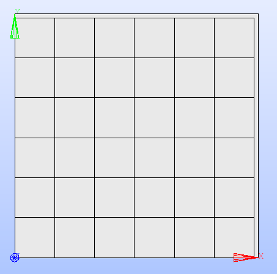

   Cartesian lattice after applying the :py:attr:`QUARTER<glow.support.types.SymmetryType.QUARTER>`
   type of symmetry.

Users should note that even if called from the *SALOME* Python console, the
method :py:meth:`apply_symmetry()<glow.geometry_layouts.fillable_layouts.Fillable.apply_symmetry>`
does not automatically update and display the portion of the geometry layout
that corresponds to the applied symmetry. To display the new layout, the method
:py:meth:`show()<glow.geometry_layouts.fillable_layouts.Fillable.show>` must
always be called.
In addition, the last applied symmetry is not used when the current
:py:class:`Fillable<glow.geometry_layouts.fillable_layouts.Fillable>` object
is exported. It is up to the user to indicate the symmetry type to the function
exporting the layout (see :ref:`layout-export`).

Cloning the *fillable* instance
"""""""""""""""""""""""""""""""

The :py:class:`Fillable<glow.geometry_layouts.fillable_layouts.Fillable>` class
comes with the :py:meth:`clone()<glow.geometry_layouts.fillable_layouts.Fillable.clone>`
method for producing a copy of the current instance that is completely
independent from the source instance. In Python terms, this means making a
*deep* copy. This allows the mutable attributes (e.g., lists and dictionaries)
of a cloned *fillable* to be unlinked from the source *fillable*. This means
that modifications to a mutable attribute in one *fillable* are not also
performed in the corresponding attribute of the other *fillable*.

Getting the geometry type edges
"""""""""""""""""""""""""""""""

As mentioned in :ref:`geom-def`, :py:class:`Fillable<glow.geometry_layouts.fillable_layouts.Fillable>`
objects are described in terms of the *technological geometry*, collecting the
*regions* each associated to a material, and the *sectorised geometry*, which
represents the refinement of the former geometry layout.

The :py:class:`Fillable<glow.geometry_layouts.fillable_layouts.Fillable>` class
stores the refined geometry layout as a :py:class:`Compound<glow.interface.geom_entities.Compound>`
object collecting the edges that subdivide the *regions* resulting by applying
a sectorisation (see :ref:`sectorisation`).

Since a :py:class:`Fillable<glow.geometry_layouts.fillable_layouts.Fillable>`
object possesses a hierarchical structure, when displaying the root *fillable*
in terms of the *sectorised geometry* (see :ref:`show`), the :py:class:`Compound<glow.interface.geom_entities.Compound>`
objects identifying the *sectorised geometry* of all the *fillables* in the
hierarchy tree of the current istance are retrieved.
The method :py:meth:`get_geometry_map()<glow.geometry_layouts.fillable_layouts.Fillable.get_geometry_map>`
iterates over all the tree to collect all the *sectorised geometries* in a single
:py:class:`Compound<glow.interface.geom_entities.Compound>` object of edges.
This method is useful for updating the :py:attr:`geometry_maps<glow.geometry_layouts.fillable_layouts.Fillable.geometry_maps>`,
a dictionary associating for each element of the :py:class:`GeometryType<glow.support.types.GeometryType>`
the corresponding :py:class:`Compound<glow.interface.geom_entities.Compound>`
object of edges. Currently, it can stores only the edges of the *sectorised
geometry*.

The following snippet shows how to update the compound of edges corresponding
to the :py:attr:`SECTORIZED<glow.support.types.GeometryType.SECTORIZED>` type
of geometry when a sectorisation has already been applied to a
:py:class:`Cell<glow.geometry_layouts.cells.Cell>` instance.

.. code-block:: python

  # Collect the refined geometry of the cells and join it with the mesh
  # by performing a partition
  assembly.geometry_maps[GeometryType.SECTORIZED] = \
      assembly.get_geometry_map(GeometryType.SECTORIZED) // wrap_shape(mesh)

  # Show the resulting refined layout with the 'MATERIAL' colour map
  assembly.show(PropertyType.MATERIAL, GeometryType.SECTORIZED)

For a deeper insight, please refer to the :ref:`symmetry-example` use case in
the :ref:`tutorials` section (see :numref:`assembly-refined` for the resulting
refined geometry).

Getting the regions
"""""""""""""""""""

In |TOOL|, objects of the :py:class:`Region<glow.geometry_layouts.layouts.Region>`
class represent the *leaves* of the hierarchical tree of a *fillable* object.
When an instance of the :py:class:`Fillable<glow.geometry_layouts.fillable_layouts.Fillable>`
subclasses is either displayed or exported, |TOOL| automatically retrieves the
*regions* of the technological geometry.
The methods :py:meth:`get_regions()<glow.geometry_layouts.fillable_layouts.Fillable.get_regions>`
and :py:meth:`get_regions_with_symmetry()<glow.geometry_layouts.fillable_layouts.Fillable.get_regions_with_symmetry>`
serve to this purpose.
The former method iterates over all the *layers* of the current *fillable* to
collect and return all the :py:class:`Region<glow.geometry_layouts.layouts.Region>`
objects that describe the technological geometry layout.
The *regions* are collected directly from the current *fillable* and by
recursively calling the :py:meth:`get_regions()<glow.geometry_layouts.fillable_layouts.Fillable.get_regions>`
method for all the :py:class:`Fillable<glow.geometry_layouts.fillable_layouts.Fillable>`
objects in the hierarchy.

The method :py:meth:`get_regions_with_symmetry()<glow.geometry_layouts.fillable_layouts.Fillable.get_regions_with_symmetry>`
similarly retrieves the *regions* of the technological geometry, with the
difference that only those in common with the shape of the indicated symmetry
type are returned.

Printing regions information
""""""""""""""""""""""""""""

When the geometry layout of a *fillable* is displayed in the 3D viewer of
*SALOME*, |TOOL| retrieves and adds to the *SALOME* study the *GEOM* face of
all the :py:class:`Region<glow.geometry_layouts.layouts.Region>` objects
that identify the technological geometry.

Users can obtain information about the :py:class:`Region<glow.geometry_layouts.layouts.Region>`
object that corresponds to either the given *GEOM* face or the one currently
selected in the 3D viewer.
The method :py:meth:`print_region_info()<glow.geometry_layouts.fillable_layouts.Fillable.print_region_info>`,
when called directly in the Python console of *SALOME*, prints the following
data (see :numref:`reg-info`):

  - the tree representation of the hierarchical structure up to the target
    :py:class:`Region<glow.geometry_layouts.layouts.Region>` object;
  - the code to retrieve the target :py:class:`Region<glow.geometry_layouts.layouts.Region>`
    object directly from the hierarchical tree of the current *fillable*;
  - the values for each of the :py:class:`PropertyType<glow.support.types.PropertyType>`
    items associated to the target :py:class:`Region<glow.geometry_layouts.layouts.Region>`
    object.

.. _reg-info:
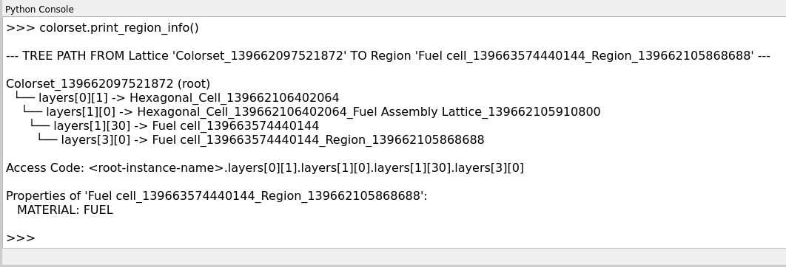

   Information about the :py:class:`Region<glow.geometry_layouts.layouts.Region>`
   object that corresponds to the *GEOM* face of the *fillable* currently
   selected in the 3D viewer of *SALOME*.

Restoring the geometry layout
"""""""""""""""""""""""""""""

There could be cases in which users need to reset the technological geometry
of a *fillable* by removing all the *regions* and clearing all the properties
(see :ref:`tutorial-overlap`).
The :py:meth:`restore()<glow.geometry_layouts.fillable_layouts.Fillable.restore>`
method addresses this need by clearing the :py:attr:`layers<glow.geometry_layouts.fillable_layouts.Fillable.layers>`
attribute from any :py:class:`Region<glow.geometry_layouts.layouts.Region>`
and :py:class:`Fillable<glow.geometry_layouts.fillable_layouts.Fillable>` object
previously stored.
In addition, any symmetry and geometry types mappings (i.e. the
:py:attr:`symmetry_map<glow.geometry_layouts.fillable_layouts.Fillable.symmetry_map>`
and the :py:attr:`geometry_maps<glow.geometry_layouts.fillable_layouts.Fillable.geometry_maps>`
attributes) are completely cleared.

A *GEOM* face object is built from the shape of the technological geometry of
the *fillable* to restore; the :py:attr:`layers<glow.geometry_layouts.fillable_layouts.Fillable.layers>`
and the :py:attr:`regions<glow.geometry_layouts.fillable_layouts.Fillable.regions>`
attributes are filled only with the :py:class:`Region<glow.geometry_layouts.layouts.Region>`
object built from this *GEOM* face. However,no properties are associated to
this new *region*.

Applying Euclidean transformations
""""""""""""""""""""""""""""""""""

As mentioned in :ref:`geom-def`, Euclidean transformations are common to all
classes of |TOOL| that inherit from :py:class:`Layout<glow.geometry_layouts.layout.Layout>`.
The :py:class:`Fillable<glow.geometry_layouts.fillable_layouts.Fillable>` class
provides a specific implementation for these methods that is shared by all its
subclasses.

In particular, the :py:meth:`rotate()<glow.geometry_layouts.fillable_layouts.Fillable.rotate>`,
:py:meth:`translate()<glow.geometry_layouts.geometries.fillable_layouts.Fillable.translate>`
and :py:meth:`scale()<glow.geometry_layouts.geometries.fillable_layouts.Fillable.scale>`
methods apply a rotation, translation and scaling, respectively, to the following
elements:

  - the py:class:`Region<glow.geometry_layouts.layouts.Region>` and
    py:class:`Fillable<glow.geometry_layouts.fillable_layouts.Fillable>` objects
    stored in the :py:attr:`layers<glow.geometry_layouts.fillable_layouts.Fillable.layers>`
    attribute;
  - the ``GEOM_Object`` the current *fillable* refers to;
  - the :py:class:`Compound<glow.interface.geom_entities.Compound>` objects
    of the :py:attr:`geometry_maps<glow.geometry_layouts.fillable_layouts.Fillable.geometry_maps>`
    attribute;
  - the :py:class:`Face<glow.interface.geom_entities.Face>` objects of the
    :py:attr:`symmetry_map<glow.geometry_layouts.fillable_layouts.Fillable.symmetry_map>`
    attribute.

Users should note that even if called from the *SALOME* Python console, the
methods applying the Euclidean transformations does not automatically display
the updated geometry layout. To do so, the method :py:meth:`show()<glow.geometry_layouts.fillable_layouts.Fillable.show>`
must always be called.

Setting properties
""""""""""""""""""

Values for the elements of the :py:class:`PropertyType<glow.support.types.PropertyType>`
enumeration are associated to the :py:class:`Region<glow.geometry_layouts.layouts.Region>`
objects that constitute a *fillable*.
In |TOOL|, properties are assigned directly when instantianting a
:py:class:`Region<glow.geometry_layouts.layouts.Region>` object, a
:py:class:`Cell<glow.geometry_layouts.cells.Cell>` one or any of its subclasses.
In case of a :py:class:`Cell<glow.geometry_layouts.cells.Cell>`, properties are
assigned to the :py:class:`Region<glow.geometry_layouts.layouts.Region>` object
built from the characteristic shape of the cell.

To handle the need for setting or updating the value for a specific property
type of a :py:class:`Region<glow.geometry_layouts.layouts.Region>` object
belonging to the hierarchical tree of the current *fillable*, the method
:py:meth:`set_region_properties()<glow.geometry_layouts.fillable_layouts.Fillable.set_region_properties>`
is available for all subclasses of :py:class:`Fillable<glow.geometry_layouts.fillable_layouts.Fillable>`.

This method allows users to set values for the indicated property types for
the :py:class:`Region<glow.geometry_layouts.layouts.Region>` object of the
*fillable* whose *GEOM* face is provided as input. If none is given, the *GEOM*
face currently selected in the 3D viewer is considered.
The whole hierarchical tree of the *fillable* is traversed to find the
:py:class:`Region<glow.geometry_layouts.layouts.Region>` object that matches
the *GEOM* face. If found, the corresponding :py:attr:`properties<glow.geometry_layouts.layouts.Region.properties>`
attribute is updated.

The following code snippet shows how to set values for the
:py:attr:`MATERIAL<glow.support.types.PropertyType.MATERIAL>` type of property
to a circular *region* whose properties was not defined at its instantiation.
For the construction of a Cartesian cell, see :ref:`cell-def`.

.. code-block:: python

  # Build the cell's geometry layout by adding two circular regions
  cell = CartesianCell(
      name="Cartesian cell", base_props={PropertyType.MATERIAL: "MAT_1"}
  )
  for radius, mat in zip([0.4, 0.3], ["MAT_2", "MAT_3"]):
      cell.add(
          Region(
            Circle(radius=radius), properties={PropertyType.MATERIAL: mat}
          )
      )
  # Add a new circular region without any property
  circle = Circle(radius=0.2)
  cell.add(Region(circle))
  # Set the circular region properties
  cell.set_region_properties(
    {PropertyType.MATERIAL: "MAT_4"}, circle
  )
  # Display the cell
  cell.show(PropertyType.MATERIAL)

In particular, materials are assigned to the characteristic shape of the Cartesian
cell and to the *regions* directly.
A new circular *region* is then added, and the corresponding
:py:class:`Circle<glow.geometry_layouts.geometries.Circle>` instance is used to
identify the *region* of the cell whose material property needed to be assigned.
From within the *SALOME* 3D viewer, the *region* can be provided by simply
selecting the corresponding *GEOM* face and calling the method from the
integrated Python console.
In any case, the cell's geometry layout with the :py:attr:`MATERIAL<glow.support.types.PropertyType.MATERIAL>`
colour map is shown in :numref:`cell-after-props`.

.. _cell-after-props:
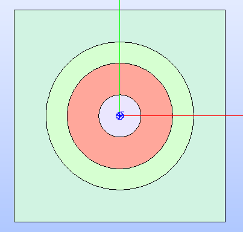

   Cartesian cell after setting up values for the :py:attr:`MATERIAL<glow.support.types.PropertyType.MATERIAL>`
   property type for each region. It is shown with a colour map highlighting
   the different values assigned to the cell's *regions*.

Displaying the geometry layout
""""""""""""""""""""""""""""""

The geometry layout of any of the :py:class:`Fillable<glow.geometry_layouts.fillable_layouts.Fillable>`
subclasses can be displayed in the 3D viewer of *SALOME* by calling the method
:py:meth:`show()<glow.geometry_layouts.fillable_layouts.Fillable.show>`.
This method erases all the previously shown *GEOM* objects from the view, and
removes the *GEOM* compound that corresponds to the technological geometry
layout of the current *fillable*. Its hierarchical tree is then updated, if
needed, to cut any overlapping layer still not handled.
The ``GEOM_Object`` (i.e. a *GEOM* compound) that corresponds to the
technological geometry layout of the current *fillable* is added to the
*SALOME study* and displayed in the 3D viewer.

In addition, the method retrieves the :py:class:`Region<glow.geometry_layouts.layouts.Region>`
objects (which are representative of the technological geometry layout), and,
if necessary, applies the *common* operation with the currently active type of
symmetry.
The *GEOM* face of each *region* is added to the *SALOME study* and included in
the *Object Browser* as children of the ``GEOM_Object`` of the *fillable*.
If not displayed automatically, these *GEOM* faces can be shown all at once by
selecting the "*Show Only Children*" item in the contextual menu (see
:numref:`show-children`).

.. _show-children:
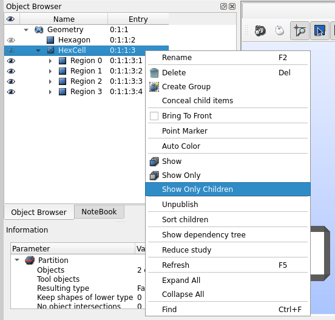

   How to display the *regions* associated to a cell in *SALOME*.

The :py:meth:`show()<glow.geometry_layouts.fillable_layouts.Fillable.show>`
method displays the *regions* according to a colour map based on the values
assigned to each *region* for the provided element of the enumeration
:py:class:`PropertyType<glow.support.types.PropertyType>`.
The RGB colours of the map are randomly generated and uniquely associated
to the values of the indicated element of :py:class:`PropertyType<glow.support.types.PropertyType>`
that each *region* stores in the :py:attr:`properties<glow.geometry_layouts.layouts.Region.properties>`
attribute.
If no property type is provided, the *regions* are displayed with a default colour.

By default, the :py:meth:`show()<glow.geometry_layouts.fillable_layouts.Fillable.show>`
method displays the *regions* of the technological geometry. If a different item
of the :py:class:`GeometryType<glow.support.types.GeometryType>` enumeration is
given (i.e. the :py:attr:`SECTORIZED<glow.support.types.GeometryType.SECTORIZED>`
one), the method also shows the :py:class:`Compound<glow.interface.geom_entities.Compound>`
of edges of the refined geometry.
This :py:class:`Compound<glow.interface.geom_entities.Compound>` object is
retrieved from the refined geometry layouts of all the *fillable* objects in
the hierarchical tree of the current one, extracting the common part with the
shape of the symmetry currently applied, if needed.
The resulting *GEOM* compound is added to the *SALOM study*, and, in the *Object
Browser*, appears as a child of the ``GEOM_Object`` of the *fillable*.

The following code snippet shows how to display the refined geometry layout of
a :py:class:`HexCell<glow.geometry_layouts.cells.HexCell>` instance by applying
a colour map according to the :py:attr:`MATERIAL<glow.support.types.PropertyType.MATERIAL>`
property type. :numref:`cell-mat` presents the resulting geometry layout as
displayed in the 3D viewer of *SALOME*.

.. code-block:: python

  hex_cell.show(PropertyType.MATERIAL, GeometryType.SECTORIZED)

.. _cell-mat:
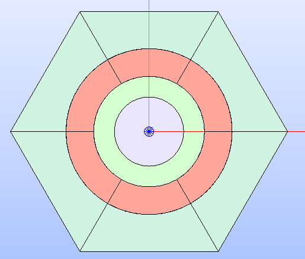

   Refined geometry layout of a hexagonal cell. Regions are displayed according
   to the :py:attr:`MATERIAL<glow.support.types.PropertyType.MATERIAL>` colour
   map.

By default, the :py:meth:`show()<glow.geometry_layouts.fillable_layouts.Fillable.show>`
method automatically displays the *GEOM* faces of all the
:py:class:`Region<glow.geometry_layouts.layouts.Region>` objects of the *fillable*.
If specified differently by providing a boolean flag with value ``False``, this
method only adds the *GEOM* faces for the *regions* and the *GEOM* compound of
edges of the refined geometry layout to the *SALOME study* without triggering
their visualisation in the 3D viewer.
This setting can be used to avoid overheads when geometry layouts characterised
by many *GEOM* face objects are shown in *SALOME*.

Updating the ``GEOM_Object``
""""""""""""""""""""""""""""

The method :py:meth:`update()<glow.geometry_layouts.fillable_layouts.Fillable.update>`
allows users to update the ``GEOM_Object`` of the :py:class:`Fillable<glow.geometry_layouts.fillable_layouts.Fillable>`
instance with another ``GEOM_Object`` provided in terms of a
:py:class:`Compound<glow.interface.geom_entities.Compound>` or a
:py:class:`Face<glow.interface.geom_entities.Face>` object.
This method also updates the centre of the layout (i.e. the
:py:attr:`o<glow.geometry_layouts.fillable_layouts.Fillable.o>` attribute) and
any :py:class:`Compound<glow.interface.geom_entities.Compound>` object of edges
associated to a :py:class:`GeometryType<glow.support.types.GeometryType>` item.

Users should note that this method does not update the *regions* and *fillables*
stored in the :py:attr:`layers<glow.geometry_layouts.fillable_layouts.Fillable.layers>`
attribute accordingly with the updated ``GEOM_Object``.

Updating the hierarchical tree
""""""""""""""""""""""""""""""

As described in :ref:`geom-def`, the building concept of |TOOL| is based on the
*layers* logic to model the hierarchical tree of a *fillable*.
Whenever objects of the :py:class:`Fillable<glow.geometry_layouts.fillable_layouts.Fillable>`
subclasses are displayed in the 3D viewer of *SALOME* or exported to file in
the *TDT*-compatible format, the method :py:meth:`update_hierarchical_structure()<glow.geometry_layouts.fillable_layouts.Fillable.update_hierarchical_structure>`
is automatically called.

This method traverses the entire hierarchical tree in reverse order to handle
any *region* and *fillable* of a layer that is overlapped by a layer in a higher
position along the conceptual Z-axis brought by the :py:attr:`layers<glow.geometry_layouts.fillable_layouts.Fillable.layers>`
attribute.
During this traversal, any *region* or *fillable* that is overlapped by a higher
layer is either clipped (if partially overlapped) or removed entirely from the
hierarchical tree (if fully covered).

This operation is skipped and the method exits without changes if there is no
need to update the layers of the *fillable*. This happens if the
:py:attr:`is_update_needed<glow.geometry_layouts.layouts.LayoutState.is_update_needed>`
value of the :py:attr:`state<glow.geometry_layouts.fillable_layouts.Fillable.state>`
attribute is ``False``.

The operation of assembling all the layers requires that each *node* in the
hierarchical tree is up-to-date. This means that each :py:class:`Fillable<glow.geometry_layouts.fillable_layouts.Fillable>`
object found in the :py:attr:`layers<glow.geometry_layouts.fillable_layouts.Fillable.layers>`
attribute is further processed by recursively calling this method to update its
hierarchical structure.

Lastly, the ``GEOM_Object`` representative of the current *fillable* is updated
by collecting in a *GEOM* compound all the :py:class:`Region<glow.geometry_layouts.layouts.Region>`
objects retrieved from each layer.

To simplify the hierarchical tree, a ``True`` value can be provided to the
:py:meth:`update_hierarchical_structure()<glow.geometry_layouts.fillable_layouts.Fillable.update_hierarchical_structure>`
method. If so, the hierarchical tree of the *fillable* is collapsed and its
layers reduced to a sigle layer collecting all the :py:class:`Region<glow.geometry_layouts.layouts.Region>`
objects of the *fillable*.
Users should note that any previously stored :py:class:`Fillable<glow.geometry_layouts.fillable_layouts.Fillable>`
object is completely removed from the hierarchical tree and substituted with its
:py:class:`Region<glow.geometry_layouts.layouts.Region>` objects.

.. _cell-def:

Cell Definition
^^^^^^^^^^^^^^^

|TOOL| comes with classes to build cells having a generic, a hexagonal or a
rectangular characteristic *surface*.
The module :py:mod:`glow.geometry_layouts.cells` provides the base class
:py:class:`Cell<glow.geometry_layouts.cells.Cell>`, which represents a cell
characterised by a generic 2D shape, described from a
:py:class:`Surface<glow.geometry_layouts.geometries.Surface>` instance, or any
of its subclasses.

In |TOOL|, according to the hierarchical tree logic, cells are the *nodes* as
they inherit from the :py:class:`Fillable<glow.geometry_layouts.fillable_layouts.Fillable>`
class.

The :py:class:`Cell<glow.geometry_layouts.cells.Cell>` class inherits from the
:py:class:`Fillable<glow.geometry_layouts.fillable_layouts.Fillable>` class which

The subclasses of :py:class:`Cell<glow.geometry_layouts.cells.Cell>` are the
following ones:

  - class :py:class:`CartesianCell<glow.geometry_layouts.cells.CartesianCell>`
    for representing rectangular cells.
  - class :py:class:`HexCell<glow.geometry_layouts.cells.HexCell>` for
    representing hexagonal cells.

When instantiating any of the aforementioned subclasses, the corresponding
instance of the :py:class:`Surface<glow.geometry_layouts.geometries.Surface>`
subclasses is built from the characteristic dimensions.
For the generic :py:class:`Cell<glow.geometry_layouts.cells.Cell>` class, the
initialisation is done from any 2D shape, instance of the
:py:class:`Surface<glow.geometry_layouts.geometries.Surface>` subclasses.

The following code snippet shows how to instantiate the different type of cells
available in |TOOL|.

.. code-block:: python

  from glow.geometry_layouts.cells import CartesianCell, Cell, HexCell

  rect_cell = CartesianCell(
      center=(0.0, 0.0, 0.0),
      width_height=(1.0, 2.0),
      rounded_corners=[(1, 0.1), (3, 0.1)],
      base_props={PropertyType.MATERIAL: "MAT"},
      name='RectCell'
  )

  hex_cell = HexCell(
      center=(0.0, 0.0, 0.0),
      side=2.0,
      base_props={PropertyType.MATERIAL: "MAT"},
      name='HexCell'
  )

  gnrc_cell = Cell(
    shape=surface,
    base_props={PropertyType.MATERIAL: "MAT"}
  )

For a Cartesian cell, the ``rounded_corners`` parameter indicates the index
of the corner of the rectangle and the associated curvature radius to generate
a rectangle with rounded corners.
The

The class :py:class:`Cell<glow.geometry_layouts.cells.Cell>` declares attributes
and methods common to all its subclasses. Public methods cover the following
functionalities:

  - displaying the cell's geometry layout in the *SALOME* 3D viewer;
  - adding and removing circles within the cell's boundaries;
  - applying transformation operations for rotating and translating the cell's
    characteristic *GEOM* elements;
  - applying a sectorization operation of the cell's geometry layout;
  - setting up values for the available property types associated to one or all
    the *regions* of the cell's technological geometry;
  - inspecting the information (name and properties value) related to a specific
    *region* of the cell that has been selected in the *SALOME* 3D viewer;
  - updating the cell's geometry layout with a *GEOM face* or a *GEOM compound*;
  - restoring the cell to its original state in terms of both geometry and the
    properties associated with its *regions*.

In the following, all these methods are detailed.

.. _cell-show:

Displaying the Cell's Geometry Layout
"""""""""""""""""""""""""""""""""""""

The cell's geometry layout can be displayed in the *SALOME* 3D viewer by calling
the method :py:meth:`show()<glow.geometry_layouts.cells.Cell.show>`.
The method has two parameters, each associated with a default value:

  - ``property_type_to_show``, an item of the enumeration :py:class:`PropertyType<glow.support.types.PropertyType>`,
    it identifies the property type (e.g. the *material*) according to which
    the cell's *regions* (i.e. the *GEOM faces*) are displayed with a color.
    Each *region* has a colour associated with the value of the indicated
    property type. If no property type is provided, the *regions* are displayed
    with a default colour.
  - ``geometry_type_to_show``, an item of the enumeration :py:class:`GeometryType<glow.support.types.GeometryType>`,
    it identifies the type of geometry to show, i.e. either the technological
    or the sectorized one. The cell's *regions*, identified by a list of objects
    of the dataclass :py:class:`Region<glow.geometry_layouts.cells.Region>`,
    are build from the *GEOM compound* associated with the technological or
    sectorized layout. By default, the method displays the *regions* of the
    technological geometry.

Users should note that the method :py:meth:`show()<glow.geometry_layouts.cells.Cell.show>`
will raise an exception if they request to display the *regions* according to
a property type for which a *region* has no corresponding value.

The following code snippet shows how to display the *regions* of the cell's
technological geometry (indicated by the :py:attr:`TECHNOLOGICAL<glow.support.types.GeometryType.TECHNOLOGICAL>`
type of geometry) with a colorset in terms of the property type
:py:attr:`MATERIAL<glow.support.types.PropertyType.MATERIAL>`.

.. code-block:: python

  hex_cell.show(
      property_type_to_show=PropertyType.MATERIAL,
      geometry_type_to_show=GeometryType.TECHNOLOGICAL
  )

*Regions* are added to the *Object Browser* in *SALOME* as children of the cell
they belong to. If not displayed automatically (it can happen when running a
new *SALOME* instance with a script), they can be shown by selecting the
"*Show Only Children*" item in the contextual menu for the cell (see
:numref:`show-children`).

.. _show-children:

   How to display the *regions* associated to a cell in *SALOME*.

The geometry layout resulting from the aforementioned code is shown in
:numref:`cell-mat`.

.. _cell-mat:
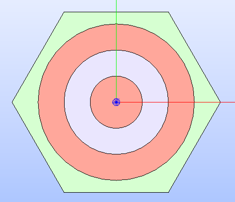

   Hexagonal cell's technological geometry with the :py:attr:`MATERIAL<glow.support.types.PropertyType.MATERIAL>`
   colorset.

Circles Addition and Removal
""""""""""""""""""""""""""""

Typically, fuel pin cells, having either a cartesian or a hexagonal geometry,
are characterised by several concentric circles to represent the different
regions of a cell, each having its own properties.
In general, circles can be placed either in the cell's centre or in any other
point within its boundaries.

In |TOOL|, the method :py:meth:`add_circle()<glow.geometry_layouts.cells.Cell.add_circle>`
allows to position a circle, with a specified radius, inside the cell. The
addition is performed only if the circle's radius does not exceeds the
characteristic dimensions (e.g. the apothem for a hexagon) of the *surface* (
:py:class:`Surface<glow.geometry_layouts.geometries.Surface>` subclasses) the
cell is based on.
Given the circle's radius, a *GEOM face* object is built in the given position,
if any is specified, otherwise the circle is added in the cell's centre.
In any case, a *partition* operation between the *GEOM compound* representing
the current technological geometry of the cell and the *GEOM face* of the new
circle is performed, resulting in a *GEOM compound* that comprises both.

The following code snippet shows how to add circles in specific positions within
a hexagonal cell.

.. code-block:: python

  hex_cell.add_circle(radius=0.5)
  hex_cell.add_circle(radius=0.1, position=(0.2, 0.2, 0.0))
  hex_cell.show()

:numref:`cell-circles` shows the result of adding two circles, the first in the
cell's centre, the second in a specific position. The resulting updated
technological geometry is shown in the *SALOME* 3D viewer after calling the
method :py:meth:`show()<glow.geometry_layouts.cells.Cell.show>`.

.. _cell-circles:
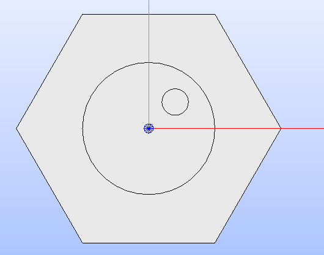

   Hexagonal cell's geometry layout after adding two circles to its
   technological geometry.

Calling the method :py:meth:`add_circle()<glow.geometry_layouts.cells.Cell.add_circle>`
updates the technological geometry of the cell. The same goes for the method
:py:meth:`remove_circle()<glow.geometry_layouts.cells.Cell.remove_circle>`.

When any property type (e.g. a *material*) has been assigned to the cell's *region*
where the circle is added, the *regions* resulting from partitioning the cell
with the circle inherit the properties of the overlapped *regions* (see
:numref:`prop-regions`).

.. _prop-regions:
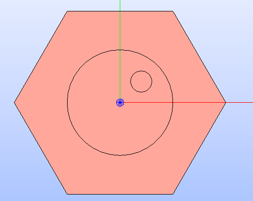

   Hexagonal cell's technological geometry shown with a properties colorset;
   the new circular *regions* have the same property type value as the *region*
   they overlap.

If the added circle is cell-centred, then it also inherits the sectorization
options of the overlapped centred *region* (see :numref:`sect-regions`).

.. _sect-regions:
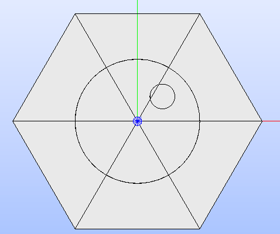

   Hexagonal cell's sectorized geometry; only the cell-centred circle is
   subdivided in six regions as the the overlapped *region*.

When removing a circular *region* having any property type or sectorization option
associated, the *region* resulting from its removal keeps the same values of the
*region* that surrounded the removed circular *region*.

Transformation Operations
"""""""""""""""""""""""""

Transformation operations can be applied by calling the methods for rotating
or translating the cell's geometric elements, i.e. the *GEOM compounds*
representing the cell's technological and sectorized layouts, as well as the
:py:class:`Region<glow.geometry_layouts.cells.Region>` objects corresponding
to the layout currently displayed.
The method :py:meth:`rotate()<glow.geometry_layouts.cells.Cell.rotate>`
requires the rotation angle, in degrees, and assumes that the rotation is
performed around the Z-axis. The direction of the rotation follows the standard
*right-hand* rule.
The method :py:meth:`translate()<glow.geometry_layouts.cells.Cell.translate>`
needs the XYZ coordinates of the new centre of the cell.
While the former operates on the same instance, the latter returns a deep copy
of the original instance positioned in the new centre.
For a hexagonal cell, the code instructions for rotating and translating the
cell are the following:

.. code-block:: python

  hex_cell.rotate(90)
  new_cell = hex_cell.translate((1.0, 1.0, 0.0))
  new_cell.show()

.. _sectorisation:

Sectorization Operation
"""""""""""""""""""""""

Other than the technological geometry, cells can be displayed also in terms of
the sectorized one.
This type of geometry consists in subdividing the cell's *regions* of the
technological geometry in a number of angular regions (the *sectors*) which is
specific for the type of cell. Subclasses of :py:class:`Cell<glow.geometry_layouts.cells.Cell>` declares
the available number of sectors a *region* of the technological geometry can have,
as well as the starting angle from which the subdivision starts.
We can have the following values:

  - :py:class:`HexCell<glow.geometry_layouts.cells.HexCell>` - admitted number
    of sectors are either `1` or `6`, while `0` or `30` for the starting angle.
  - :py:class:`RectCell<glow.geometry_layouts.cells.RectCell>` - admitted number
    of sectors are `1`, `4`, `8` and `16`, while the corresponding angles are
    `0` and `45.0` for a subdivision in four sectors, `0` and `22.5` for a
    subdivision in eight sectors, `0` for a subdivision in one or sixteen
    sectors.

Rectangular cells also have the option of applying a *windmill* sectorization
to the region farthest from the cell's center, provided that the *region* is
subdivided into eight sectors.

Each of the subclasses of :py:class:`Cell<glow.geometry_layouts.cells.Cell>`
provide their own configuration for applying the sectorization. In particular,
for a :py:class:`RectCell<glow.geometry_layouts.cells.RectCell>` the ``windmill``
parameter can be provided to apply a *windmill* sectorization, while for
:py:class:`HexCell<glow.geometry_layouts.cells.HexCell>` and
:py:class:`GenericCell<glow.geometry_layouts.cells.GenericCell>` this parameter
is absent. In any case, the logic for subdividing the *regions* in sectors is
common to all subclasses.

The following code snippet shows how to apply a sectorization, with ``windmill``
option enabled, for a cartesian cell having two cell-centred circles.

.. code-block:: python

  rect_cell.sectorize([1, 4, 8], [0, 45, 22.5], windmill=True)
  rect_cell.show(geometry_type_to_show=GeometryType.SECTORIZED)

Elements in the two lists provided to the method
:py:meth:`sectorize()<glow.geometry_layouts.cells.RectCell.sectorize>` are
associated to the *regions* from the closest to the farthest one from the cell's
centre.
:numref:`cart-cell-sect` shows the result after applying the indicated sectorization.

.. _cart-cell-sect:
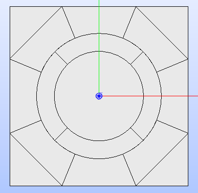

   Cartesian cell after applying the sectorization operation. The number of
   subdivisions of the cell's *regions* matches the order in which sectorization
   numbers are provided to the method.

.. _set-cell-prop:

Setting Up the Cell's Regions Properties
""""""""""""""""""""""""""""""""""""""""

Cells' *regions* can be displayed by applying a colorset that depends on the type
of property to show, as item of the :py:class:`PropertyType<glow.support.types.PropertyType>`
enumeration. An example of property type is the *material* constituing each
*region*, identified by the item :py:attr:`MATERIAL<glow.support.types.PropertyType.MATERIAL>`.
To set values for a specific property type, users can rely on two methods:

  - :py:meth:`set_properties()<glow.geometry_layouts.cells.Cell.set_properties>`,
    which allows users to set values for different types of properties for *all*
    the regions of the cell's technological geometry.
    The convention for declaring the values of a property is from the closest
    to the farthest *region* with respect to the cell's centre.
  - :py:meth:`set_region_property()<glow.geometry_layouts.cells.Cell.set_region_property>`,
    which allows to set a value for the indicated type of property of a *single*
    region of a cell; this can be either the *GEOM face* currently selected in
    the *SALOME* 3D viewer or the one provided as parameter to the method.

The following code snippet shows how to apply values for the
:py:attr:`MATERIAL<glow.support.types.PropertyType.MATERIAL>` type of property,
which is the only one currently implemented.

.. code-block:: python

  rect_cell.set_properties(
      {PropertyType.MATERIAL: ['GAP', 'FUEL', 'COOLANT']}
  )
  rect_cell.add_circle(0.1)
  rect_cell.set_region_property(
      PropertyType.MATERIAL,
      'MAT',
      Circle(radius=0.1).face
  )
  rect_cell.show(PropertyType.MATERIAL)

In particular, given a cartesian cell with two cell-centred circles, the first
method enables all the material values to be set at the same time.
A new circular *region* is added, and the corresponding *GEOM face* is used to
identify the *region* within the cell to which the property should be assigned.
From within the *SALOME* 3D viewer, the *region* can be provided by simply
selecting the corresponding *GEOM face* and calling the method from the
integrated Python console.
In any case, the cell's geometry layout with the :py:attr:`MATERIAL<glow.support.types.PropertyType.MATERIAL>`
colorset is shown in :numref:`cell-after-props`.

.. _cell-after-props:

   Cartesian cell after setting up values for the :py:attr:`MATERIAL<glow.support.types.PropertyType.MATERIAL>`
   property type for each region. It is shown with a colorset highlighting the
   different values assigned to the cell's *regions*.

Inspection of Regions
"""""""""""""""""""""

.. When *regions* of a cell are displayed in the *SALOME* 3D viewer, users can
.. obtain information about an individual *region*, including its assigned
.. properties. This is done by calling the method :py:meth:`get_regions_info()<glow.geometry_layouts.cells.Cell.get_regions_info>`
.. directly in the Python console of *SALOME* from an object
.. of any of the subclasses of :py:class:`Cell<glow.geometry_layouts.cells.Cell>`.
.. If no *region* (as *GEOM* face), or more than one, is selected when calling the
.. method, an exception is raised.
.. The available information, which is printed in the Python console, includes the
.. name of the cell's *region* and the value for each of the assigned type of
.. properties (see :numref:`reg-info`).

.. .. _reg-info:
.. .. figure:: images/region_info.png
..    :alt: Information about a selected region of the cell
..    :width: 400px
..    :align: center

..    Information about a selected *region* of the cell; its name and values for
..    the assigned properties are printed.

Updating the Cell's Geometry Layout
"""""""""""""""""""""""""""""""""""

The methods of the class :py:class:`Cell<glow.geometry_layouts.cells.Cell>`
enable the cell's technological and sectorized geometries to be customized
by means of circles and lines, where the latter must follow the rules tied to
the sectorization operation (i.e. lines subdivides *regions* of the technological
geometry in fixed numbers of angular sectors).
To support any customization of the cell's geometry layout, while keeping the
base *surface* (subclass of :py:class:`Surface<glow.geometry_layouts.geometries.Surface>`)
the same, two methods are provided:

  - :py:meth:`update_geometry()<glow.geometry_layouts.cells.Cell.update_geometry>`,
    which enables to update the *GEOM compound*, representing either the
    technological or the sectorized geometry, that is displayed in the *SALOME*
    3D viewer with the *GEOM face* or *GEOM compound* currently selected.
  - :py:meth:`update_geometry_from_face()<glow.geometry_layouts.cells.Cell.update_geometry_from_face>`,
    which enables to update the *GEOM compound* corresponding to the indicated
    :py:class:`GeometryType<glow.support.types.GeometryType>` with the given
    *GEOM face* or *GEOM compound*.

In both cases, the result is a new layout for the technological or the sectorized
geometry where the new *regions* inherit the already assigned properties, if
any; the same goes for the sectorization options.

The following code snippet shows how the cell's technological geometry could
be updated with a non-standard geometry built by overlapping two hexagonal
*surfaces* with different dimensions.

.. code-block:: python

  hex_1 = Hexagon(edge_length=1)
  hex_2 = Hexagon(edge_length=1.5)

  shape = make_partition([hex_2.face], [hex_1.face], ShapeType.COMPOUND)

  hex_cell = HexCell()
  hex_cell.update_geometry_from_face(GeometryType.TECHNOLOGICAL, shape)
  hex_cell.show()

The function :py:func:`make_partition()<glow.interface.geom_interface.make_partition>`
cuts a list of *GEOM faces* (in the first argument) with those provided in the
list as second argument; the resulting type of shape is indicated as third argument.
After applying the built geometry to the cell, the result can be displayed in
the *SALOME* 3D viewer (see :numref:`updated-cell`).

.. _updated-cell:
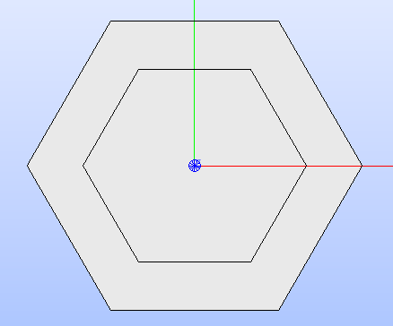

   Hexagonal cell's layout after updating its technological geometry.

Restoring Cell's State
""""""""""""""""""""""

There could be cases where users need to reset the cell's geometry layout and
the properties associated to its regions (see :ref:`tutorial-overlap`).
The method :py:meth:`restore()<glow.geometry_layouts.cells.Cell.restore>`
satisfies this need by restoring the *GEOM compound* of the cell's technological
layout to its base *surface* (e.g. a *GEOM face* identifying a rectangle) without
any inner circle.
The sectorized layout, as well as the properties and sectorization options, are
completely removed.

.. _lattice-def:

Lattice Definition
^^^^^^^^^^^^^^^^^^

|TOOL| comes with classes to build lattices characterised by either hexagonal
or cartesian cells.
The module :py:mod:`glow.geometry_layouts.lattices` provides the class
:py:class:`Lattice<glow.geometry_layouts.lattices.Lattice>` to describe any
kind of lattice of cells.
The type of lattice is determined by the type of the cells, either cartesian or
hexagonal. All the cells in the lattice must be of the same type, identified by
an item of the enumeration :py:class:`CellType<glow.support.types.CellType>`.
This is automatically set at instantiation time or when adding cells to the
lattice.

The :py:class:`Lattice<glow.geometry_layouts.lattices.Lattice>` class can be
instantiated either without any cell or by providing a list of objects of the
subclasses of :py:class:`Cell<glow.geometry_layouts.cells.Cell>`.

In |TOOL|, the logic behind the construction of a lattice relies on the *layer*
concept: when a new cell, or a group of cells is added to the lattice, the cells
are associated to a layer (either a new layer or an existing one already
containing some cells). The layer to which the cells are added depends on the
specific method used to add them.
By adopting this logic, |TOOL| can easily handle the construction of the *GEOM
compound* that identifies the lattice geometry layout, especially in the case
of lattices made by superimposing cells with different dimensions.

The following code snippet shows how to instantiate a lattice with the cartesian
or hexagonal cells available in |TOOL|.

.. code-block:: python

  from glow.geometry_layouts.cells import HexCell, RectCell
  from glow.geometry_layouts.lattices import Lattice

  hex_cell = HexCell()
  rect_cell = RectCell()

  # Lattice instantiation by providing all the cartesian cells at once
  cart_lattice = Lattice(
      cells=[
          rect_cell.translate((0.5, 0.5, 0.0)),
          rect_cell.translate((-0.5, 0.5, 0.0)),
          rect_cell.translate((-0.5, -0.5, 0.0)),
          rect_cell.translate((0.5, -0.5, 0.0)),
      ],
      name="Cartesian Lattice",
      center=(0.0, 0.0, 0.0),
      boxes_thick=[0.075, 0.075]
  )
  # Lattice instantiation without any cell
  lattice = Lattice()
  # Lattice instantiation with a hexagonal central cell
  hex_lattice = Lattice([hex_cell])

The three examples show different instantiations; in particular, we have:

  - a cartesian lattice built from a list of cells positioned to recreate a
    2x2 pattern; by specifying the ``boxes_thick`` parameter, the built lattice
    is enclosed within a rectangular box made by two layers of given thicknesses.
  - a lattice built without any cell. The lattice's methods for adding cells
    need to be called to define its geometry layout (see :ref:`add-cells`).
  - a hexagonal lattice built from a single cell positioned in the centre of
    the lattice.

Similarly to the cells, the two types of geometry layout, the technological and
the sectorized ones, apply to the lattice (see :ref:`geom-def`).

The :py:class:`Lattice<glow.geometry_layouts.lattices.Lattice>` public methods
cover the following functionalities:

  - building the lattice's *regions*, as elements of the dataclass
    :py:class:`Region<glow.geometry_layouts.cells.Region>`, according to either
    the technological or the sectorized type of geometry of the cells in the
    lattice;
  - displaying the lattice's geometry layout in the *SALOME* 3D viewer;
  - adding a single cell or a group of the same cell organised in one or more
    rings around the lattice's centre;
  - transformation operations for rotating or translating the lattice's cells;
  - enclosing the lattice in a box declared from the thicknesses of its layers
    or by means of an instance of the subclasses of
    :py:class:`Cell<glow.geometry_layouts.cells.Cell>`;
  - setting up the properties associated to one *region* of the lattice or to
    the ones of the box;
  - applying a specific type of symmetry in accordance with the type of lattice;
  - setting the type of geometry in accordance with the type of lattice and of
    applied symmetry;
  - inspecting the information related to a specific *region* of the lattice
    that has been selected in the *SALOME* 3D viewer;
  - restoring a list of cells of the lattice to their original state, both in
    terms of geometry and properties.

Building Lattice's Regions
""""""""""""""""""""""""""

To facilitate displaying and exporting the lattice's geometry layout, the method
:py:meth:`build_regions()<glow.geometry_layouts.lattices.Lattice.build_regions>`
is provided. It builds a list of :py:class:`Region<glow.geometry_layouts.cells.Region>`
objects that are representative of the *regions* in which the lattice is subdivided
when assembling all the cells together with the box, if present.
Cells can be associated with different layers of cells in the lattice. When the
lattice's regions are built to be displayed in the *SALOME* 3D viewer, a process
is carried out. This can be imagined as if all the layers were collapsed into a
single layer of cells. The layers are traversed from top to bottom, and any cells
that are found to be overlapped by those of a higher layer are either cut or
removed from the lattice.
:numref:`overlap` shows the result of overlapping a cell with others.

.. _overlap:
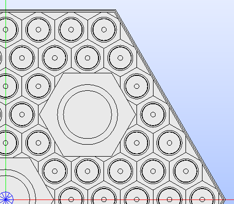

   Hexagonal lattice where a cell overlaps other cells of an inferior layer.

If any symmetry is applied or the lattice is enclosed in a box, the *GEOM compound*
of the assembled cells is either cut to extract the portion that replicates the
symmetry or assembled with the geometry layout of the box.
Given the final *GEOM compound*, the contained *GEOM faces* are extracted and
a :py:class:`Region<glow.geometry_layouts.cells.Region>` object is built for
each one.
In any case, the property assignment involves identifying the corresponding
*region* among the ones of the technological geometry of the lattice's cells.

According to the type of geometry of the cells that is provided to the method
:py:meth:`build_regions()<glow.geometry_layouts.lattices.Lattice.build_regions>`,
the resulting regions describe either the technological or the sectorized
geometry of the lattice.

Displaying the Lattice's Geometry Layout
""""""""""""""""""""""""""""""""""""""""

The lattice's geometry layout can be displayed in the *SALOME* 3D viewer by
calling the method :py:meth:`show()<glow.geometry_layouts.lattices.Lattice.show>`.
Depending on its parameters, it builds and displays the corresponding *regions*
(i.e. the *GEOM faces*) of the lattice.

Regions are built and shown according to either the technological or the
sectorized geometry by specifying it as parameter of the method.
The same considerations on the parameters done for the method
:py:meth:`show()<glow.geometry_layouts.cells.Cell.show>` of the subclasses of
:py:class:`Cell<glow.geometry_layouts.cells.Cell>` are valid for the lattice
as well (see :ref:`cell-show`).
It is important to note that when displaying the lattice's *regions* with a
colorset according to the indicated :py:class:`PropertyType<glow.support.types.PropertyType>`,
regions with the same property type value are coloured the same.

In *SALOME*, regions are added to the *Object Browser* as children of the
lattice they belong to, similarly to what happens for cells (see
:numref:`show-children`).

The following code snippet shows how to display the regions of the lattice's
technological geometry (indicated by the :py:attr:`TECHNOLOGICAL<glow.support.types.GeometryType.TECHNOLOGICAL>`
type of geometry) with a colorset in terms of the property type
:py:attr:`MATERIAL<glow.support.types.PropertyType.MATERIAL>`.

.. code-block:: python

  cart_lattice.show(
      property_type_to_show=PropertyType.MATERIAL,
      geometry_type_to_show=GeometryType.TECHNOLOGICAL
  )

:numref:`lattice-show` shows the resulting geometry layout of the lattice after
running the above code.

.. _lattice-show:
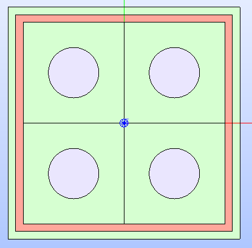

   Cartesian lattice's technological geometry with the :py:attr:`MATERIAL<glow.support.types.PropertyType.MATERIAL>`
   colorset.

.. _add-cells:

Adding cell(s)
""""""""""""""

A lattice can be built by instantianting a :py:class:`Lattice<glow.geometry_layouts.lattices.Lattice>`
object, providing a list of :py:class:`Cell<glow.geometry_layouts.cells.Cell>`
subclasses. In addition to this approach, it is often useful to contruct a
lattice by adding a cell or a ring of cells with simple methods. For this reason,
the following methods have been introduced:

  - :py:meth:`add_cell()<glow.geometry_layouts.lattices.Lattice.add_cell>`,
    which allows to add a single cell at an indicated position;
  - :py:meth:`add_ring_of_cells()<glow.geometry_layouts.lattices.Lattice.add_ring_of_cells>`,
    which allows to add a ring of the same cell at the indicated ring index;
  - :py:meth:`add_rings_of_cells()<glow.geometry_layouts.lattices.Lattice.add_rings_of_cells>`,
    which allows to add the indicated number of rings of the same cell, starting
    from the current ring index occupied by cells.

The method :py:meth:`add_cell()<glow.geometry_layouts.lattices.Lattice.add_cell>`
adds the cell to the specified position, if any is provided, otherwise the cell
is placed at the position indicated by the cell's centre. It is important to
note that any cell added with this method is included in a new *layer*, i.e. a
new sub-list is created for the attribute :py:attr:`layers<glow.geometry_layouts.lattices.Lattice.layers>`
containing the cell itself.

The layout of a lattice can be considered as consisting of several rings, each
occupied by an increasing number of cells as the ring index increases. The two
methods :py:meth:`add_ring_of_cells()<glow.geometry_layouts.lattices.Lattice.add_ring_of_cells>`
and :py:meth:`add_rings_of_cells()<glow.geometry_layouts.lattices.Lattice.add_rings_of_cells>`
provide a quick way for adding one or more rings of cells. The former adds the
cells at the given ring index while the latter adds the indicated number of
rings of cells starting from the maximum value of ring index currently present
in the lattice.
Users should also note that, while the former method enables them to specify
the *layer* to which the ring of cells is added (by providing its index), the
latter always adds the rings of cells to a new *layer*.

All the aforementioned methods do not allow to mix cells with different types
(i.e. having different item of the enumeration :py:class:`CellType<glow.support.types.CellType>`);
this ensures that all the cells have either a cartesian or a hexagonal type.

The following code snippet shows the different ways to add cells to a lattice.

.. code-block:: python

  cell = HexCell()
  lattice = Lattice([cell])

  lattice.add_ring_of_cells(cell, 1)
  lattice.add_rings_of_cells(cell, 2)
  lattice.add_cell(cell, (1.5, 1.5, 0.0))
  lattice.show()

The lattice's geometry layout resulting from adding hexagonal cells using the
three methods is shown in :numref:`lattice-add`.

.. _lattice-add:
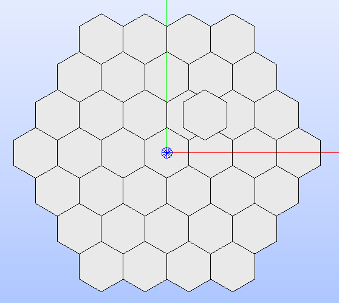

   Hexagonal lattice built by applying the three methods for adding cells.

Lattice's Transformation Operations
"""""""""""""""""""""""""""""""""""

Transformation operations can be applied by calling the methods for rotating
or translating the lattice's geometric elements, i.e. the *GEOM compound* objects
representing its full and partial (if any symmetry is applied) geometry layouts,
the contained cells, including the box (if present), and all the *regions*.
The method :py:meth:`rotate()<glow.geometry_layouts.lattices.Lattice.rotate>`
requires the rotation angle, in degrees, and assumes that the rotation is
performed around the Z-axis. The direction of the rotation follows the standard
*right-hand* rule.
The method :py:meth:`translate()<glow.geometry_layouts.lattices.Lattice.translate>`
needs the new XYZ coordinates of the centre of the lattice.
Users should note that both methods operate on the same instance and the result
of the transformation is directly shown in the *SALOME* 3D viewer.

Enclosing the Lattice in a Box
""""""""""""""""""""""""""""""

In nuclear reactors, fuel assemblies are typically framed in a metallic container.
To replicate exactly the same kind of layouts, |TOOL| allows to insert a lattice
within a box.
A box is an instance of the subclasses of :py:class:`Cell<glow.geometry_layouts.cells.Cell>`
which can be built either from the thickness of its layers or by instantiating
the corresponding :py:class:`Cell<glow.geometry_layouts.cells.Cell>` object
directly.
The former case relies on the method :py:meth:`build_lattice_box()<glow.geometry_layouts.lattices.Lattice.build_lattice_box>`,
which, given the type of lattice (i.e. hexagonal or cartesian), automatically
instantiates a :py:class:`Cell<glow.geometry_layouts.cells.Cell>` object built
by overlapping as many rectangles or hexagons as the number of the indicated
thicknesses of the layers.
If all the values provided to the :py:meth:`build_lattice_box()<glow.geometry_layouts.lattices.Lattice.build_lattice_box>`
method are positive (independently from the value), the borders of the layer
closest to the centre of the lattice touch the outermost ring of cells without
overlapping it (see :numref:`box-pos`).
The method also allows the first thickness value in the list to be negative,
which handles a situation where the layer closest to the centre cuts the
farthest ring of cells (see :numref:`box-neg`).

The following code snippet shows how to build a box for the lattice using the
method :py:meth:`build_lattice_box()<glow.geometry_layouts.lattices.Lattice.build_lattice_box>`
with the thickness of the first layer either being positive or negative.

.. code-block:: python

  lattice.build_lattice_box([0.1, 0.1])
  lattice.show()

  lattice.build_lattice_box([-0.1, 0.1])
  lattice.show()

The result of applying both method calls separately, for a hexagonal lattice,
is shown in :numref:`box-pos` and in :numref:`box-neg` respectively.

.. _box-pos:
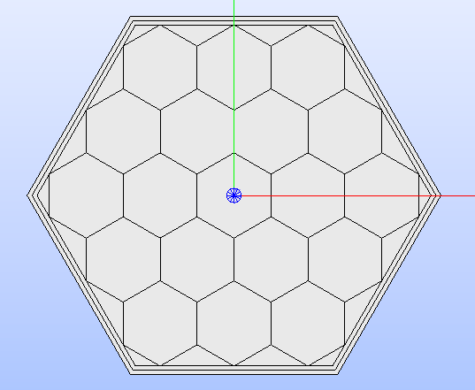

   Hexagonal lattice framed in a box with all positive thicknesses for the
   layers.

.. _box-neg:
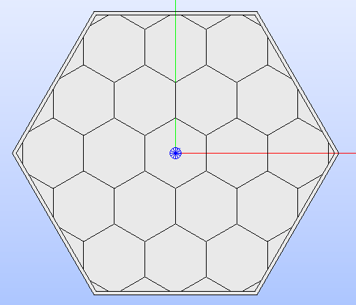

   Hexagonal lattice framed in a box with a negative thickness for the first
   layer. The box cuts the farthest ring of cells.

The lattice's box can also be declared by setting the corresponding property
:py:attr:`lattice_box<glow.geometry_layouts.lattices.Lattice.lattice_box>` with
an object of the subclasses of :py:class:`Cell<glow.geometry_layouts.cells.Cell>`.
The setter of the property requires the cell's centre to coincide with that of
the lattice, otherwise an exception is raised.
Both :py:class:`Cell<glow.geometry_layouts.cells.Cell>` objects or ``None`` are
valid inputs for the setter. The latter can be used to remove any box previously
set.

Both approaches to setting a box lead to the same result: the *GEOM compound*
representing the geometry layout of the lattice is updated by assembling the
*GEOM compound* of each cell with that of the box, which can potentially cut the
*GEOM compound* of the cells of the farthest ring.

Setting Up Properties
"""""""""""""""""""""

Just like for cells, the *regions* of a lattice can be displayed with a colorset
according to the type of property to display, as item of the
:py:class:`PropertyType<glow.support.types.PropertyType>` enumeration.

There are different ways for users to set values for a specific property type
of a *region* of the lattice.
If the *region* belongs to any cell, the methods previously described (see
:ref:`set-cell-prop`) for a :py:class:`Cell<glow.geometry_layouts.cells.Cell>`
object remain valid, provided they are applied to the correct instance stored
in the attribute :py:attr:`layers<glow.geometry_layouts.lattices.Lattice.layers>`.

In addition, users can rely on the following methods of the class
:py:class:`Lattice<glow.geometry_layouts.lattices.Lattice>`:

  - :py:meth:`set_region_property()<glow.geometry_layouts.lattices.Lattice.set_region_property>`,
    which allows to set a value for the indicated type of property of a single
    lattice's *region* (i.e. a *GEOM face*); this can be either the *GEOM face*
    currently selected in the *SALOME* 3D viewer or the one provided as parameter
    to the method.
  - :py:meth:`set_lattice_box_properties()<glow.geometry_layouts.lattices.Lattice.set_lattice_box_properties>`,
    which allows users to set values for different types of properties for all
    the regions of the :py:class:`Cell<glow.geometry_layouts.cells.Cell>`
    instance, which is the box that encloses the lattice.
    The convention for declaring the values of a property is always the same,
    i.e. from the *region* closest to the center to the farthest *region*.
    Users should note that for hexagonal boxes, the number of values to provide
    is always equal to that of the layers plus one. The reason is that the first
    value in the list is associated with the *regions* between the cells and the
    first layer of the box. These regions all share the same property type value.

The following code snippet shows the different ways to apply values for the
:py:attr:`MATERIAL<glow.support.types.PropertyType.MATERIAL>` property type,
i.e. either to all the cells or to an indicated *region* or to the regions of
the lattice's box.

.. code-block:: python

  # Build the lattice geometry layout
  hex_cell = HexCell()
  hex_cell.rotate(90)
  lattice = Lattice([hex_cell])
  lattice.add_ring_of_cells(hex_cell, 1)
  lattice.build_lattice_box([0.1])
  # The same value for the 'MATERIAL' property is assigned to all the cells
  for layer in lattice.layers:
      for cell in layer:
          cell.set_properties(
              {PropertyType.MATERIAL: ['COOLANT']}
          )
  # A different value for the 'MATERIAL' property is assigned to the central
  # cell
  lattice.set_region_property(PropertyType.MATERIAL, 'GAP', hex_cell.face)
  # Values for the 'MATERIAL' property are assigned to the box's regions
  lattice.set_lattice_box_properties(
      {PropertyType.MATERIAL: ['COOLANT', 'METAL']}
  )
  lattice.show(PropertyType.MATERIAL)

The resulting lattice's geometry layout with the :py:attr:`MATERIAL<glow.support.types.PropertyType.MATERIAL>`
colorset is shown in :numref:`lattice-set-props`.

.. _lattice-set-props:
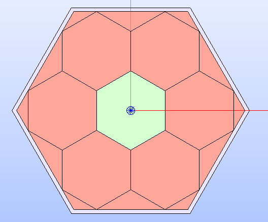

   Lattice after setting up the values for a type of property. It is shown
   with the corresponding colorset.

Applying Symmetries
"""""""""""""""""""

Solving the Boltzmann transport equation on the full geometry layout of a fuel
assembly can be computationally expensive, in particular if the geometry contains
many rings of cells.
To speed up the calculations, users can rely on cuts to extract parts out of
the existing layout, thereby isolating the minimum portion of the geometry
required to describe the entire pattern.
|TOOL| supports the application of specific types of symmetries to the lattice.
According to the type of cells in the lattice, we can have:

  - Half, quarter, and eighth symmetries for a cartesian lattice. Half and quarter
    symmetries cut out the corresponding rectangular portion of the lattice,
    while the eighth symmetry cuts out a right triangular portion with a centre
    angle of 45°.
  - Third, sixth and twelfth symmetries for a hexagonal lattice framed in a box.
    The third symmetry cuts out a parallelogram of the lattice, the sixth symmetry
    a regular triangle and the twelfth a right triangle with a centre angle of
    30°.

The method :py:meth:`apply_symmetry()<glow.geometry_layouts.lattices.Lattice.apply_symmetry>`
allows users to apply the indicated type of symmetry as item of the enumeration
:py:class:`SymmetryType<glow.support.types.SymmetryType>`.
Since |TOOL| considers that only specific types of symmetry are allowed for
each type of lattice, an exception is raised if the user tries to apply an
invalid symmetry.
Independently from the type of symmetry, the method
:py:meth:`apply_symmetry()<glow.geometry_layouts.lattices.Lattice.apply_symmetry>`
automatically performs *cut* operations on the *GEOM compound* of the lattice
so that the remaining part describes the requested symmetry.

For cartesian lattices, the operation of applying a symmetry is performed
independently of the presence of a box. However, for hexagonal lattices, |TOOL|
requires the lattice to be framed in a box. This is because the *SALT* module
of *DRAGON5* cannot track the resulting geometry layout if the shape is not
triangular or quadrilateral.

The following code snippet shows different applications of a symmetry type
for a cartesian and a hexagonal lattice.

.. code-block:: python

  rect_lattice.apply_symmetry(SymmetryType.QUARTER)
  hex_lattice.apply_symmetry(SymmetryType.TWELFTH)

When calling the method :py:meth:`apply_symmetry()<glow.geometry_layouts.lattices.Lattice.apply_symmetry>`,
the geometry layout of the lattice is automatically updated and displayed in
the *SALOME* 3D viewer (if the method is called from its Python console).
If the :py:attr:`FULL<glow.support.types.SymmetryType.FULL>` is provided to the
method, any previously applied symmetry is removed and the entire geometry layout
of the lattice is displayed.

:numref:`quarter-symm` and :numref:`twelfth-symm` show the results of applying
a :py:attr:`QUARTER<glow.support.types.SymmetryType.QUARTER>` and a
:py:attr:`TWELFTH<glow.support.types.SymmetryType.TWELFTH>` symmetry to a
cartesian and a hexagonal lattice, respectively.

.. _twelfth-symm:
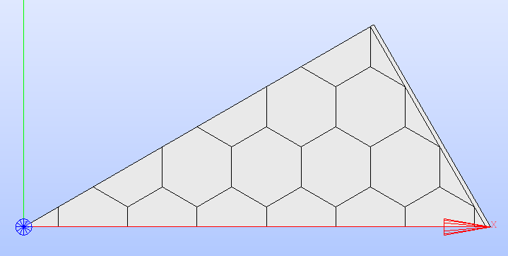

   Hexagonal lattice after applying the :py:attr:`TWELFTH<glow.support.types.SymmetryType.TWELFTH>`
   type of symmetry.

Users should note that |TOOL| does not recognize whether the layout of cells
replicates the full layout when any valid symmetry is applied.
It is up to the user to apply a symmetry that can be representative for the
specific layout of the lattice.

Setting the Lattice's Type of Geometry
""""""""""""""""""""""""""""""""""""""

The *SALT* module of *DRAGON5* identifies each type of geometry layout of the
lattice with a specific index value. In the *TDT* file, this is identified by
the *typgeo* value which is representative of the geometry layout (either full
or partial, if any symmetry is applied) and the type of BCs on the lattice's
borders.
User should note that specific values of *typgeo* are also associated to the
two different types of tracking allowed by the *SALT* module of *DRAGON5*
:cite:`dragon5-ug`. In particular, we have that:

  - values of `0`, `1` and `2` for *typgeo* are associated with a *TISO* tracking
    type, which produces non-cycling tracks distributed uniformally over the
    domain.
  - values greater that `2` for *typgeo* are associated with a *TSPC* tracking
    type, which indicates a cyclic tracking over a closed domain.

The items of the enumeration :py:class:`LatticeGeometryType<glow.support.types.LatticeGeometryType>`
identify the different *typgeo* values available in |TOOL|. In particular, we have:

  - :py:attr:`ISOTROPIC<glow.support.types.LatticeGeometryType.ISOTROPIC>` to
    represent a layout having an isotropic reflection on its boundaries. It is
    associated with a *TISO* tracking.
  - :py:attr:`SYMMETRIES_TWO<glow.support.types.LatticeGeometryType.SYMMETRIES_TWO>`
    to represent a layout having symmetries of two axis of angle ``pi/n`` (
    :math:`n>0`) on its boundaries. It is associated with a *TISO* tracking.
  - :py:attr:`ROTATION<glow.support.types.LatticeGeometryType.ROTATION>` to
    represent a layout with a rotation of angle ``2*pi/n`` (:math:`n>1`) for
    its boundaries. It is associated with a *TISO* tracking.
  - :py:attr:`RECTANGLE_TRAN<glow.support.types.LatticeGeometryType.RECTANGLE_TRAN>`
    to represent a cartesian layout having a translation BC to its boundaries.
    It is associated with a *TSPC* tracking.
  - :py:attr:`RECTANGLE_SYM<glow.support.types.LatticeGeometryType.RECTANGLE_SYM>`
    to represent a full, half and quarter symmetry for a cartesian layout.
    It is associated with a *TSPC* tracking.
  - :py:attr:`RECTANGLE_EIGHT<glow.support.types.LatticeGeometryType.RECTANGLE_EIGHT>`
    to represent a layout with an eighth symmetry. It is associated with a *TSPC*
    tracking.
  - :py:attr:`SA60<glow.support.types.LatticeGeometryType.SA60>` to represent a
    layout with an sixth symmetry. It is associated with a *TSPC* tracking.
  - :py:attr:`HEXAGON_TRAN<glow.support.types.LatticeGeometryType.HEXAGON_TRAN>`
    to represent a full hexagonal layout having a translation BC to its boundaries.
    It is associated with a *TSPC* tracking.
  - :py:attr:`RA60<glow.support.types.LatticeGeometryType.RA60>` to represent a
    layout with an sixth symmetry with both rotation and translation BCs to its
    boundaries. It is associated with a *TSPC* tracking.
  - :py:attr:`R120<glow.support.types.LatticeGeometryType.R120>` to represent a
    layout with an third symmetry with both rotation and translation BCs to its
    boundaries. It is associated with a *TSPC* tracking.
  - :py:attr:`S30<glow.support.types.LatticeGeometryType.S30>` to represent a
    layout with a twelfth symmetry. It is associated with a *TSPC* tracking.

When a :py:class:`Lattice<glow.geometry_layouts.lattices.Lattice>` class is
instantiated, a default value for the property :py:attr:`type_geo<glow.geometry_layouts.lattices.Lattice.type_geo>`
is assigned according to the number and the type of cells.
Users can assign a value to this property directly, provided it is valid for
the lattice's geometry layout. This means that values specific for a type of
lattice and symmetry cannot be applied if not matching the current state of the
lattice.
For any values of *typgeo* involving BCs of type *translation*, the assignement
is performed only if the lattice is either made by a single cell or if enclosed
in a box.

|TOOL| provides also the method :py:meth:`set_type_geo()<glow.geometry_layouts.lattices.Lattice.set_type_geo>`
to set the item of the enumeration
:py:class:`LatticeGeometryType<glow.support.types.LatticeGeometryType>`.

The following code snippet shows different applications of the property
:py:attr:`type_geo<glow.geometry_layouts.lattices.Lattice.type_geo>`.

.. code-block:: python

  rect_lattice.type_geo = LatticeGeometryType.RECTANGLE_TRAN
  hex_lattice.set_type_geo(LatticeGeometryType.SA60)

Setting the value for the property does not result in any change in the lattice's
geometry layout. It influences the information written in the output *TDT* file
in terms of the BCs section, as this is strictly related to the *typgeo*.

Lattice's Regions Inspection
""""""""""""""""""""""""""""

When the regions of the lattice's technological or sectorized geometry are
displayed in the *SALOME* 3D viewer, information about a selected *region*,
including the assigned properties, can be inspected.
The method :py:meth:`get_regions_info()<glow.geometry_layouts.lattices.Lattice.get_regions_info>`
can be called directly in the Python console of *SALOME* from an object
of :py:class:`Lattice<glow.geometry_layouts.lattices.Lattice>`.
If no *region* (i.e. a *GEOM face*), or more than one, is selected when calling
the method, an exception is raised.
The available information, that is printed in the Python console, includes the
name of the lattice's *region* and the value for each of the assigned type of
properties.

Restoring Lattice's Cells
"""""""""""""""""""""""""

Similarly to the class :py:class:`Cell<glow.geometry_layouts.cells.Cell>`, also
the class :py:class:`Lattice<glow.geometry_layouts.lattices.Lattice>` offers
a *restore* functionality.
The method :py:meth:`restore_cells()<glow.geometry_layouts.lattices.Lattice.restore_cells>`
allows users to restore the geometry layout of a group of cells of the lattice
by calling the method :py:meth:`restore()<glow.geometry_layouts.cells.Cell.restore>`
for each cell. The result is that any circular *region* of the cells is removed,
while also setting the cell's properties accordingly with the ones passed as
input to the method.
If any cells have no centered circular regions, the *restore* operation is not
performed for those specific cells.
In addition, users can specify whether the operation should be ignored for cells
whose circular regions (being part of the technological geometry) have not been
cut when overlapping with another cell (see :numref:`overlap`).

This method can be combined with the function :py:func:`get_changed_cells()<glow.geometry_layouts.lattices.get_changed_cells>`
to retrieve any cells whose geometry layout has been modified, making it easy
to restore them.

The following code snippet shows the case of a hexagonal lattice where a
central cell overlaps those of the layer below it. The *restore* operation
is applied to all the overlapped cells resulting in the lattice's geometry
layout of :numref:`restored-cells`.

.. code-block:: python

  # Build the lattice geometry layout
  cell = HexCell()
  cell.add_circle(0.2)
  cell.add_circle(0.3)
  cell.add_circle(0.4)
  cell.rotate(90)
  cell.set_properties({PropertyType.MATERIAL: ['MAT_1', 'MAT_2', 'MAT_3', 'MAT_4']})
  lattice = Lattice([])
  lattice.add_ring_of_cells(cell, 2)
  # A cell with greater dimensions is added in the lattice centre, overlapping
  # those of the layer below
  central_cell = HexCell(edge_length=1.5)
  central_cell.rotate(90)
  central_cell.set_properties({PropertyType.MATERIAL: ['MAT_4']})
  lattice.add_cell(central_cell, ())
  # Assemble all the layers
  lattice.build_regions()
  # Restore the overlapped cells
  lattice.restore_cells(
      get_changed_cells(lattice),
      {PropertyType.MATERIAL: 'MAT_4'},
      ignore_not_cut=False
  )
  lattice.show(PropertyType.MATERIAL)

.. _restored-cells:
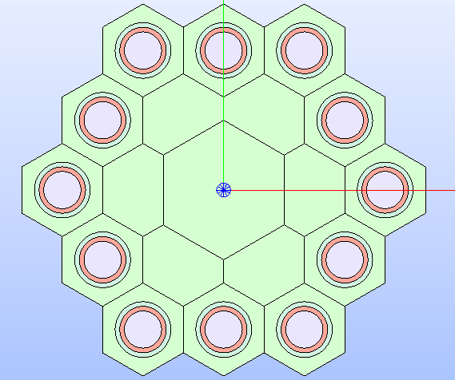

   Hexagonal lattice's technological geometry showing the result of restoring
   the overlapped cells. The geometry layout is displayed with the
   :py:attr:`MATERIAL<glow.support.types.PropertyType.MATERIAL>` colorset.

.. _layout-export:

Lattice Analysis and Export
---------------------------

The aim of |TOOL| is to provide neutronics code users with a tool that allows
them to create geometry layouts and export the surface geometry representation
to a file. This file can then be used to perform a tracking with the *SALT*
module of *DRAGON5*.
The generated file is in the format *APOLLO2* requires for its *TDT* solver.

To meet this requirement, |TOOL| comes with a functionality for extracting the
necessary information about the geometry and generate the output file in the
required format.

Once the geometry layout has been created using one or more
:py:class:`Lattice<glow.geometry_layouts.lattices.Lattice>` instances, users
can run the export process by calling the function
:py:func:`analyse_and_generate_tdt()<glow.main.analyse_and_generate_tdt>`.
This function first analyses the provided list of lattices with respect to the
compound layout representing a portion of them, if any is provided, then
generates the output file containing the extracted information.

This function operates on the provided list of :py:class:`Lattice<glow.geometry_layouts.lattices.Lattice>`
instances on the basis of specific configuration options defined in the dataclass
:py:class:`TdtSetup<glow.main.TdtSetup>`. Values for these options influence
the data about the surface geometry representation of the layout contained in
the output *TDT* file, but only if a portion of the entire geometry layout is
provided.
The available settings in the :py:class:`TdtSetup<glow.main.TdtSetup>` instance
include:

  - the type of geometry layout of the lattice's cells, as item of the enumeration
    :py:class:`GeometryType<glow.support.types.GeometryType>`. A value different
    from that used to display the lattice in the *SALOME* 3D viewer can be
    specified.
  - the type of property associated to the lattice's *regions*, as item of the
    enumeration :py:class:`PropertyType<glow.support.types.PropertyType>`.
    A value different to that used to apply the colorset to the *regions* can
    be specified.
  - the value of the *albedo*, indicating how much reflective the BCs are,
    i.e. the ratio of exiting to entering neutrons. This attribute can assume
    values between `0.0` (no reflection) and `1.0` (full reflection) for a
    :py:attr:`ISOTROPIC<glow.support.types.LatticeGeometryType.ISOTROPIC>`
    type of geometry of the lattice. If nothing is provided, a default value
    that corresponds to the lattice's geometry type is adopted (i.e. `1.0` for
    :py:attr:`ISOTROPIC<glow.support.types.LatticeGeometryType.ISOTROPIC>`
    geometry layouts, `0.0` for the others). An exception is raised if users
    provide a value different from `0.0` for a geometry type other than
    :py:attr:`ISOTROPIC<glow.support.types.LatticeGeometryType.ISOTROPIC>`,
    as this would not make sense.
  - the value for the *typegeo* parameter, which is strictly related to the
    type of cells, the applied symmetry and the type of tracking;
  - the type of symmetry applied to the geometry layout.

The analysis step involves the extraction of the geometric data, that is needed
for the generation of the output *TDT* file, from the layout.
The first step consists in determining the *GEOM compound* to analyse, if one
or more lattices are provided; this compound is selected on the basis of the
:py:class:`GeometryType<glow.support.types.GeometryType>` and on the applied
:py:class:`SymmetryType<glow.support.types.SymmetryType>`.
In case a *GEOM compound* is directly provided, it will be used for extracting
the geometric data, provided that the *GEOM compound* is a portion of the given
lattice(s).
For each :py:class:`Region<glow.geometry_layouts.cells.Region>` object, which
corresponds to the *regions* of the layout's compound, a
`Face<glow.generator.geom_extractor.Face>` object is built and associated with
the property type value (:py:class:`PropertyType<glow.support.types.PropertyType>`)
for which the layout is analysed. In addition, an index is assigned to ensure
their identification.
The *GEOM edge* objects are then extracted and associated to the corresponding
regions. This means that each edge, identified with another index, has one or
two regions associated with it. Those associated with two regions are internal
edges, shared by two adjacent regions, while those associated with only one
*region* are border edges.
Lastly, the indices of the border edges are associated to a *boundary*, whose
type (as item of the enumeration :py:class:`BoundaryType<glow.support.types.BoundaryType>`)
and geometric data are determined on the basis of the
:py:class:`LatticeGeometryType<glow.support.types.LatticeGeometryType>` and the
applied :py:class:`SymmetryType<glow.support.types.SymmetryType>`.

.. only:: html

   :numref:`tdt-types` provides the association between
   :py:class:`LatticeGeometryType<glow.support.types.LatticeGeometryType>` and
   :py:class:`BoundaryType<glow.support.types.BoundaryType>` for the two type of
   cells with the symmetries available in |TOOL|.
   The first group of coloumns *LatticeGeometryType*-*BoundaryType* indicates the
   values for which a uniform tracking (i.e. *TISO*) should be performed in *SALT*;
   the second group refers to values which correspond to a cyclic tracking (i.e.
   *TSPC*).
   An :py:attr:`ISOTROPIC<glow.support.types.LatticeGeometryType.ISOTROPIC>` type
   of geometry does not correspond to any BC, whereas those having two types of
   BCs applies a :py:attr:`ROTATION<glow.support.types.BoundaryType.ROTATION>`
   on the internal boundaries and a :py:attr:`TRANSLATION<glow.support.types.BoundaryType.TRANSLATION>`
   on the external ones (see :numref:`tran-rota`).

.. only:: latex

   The following tables provides the association between
   :py:class:`LatticeGeometryType<glow.support.types.LatticeGeometryType>` and
   :py:class:`BoundaryType<glow.support.types.BoundaryType>` for the two type of
   cells with the symmetries available in |TOOL|.
   The first table indicates the values for which a uniform tracking (i.e.
   *TISO*) should be performed in *SALT*; the second table refers to values
   which correspond to a cyclic tracking (i.e. *TSPC*).
   An :py:attr:`ISOTROPIC<glow.support.types.LatticeGeometryType.ISOTROPIC>` type
   of geometry does not correspond to any BC, whereas those having two types of
   BCs applies a :py:attr:`ROTATION<glow.support.types.BoundaryType.ROTATION>`
   on the internal boundaries and a :py:attr:`TRANSLATION<glow.support.types.BoundaryType.TRANSLATION>`
   on the external ones (see :numref:`tran-rota`).

.. only:: html

   .. _tdt-types:

   .. table:: Available combinations for *TISO* and *TSPC* cases.
      :widths: auto
      :align: center

      +----------+--------------+---------------------+----------------------+---------------------+----------------------+
      | CellType | SymmetryType | LatticeGeometryType | BoundaryType         | LatticeGeometryType | BoundaryType         |
      +==========+==============+=====================+======================+=====================+======================+
      |          | FULL         | ISOTROPIC           |          /           | HEXAGON_TRAN        | TRANSLATION          |
      |          +--------------+---------------------+----------------------+---------------------+----------------------+
      |          | THIRD        | ROTATION            | TRANSLATION/ROTATION | R120                | TRANSLATION/ROTATION |
      |          +--------------+---------------------+----------------------+---------------------+----------------------+
      |  HEX     |              | SYMMETRIES_TWO      | AXIAL_SYMMETRY       | SA60                | AXIAL_SYMMETRY       |
      |          | SIXTH        +---------------------+----------------------+---------------------+----------------------+
      |          |              | ROTATION            | TRANSLATION/ROTATION | RA60                | TRANSLATION/ROTATION |
      |          +--------------+---------------------+----------------------+---------------------+----------------------+
      |          | TWELFTH      | SYMMETRIES_TWO      | AXIAL_SYMMETRY       | S30                 | AXIAL_SYMMETRY       |
      +----------+--------------+---------------------+----------------------+---------------------+----------------------+
      |          |              |                     |                      | RECTANGLE_TRAN      | TRANSLATION          |
      |          | FULL         | ISOTROPIC           |          /           +---------------------+----------------------+
      |          |              |                     |                      | RECTANGLE_SYM       | AXIAL_SYMMETRY       |
      |          +--------------+---------------------+----------------------+---------------------+----------------------+
      |  RECT    | HALF         | SYMMETRIES_TWO      | AXIAL_SYMMETRY       | RECTANGLE_SYM       | AXIAL_SYMMETRY       |
      |          +--------------+---------------------+----------------------+---------------------+----------------------+
      |          | QUARTER      | SYMMETRIES_TWO      | AXIAL_SYMMETRY       | RECTANGLE_SYM       | AXIAL_SYMMETRY       |
      |          +--------------+---------------------+----------------------+---------------------+----------------------+
      |          | EIGHTH       | SYMMETRIES_TWO      | AXIAL_SYMMETRY       | RECTANGLE_EIGHTH    | AXIAL_SYMMETRY       |
      +----------+--------------+---------------------+----------------------+---------------------+----------------------+

.. only:: latex

   .. raw:: latex

      {\small
      \begin{table}[ht]
      \centering
      \begin{tabularx}{.95\textwidth}{|X|X|X|X|}\hline
        \textbf{CellType} & \textbf{SymmetryType} & \textbf{LatticeGeometryType} & \textbf{BoundaryType} \\ \hline
        HEX & FULL & ISOTROPIC & N.D.\\ \hline
        HEX & THIRD & ROTATION & TRANSLATION\-ROTATION\\ \hline
        HEX & SIXTH & SYMMETRIES\_TWO & AXIAL\_SYMMETRY\\ \hline
        HEX & SIXTH & ROTATION & TRANSLATION\-ROTATION\\ \hline
        HEX & TWELFTH & SYMMETRIES\_TWO & AXIAL\_SYMMETRY\\ \hline
        RECT & FULL & ISOTROPIC & N.D.\\ \hline
        RECT & HALF & SYMMETRIES\_TWO & AXIAL\_SYMMETRY\\ \hline
        RECT & QUARTER & SYMMETRIES\_TWO & AXIAL\_SYMMETRY\\ \hline
        RECT & EIGHTH & SYMMETRIES\_TWO & AXIAL\_SYMMETRY\\ \hline
      \end{tabularx}
      \caption{Available combinations for \textit{TISO} case}
      \end{table}
      }

      {\small
      \begin{table}[ht]
      \centering
      \begin{tabularx}{.95\textwidth}{|X|X|X|X|}\hline
        \textbf{CellType} & \textbf{SymmetryType} & \textbf{LatticeGeometryType} & \textbf{BoundaryType} \\ \hline
        HEX & FULL & HEXAGON\_TRAN & TRANSLATION\\ \hline
        HEX & THIRD & R120 & TRANSLATION\-ROTATION\\ \hline
        HEX & SIXTH & SA60 & AXIAL\_SYMMETRY\\ \hline
        HEX & SIXTH & RA60 & TRANSLATION\-ROTATION\\ \hline
        HEX & TWELFTH & S30 & AXIAL\_SYMMETRY\\ \hline
        RECT & FULL & RECTANGLE\_TRAN & TRANSLATION\\ \hline
        RECT & FULL & RECTANGLE\_SYM & AXIAL\_SYMMETRY\\ \hline
        RECT & HALF & RECTANGLE\_SYM & AXIAL\_SYMMETRY\\ \hline
        RECT & QUARTER & RECTANGLE\_SYM & AXIAL\_SYMMETRY\\ \hline
        RECT & EIGHTH & RECTANGLE\_SYM & AXIAL\_SYMMETRY\\ \hline
      \end{tabularx}
      \caption{Available combinations for \textit{TSPC} case}
      \end{table}
      }

The different values of BCs that are automatically applied by |TOOL| to the
boundaries of the lattice's geometry layout are identified by the items of the
enumeration :py:class:`BoundaryType<glow.support.types.BoundaryType>`. Their
meaning and usage is the same as specified in :cite:`dragon5-ug`:

  - :py:attr:`VOID<glow.support.types.BoundaryType.VOID>`, indicating that
    boundaries have zero re-entrant angular flux;
  - :py:attr:`REFL<glow.support.types.BoundaryType.REFL>`, indicating a
    reflective boundary condition;
  - :py:attr:`TRANSLATION<glow.support.types.BoundaryType.TRANSLATION>`,
    indicating that the analysed layout is connected to another one for all its
    boundaries, thus treating an infinite geometry with translation symmetry;
  - :py:attr:`ROTATION<glow.support.types.BoundaryType.ROTATION>`, indicating
    a rotation symmetry;
  - :py:attr:`AXIAL_SYMMETRY<glow.support.types.BoundaryType.AXIAL_SYMMETRY>`,
    indicating a reflection symmetry;
  - :py:attr:`CENTRAL_SYMMETRY<glow.support.types.BoundaryType.CENTRAL_SYMMETRY>`,
    indicating a mirror reflective boundary condition.

.. _tran-rota:
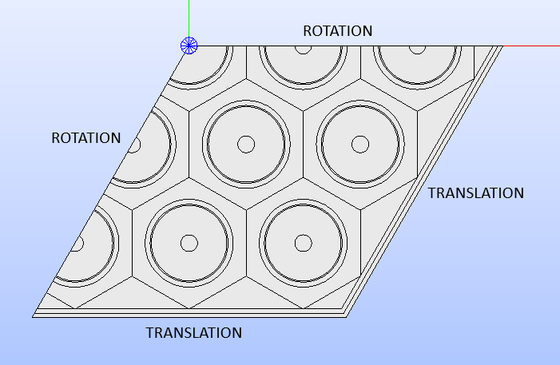

   Showing to which boundaries the :py:attr:`ROTATION<glow.support.types.BoundaryType.ROTATION>`
   and :py:attr:`TRANSLATION<glow.support.types.BoundaryType.TRANSLATION>` BC
   types are assigned to (third symmetry case).

Given all the geometric data extracted from the lattice, the output file is
generated. Its structure consists of five sections, that are:

  - the *header* section, providing information about the type of geometry
    (*typgeo* value), the number of *folds* (*nbfold* value), which is
    consistent with the *typgeo*, the number of *nodes* (i.e. the regions),
    the number of *elements* (i.e. the edges).
  - the *regions* section, providing a list of indices attributed to the
    *regions* in the lattice. It also contains the definition of the *macros*
    to indicate subvolumes of the assembly.
  - the *edges* section, providing the geometric information about all the edges
    in the geometry layout, as well as the indices of the regions they belong
    to.
  - the *boundary conditions* section, providing information about the BC types
    and the indices of the edges belonging to each boundary.
  - the *property* section, indicating the index of each value of the considered
    property type (e.g. the :py:attr:`MATERIAL<glow.support.types.PropertyType.MATERIAL>`
    one). The order in which values are present matches the indices of the
    regions.

.. _usage:

Usage
-----

|TOOL| can be used directly by writing down a Python script where the single
needed modules can be imported; alternatively, users can import all the modules
at once to have them available by setting the following import instruction:

.. code-block:: python

  from glow import *

Given that, classes and methods are directly accessible and users can exploit
them to:

- assemble the geometry;
- assign properties to regions;
- visualize the result in the *SALOME* 3D viewer;
- perform the geometry analysis and the output file generation.

To run this script, users can:

- provide it as argument when running *SALOME*;

    .. code-block:: bash

      salome my_script.py

- load it directly from within the *SALOME* application.

In addition, since *SALOME* comes with an embedded Python console, users can
import the |TOOL| modules and exploit its functionalities directly.

To see some of the |TOOL| functionalities in action, please refer to the script
files present in the ``tutorials`` folder and described in the :ref:`tutorials`
section.
These examples are intended to show a few case studies and how they are managed
in |TOOL|.
For further information about the available classes and methods, please refer
to the :doc:`api_guide` section.
