.. _tutorials:

=========
Tutorials
=========

To fully exploit the functionalities offered by |TOOL|, several examples are
provided. They can be found in the ``tutorials`` folder. In the following,
they are presented and explained in detail, showing for each the resulting
geometry layout as displayed in the 3D viewer of *SALOME*.

Hexagonal Cell
--------------

The use case ``hexagonal_cell.py`` shows the steps required to declare a single
hexagonal cell and customize its geometry layout.

The goal is to instantiate a hexagonal cell whose edge is ``1.0`` long, having
three circles to delimit the different regions where each one is attributed to
a specific material.
The cell's technological geometry is declared as follows:

.. code-block:: python

  # Build the cell's geometry layout by adding three circular regions
  cell = HexCell(name="Hexagonal Cell")
  radii = [0.25, 0.4, 0.6]
  for radius in radii:
        cell.add_circle(radius)
  # Show the cell's technological geometry in the SALOME 3D viewer
  cell.show()

By calling the method :py:meth:`show()<glow.geometry_layouts.cells.Cell.show>`,
the cell's technological geometry is shown in the *SALOME* viewer (see
:numref:`cell-tech`).

.. _cell-tech:
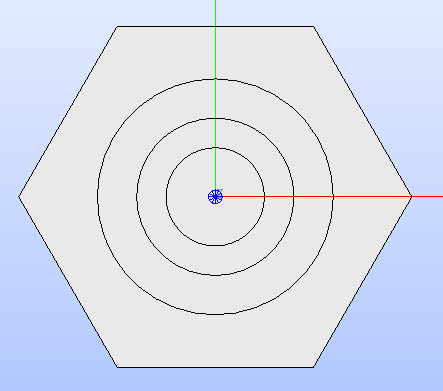

   Hexagonal cell's technological geometry built by adding three circular
   regions.

Materials can be assigned to the four regions of the cell's technological geometry
by providing a value for the property type :py:attr:`MATERIAL<glow.support.types.PropertyType.MATERIAL>`
to each.
The assignement is performed using the method :py:meth:`set_properties()<glow.geometry_layouts.cells.Cell.set_properties>`.
The names of the materials should be provided in order from the region closest
to the cell's centre to the farthest one.
Regions can now be shown with the :py:attr:`MATERIAL<glow.support.types.PropertyType.MATERIAL>`
color map by specifying it in the arguments of the method :py:meth:`show()<glow.geometry_layouts.cells.Cell.show>`
(see :numref:`cell-colormap`).

.. code-block:: python

  # Assign the materials to each zone in the cell
  cell.set_properties(
      {PropertyType.MATERIAL: ["MAT_1", "MAT_2", "MAT_3", "MAT_4"]}
  )
  # Show the regions by applying a color map
  cell.show(PropertyType.MATERIAL)

.. _cell-colormap:
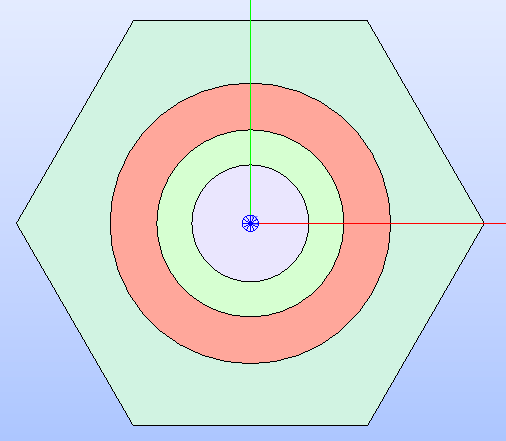

   Hexagonal cell's technological geometry shown by applying a color map that
   highlights the type of property :py:attr:`MATERIAL<glow.support.types.PropertyType.MATERIAL>`
   applied to the different regions.

Having a refined geometry layout can provide better tracking results; hence, a
sectorization can be applied with the method :py:meth:`sectorize()<glow.geometry_layouts.cells.Cell.sectorize>`.
It requires two lists, one with the number of sectors that each region is
subdivided into and one with the angle that each sectorization starts from.
The refined geometry can be shown even with the :py:attr:`MATERIAL<glow.support.types.PropertyType.MATERIAL>`
colorset by specifying it among the arguments of the method :py:meth:`show()<glow.geometry_layouts.cells.Cell.show>`
together with the :py:attr:`SECTORIZED<glow.support.types.GeometryType.SECTORIZED>`
type of geometry (see :numref:`cell-sect`).

.. code-block:: python

  # Build the cell's sectorized geometry
  cell.sectorize([1, 1, 6, 6], [0]*4)
  # Show the sectorized cell with regions colored according to the 'MATERIAL'
  # property
  cell.show(PropertyType.MATERIAL, GeometryType.SECTORIZED)

.. _cell-sect:
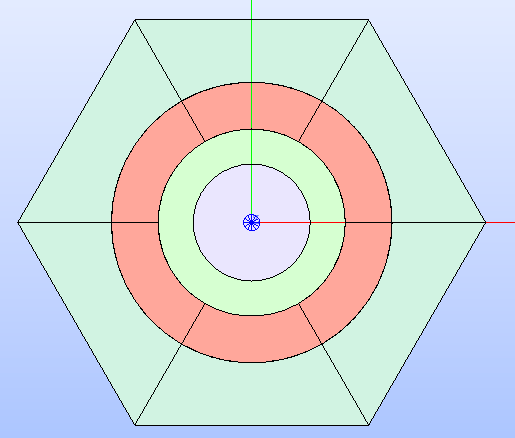

   Hexagonal cell's sectorized geometry shown by applying a color map that
   highlights the :py:attr:`MATERIAL<glow.support.types.PropertyType.MATERIAL>`
   property type applied to the different regions resulting from the sectorization.

Cartesian Cell With Custom Geometry Layout
------------------------------------------

The use case ``cartesian_cell.py`` shows the steps required to declare a single
rectangular cell and customize its geometry layout by means of the functions
of the module :mod:`glow.interface.geom_interface` that wrap the ones of the
*GEOM* module of *SALOME*.

The goal is to instantiate a cartesian cell with a square shape whose edge is
``1.0`` long. The cell is subdivided into four regions by means of three circles;
a specific material is assigned to each of the regions of the resulting
technological geometry.
The characterization of the cell's technological geometry follows the same
instructions as shown in the previous case. In addition, the
:py:attr:`MATERIAL<glow.support.types.PropertyType.MATERIAL>` property type is
assigned to the different regions of the technological geometry of the cell.

.. code-block:: python

  # Build the cell's geometry layout by adding three circular regions
  cell = RectCell(name="Cartesian cell")
  radii = [0.2, 0.3, 0.4]
  for radius in radii:
        cell.add_circle(radius)
  # Assign the materials to each zone in the cell
  cell.set_properties(
      {PropertyType.MATERIAL: ["MAT_1", "MAT_2", "MAT_3", "MAT_4"]}
  )

To further refine the geometry layout, a sectorization can be applied with the method :py:meth:`sectorize()<glow.geometry_layouts.cells.Cell.sectorize>`.
In addition to the two lists indicating the number of sectors and the angle the
sectorization starts from, a cartesian cell can also receive the boolean flag
``windmill``. This option generates a sectorized geometry where lines are drawn
between two successive intersection points between the lines of the sectors and
the borders of the cell (see :numref:`cell-windmill`).

.. code-block:: python

  # Build the cell's sectorized geometry with 'windimill' option enabled
  cell.sectorize([1, 1, 4, 8], [0, 0, 0, 22.5], windmill=True)
  # Show the sectorized cell with regions colored according to the 'MATERIAL'
  # property
  cell.show(PropertyType.MATERIAL, GeometryType.SECTORIZED)

.. _cell-windmill:
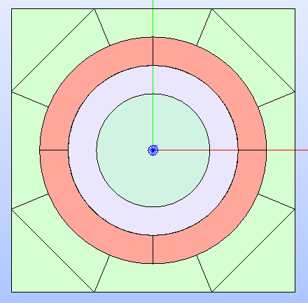

   Cartesian cell's sectorized geometry with `windmill` sectorization enabled.
   It is shown by applying a color map that highlights the type of property
   :py:attr:`MATERIAL<glow.support.types.PropertyType.MATERIAL>`
   applied to the different regions resulting from the sectorization.

The methods offered by the subclasses of :py:class:`Cell<glow.geometry_layouts.cells.Cell>`
for setting up the technological geometry only cover the addition and removal
of circular regions. The sectorized geometry can be characterized by subdividing
the technological geometry into sectors by drawing lines.
If a customisation of any of the two available geometry layouts is required,
users can make use of the functions in the :mod:`glow.interface.geom_interface`
module to build the *GEOM face* or *GEOM compound* of need. The methods
:py:meth:`update_geometry()<glow.geometry_layouts.cells.Cell.update_geometry>`
and :py:meth:`update_geometry_from_face()<glow.geometry_layouts.cells.Cell.update_geometry_from_face>`
can be used to update either the technological or the sectorized geometry layout
with the built *GEOM* object.
This tutorial demonstrates how to customise the cell by updating the sectorized
geometry with a *GEOM compound* containing more circles between two adjacent
regions of the technological geometry.
Users should note that the previously set sectorization geometry is
substituted by the new one. The result of the following code is shown in
:numref:`cell-update`.

.. code-block:: python

  # Setup the XYZ coordinates of the centres of the circles
  centres = [(0, 0.1, 0), (0, -0.1, 0), (0.1, 0, 0), (-0.1, 0, 0)]
  # Build the corresponding 'Circle' objects, all with the same radius
  circles = [Circle(centre, radius=0.05) for centre in centres]
  # Build circles positioned in the cell centre
  center_circles = [Circle(radius=r) for r in [0.32, 0.34, 0.36, 0.38]]
  # Update the list of 'Circle' objects
  circles += center_circles

  # Partition the original cell's technological geometry with all the circles
  updated_face = make_partition(
      [cell.face], [c.face for c in circles], ShapeType.FACE)
  # Update the cell's sectorized geometry with the just built shape
  cell.update_geometry_from_face(GeometryType.SECTORIZED, updated_face)
  # Show the result in the 3D viewer
  cell.show(PropertyType.MATERIAL, GeometryType.SECTORIZED)

.. _cell-update:
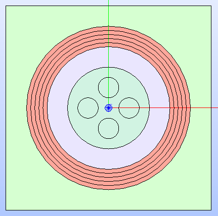

   Cartesian cell's sectorized geometry after updating it by adding several
   circles. It is shown by applying a color map that highlights the type of
   property :py:attr:`MATERIAL<glow.support.types.PropertyType.MATERIAL>`
   applied to the different regions resulting from the updated sectorized
   geometry.

Cartesian Assembly With Symmetry
--------------------------------

The use case ``cartesian_assembly.py`` shows the steps required to declare an
assembly made by a central cell (of cartesian type) around which several rings
of the same cell are placed.
This type of geometry layout can be tracked by the *SALT* module of *DRAGON5*
using an eighth symmetry as this is the minimum portion of the geometry that
can describe the entire layout of the assembly.

The first step for assembling this use case geometry is to instantiate the
cartesian cell (i.e. object of the class
:py:class:`RectCell<glow.geometry_layouts.cells.RectCell>`) which constitutes
the lattice.
The instructions that follow build a cartesian cell with a square shape whose
edge is ``1.0`` long; the cell is subdivided into four regions by means of
three circles and the type of property
:py:attr:`MATERIAL<glow.support.types.PropertyType.MATERIAL>` is assigned to
each. In addition, the regions are sectorized with the `windmill` option
enabled.

.. code-block:: python

  # Build the cell's geometry layout by adding three circular regions
  cell = RectCell(name="Cartesian cell")
  radii = [0.2, 0.3, 0.4]
  for radius in radii:
        cell.add_circle(radius)
  # Assign the materials to each zone in the cell
  cell.set_properties(
      {PropertyType.MATERIAL: ["MAT_1", "MAT_2", "MAT_3", "MAT_4"]}
  )
  # Apply the cell's sectorization
  cell.sectorize([1, 1, 4, 8], [0, 0, 0, 22.5], windmill=True)

The subsequent step is to declare the instance of the class
:py:class:`Lattice<glow.geometry_layouts.lattices.Lattice>` and add the cells
it is made of.
A single cell is provided when instantiating the lattice; this cell is placed
at the centre of the lattice since the cell and the lattice share the same
coordinates for their centres.
To add several rings of the same cell, the method
:py:meth:`add_rings_of_cells()<glow.geometry_layouts.lattices.Lattice.add_rings_of_cells>`
is provided with the instance of the :py:class:`RectCell<glow.geometry_layouts.cells.RectCell>`
class, previously declared, and the number of rings to add.
The lattice's technological geometry resulting from assembling all the
rings of cells is shown in :numref:`lattice-tech`.

.. code-block:: python

  # Build the lattice with several rings of the same cartesian cell
  lattice = Lattice([cell], 'Cartesian Lattice')
  lattice.add_rings_of_cells(cell, 4)
  lattice.show(PropertyType.MATERIAL)

.. _lattice-tech:
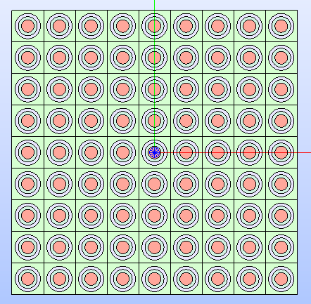

   Cartesian lattice's technological geometry resulting by adding several
   rings of cells. It is shown by applying a color map that highlights the type
   of property :py:attr:`MATERIAL<glow.support.types.PropertyType.MATERIAL>`
   applied to the different regions of its cells.

To replicate a fuel assembly, the lattice needs to be framed into a box. This
can be performed in different ways in |TOOL|, either by calling the method
:py:meth:`build_lattice_box()<glow.geometry_layouts.lattices.Lattice.build_lattice_box>`
that automatically builds a rectangular box with layers of the indicated
thicknesses or by instantiating a :py:class:`RectCell<glow.geometry_layouts.cells.RectCell>`
object and assigning it to the
:py:attr:`lattice_box<glow.geometry_layouts.lattices.Lattice.lattice_box>`
property.
In the following, the second option is shown. The cell is built from the XY
dimensions of the lattice and the thickness of the layers. In this specific
use case, the box cuts the *GEOM compound* of the cells located on the outermost
ring, i.e. the cells farthest from the centre of the lattice.
In addition, the geometric shape of the box's single layer is subdivided
in rectangular sub-shapes.
The lattice's technological geometry resulting from assembling the box with the
lattice is shown in :numref:`lattice-boxed`.

.. code-block:: python

  # Build the cell representing the lattice's box so that it sligthly cuts
  # the outmost ring of cells; the box is subdivided by means of squares at
  # its corners. The dimensions of the lattice are extracted to get the box
  # dimensions.
  x_min, x_max, y_min, y_max = get_bounding_box(lattice.lattice_cmpd)
  thickness = 0.1
  box = RectCell(
      height_x_width=((y_max-y_min) + thickness, (x_max-x_min) + thickness)
  )
  box.set_properties({PropertyType.MATERIAL: ["MAT_2"]})
  # Build the characteristic shapes that subdivide the box
  layer_1 = Rectangle(
      height=(y_max-y_min) - thickness,
      width=(x_max-x_min) - thickness
  )
  corners = [
      Rectangle((x_max, y_max, 0.0), thickness, thickness),
      Rectangle((x_max, y_min, 0.0), thickness, thickness),
      Rectangle((x_min, y_min, 0.0), thickness, thickness),
      Rectangle((x_min, y_max, 0.0), thickness, thickness),
  ]
  # Assemble all the geometric shapes together
  box_face = make_partition(
      [box.face],
      [layer.face for layer in [layer_1] + corners],
      ShapeType.COMPOUND
  )
  # Update the box cell's technological geometry with the assembled one
  box.update_geometry_from_face(GeometryType.TECHNOLOGICAL, box_face)

  # Assemble the box's cell with the whole lattice and show the result in the
  # SALOME 3D viewer
  lattice.lattice_box = box
  lattice.show(PropertyType.MATERIAL)

.. _lattice-boxed:
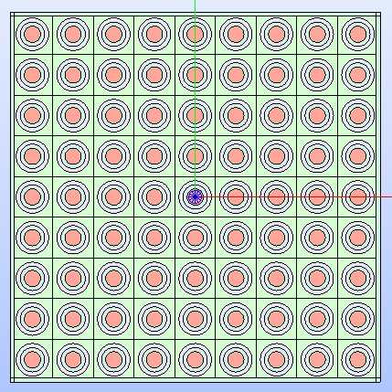

   Cartesian lattice's technological geometry resulting by framing the cells
   in a box that sligthly cuts the outmost ring of cells.

A symmetry can be applied to the lattice's geometry layout. For the specific
layout of this use case, the :py:attr:`EIGHTH<glow.support.types.SymmetryType.EIGHTH>`
type of symmetry can be used in tracking calculations since it is the minimum
portion that can represent the entire geometry layout of the lattice.
The result of applying the above mentioned type of symmetry is shown in
:numref:`lattice-eighth`.

.. code-block:: python

  # Apply the eighth symmetry type to the cartesian lattice
  lattice.apply_symmetry(SymmetryType.EIGHTH)
  # Show the resulting layout with the 'MATERIAL' color map
  lattice.show(PropertyType.MATERIAL)

.. _lattice-eighth:
.. figure:: images/cartesian_lattice_eighth.png
   :alt: Cartesian lattice's technological geometry framed in a box with an eighth symmetry
   :width: 400px
   :align: center

   Cartesian lattice's technological geometry resulting by framing the cells
   in a box and applying the :py:attr:`EIGHTH<glow.support.types.SymmetryType.EIGHTH>`
   type of symmetry.

This geometry layout for the assembly can be exported to the output *TDT* file
by calling the function :py:func:`analyse_and_generate_tdt()<glow.main.analyse_and_generate_tdt>`.
It is possible to indicate which :py:class:`GeometryType<glow.support.types.GeometryType>`
of the cells to use in the analysis that |TOOL| performs to generate the output
*TDT* file. In the following, the instance of the dataclass :py:class:`TdtSetup<glow.main.TdtSetup>`
is provided specifying the :py:attr:`SECTORIZED<glow.support.types.GeometryType.SECTORIZED>`
type of geometry.
The resulting geometry, which the *SALT* module of *DRAGON5* can perform tracking
calculations on, is shown in :numref:`lattice-g2s`.

.. code-block:: python

  # Perform the geometry analysis and export the TDT file of the surface
  # geometry
  analyse_and_generate_tdt(
      [lattice], "cartesian_lattice", TdtSetup(GeometryType.SECTORIZED))

.. _lattice-g2s:
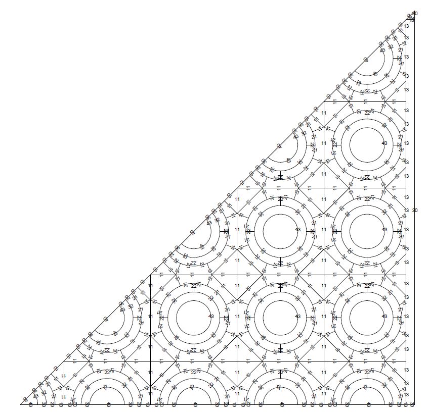

   Cartesian lattice's geometry layout that the *SALT* module of *DRAGON5*
   uses to perform the tracking.

.. _tutorial-overlap:

Hexagonal Assembly With Different Cells
---------------------------------------

The use case ``hexagonal_assembly.py`` shows the steps required to declare an
assembly made by several rings of the same hexagonal cell framed in a hexagonal
box. In addition, a hexagonal cell having different dimension, layout and materials
combination is positioned at different XYZ coordinates within the lattice.

The first step in assembling the use case geometry is to instantiate the
hexagonal cell (i.e. the object of the class
:py:class:`HexCell<glow.geometry_layouts.cells.HexCell>`) the lattice is made
out of.
The two hexagonal cells that characterise the lattice are built with edges
``1.0`` and ``2.0``.
The former cell, which constitutes the main pattern of the geometry layout,
is subdivided into five regions by means of four circles; the latter has a
different layout characterized by two circular regions.
In addition, the first cell is rotated by 90° so that the final assembly is
enclosed in a X-oriented hexagonal box, as requested by the *SALT* module of
*DRAGON5*.
The type of property :py:attr:`MATERIAL<glow.support.types.PropertyType.MATERIAL>`
is assigned to the regions of each cell.

.. code-block:: python

  # Build the hexagonal cell that constitutes the lattice. It is rotated
  # by 90° as needed for tracking
  cell_1 = HexCell(name="Cell 1")
  cell_1.rotate(90)
  radii = [0.1, 0.6, 0.625, 0.70]
  for radius in radii:
      cell_1.add_circle(radius)
  cell_1.set_properties(
      {PropertyType.MATERIAL: [
          "GAP", "FUEL", "GAP", "CLADDING", "COOLANT"]}
  )
  # Build the second hexagonal cell
  cell_2 = HexCell(edge_length=2.0, name="Cell 2")
  radii = [1.0, 1.25]
  for radius in radii:
      cell_2.add_circle(radius)
  cell_2.set_properties(
      {PropertyType.MATERIAL: ['COOLANT', 'CLADDING', 'COOLANT']}
  )

The subsequent step is to declare the instance of the class
:py:class:`Lattice<glow.geometry_layouts.lattices.Lattice>` and add the cells
it is made of.
A single cell (the one with smaller size) is provided when instantiating the
lattice. This cell is placed at the centre of the lattice as they both have
the same coordinates of the centre.
Several rings of the same cell are then added with the method
:py:meth:`add_rings_of_cells()<glow.geometry_layouts.lattices.Lattice.add_rings_of_cells>`:
the instance of the :py:class:`HexCell<glow.geometry_layouts.cells.HexCell>`
class, previously declared, is provided together with the number of rings to
add.
To complete the lattice's geometry layout, the cell with greater size is added
at specific coordinates using the method
:py:meth:`add_cell()<glow.geometry_layouts.lattices.Lattice.add_cell>`.
The resulting geometry layout (see :numref:`hex-lattice-overlap-cells`) shows
that larger cells overlap smaller cells because they have been placed in a
higher layer. Consequently, the *GEOM compound* of each cell in the lower layer
is cut out of the *GEOM compound* of the cells in the upper layer.

.. code-block:: python

  # Build the lattice with several rings of the same cartesian cell
  lattice = Lattice([cell_1])
  lattice.add_rings_of_cells(cell_1, 6)
  # XY coordinates of the centres of the cells with greater size
  x = 4.330127
  y = 4.5
  lattice.add_cell(cell_2, ())
  lattice.add_cell(cell_2, (x, y, 0.0))
  lattice.add_cell(cell_2, (-x, y, 0.0))
  lattice.add_cell(cell_2, (x, -y, 0.0))
  lattice.add_cell(cell_2, (-x, -y, 0.0))
  # Show the lattice's technological geometry with the 'MATERIAL' color map
  lattice.show(PropertyType.MATERIAL)

.. _hex-lattice-overlap-cells:
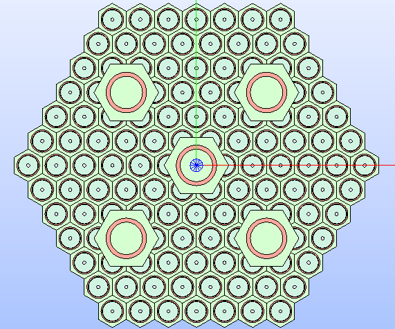

   Hexagonal lattice's technological geometry resulting by adding several
   rings of cells with smaller size and cells with a greater size at
   different coordinates. The resulting geometry layout shows that the cells of
   the higher layer cut those of the layer below. The color map that highlights
   the type of property :py:attr:`MATERIAL<glow.support.types.PropertyType.MATERIAL>`
   is applied to the different regions of the lattice's cells.

The current lattice's geometry layout shown in :numref:`hex-lattice-overlap-cells`
presents a situation where the structural parts (e.g. regions associated with
a fuel material) of the smaller cells are cut.
Since this scenario cannot happen in real-life situations, these cells need to
be restored by removing any circular region.
This is done by using the function :py:func:`get_changed_cells()<glow.geometry_layouts.lattices.get_changed_cells>`,
to retrieve the cut cells, and the method :py:meth:`restore_cells()<glow.geometry_layouts.lattices.Lattice.restore_cells>`,
to restore the geometry layout and assign a value for the provided types of
property. :numref:`hex-lattice-restored` shows the result of restoring the cut
cells.

.. code-block:: python

  # Get the cells whose geometry layout has been cut and restore them by
  # assigning a specific property type
  lattice.restore_cells(
      get_changed_cells(lattice),
      {PropertyType.MATERIAL: 'COOLANT'}
  )

.. _hex-lattice-restored:
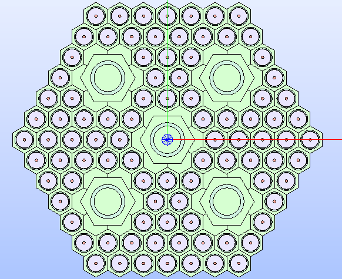

   Hexagonal lattice's technological geometry resulting by restoring the geometry
   layout of those cells that have been cut. The color map that highlights
   the type of property :py:attr:`MATERIAL<glow.support.types.PropertyType.MATERIAL>`
   is applied to the different regions of the lattice's cells.

An assembly requires the lattice to be framed into a box. In this use case
the method :py:meth:`build_lattice_box()<glow.geometry_layouts.lattices.Lattice.build_lattice_box>`
is used. It automatically builds an X-oriented hexagonal box with layers of
the indicated thicknesses.
The type of property :py:attr:`MATERIAL<glow.support.types.PropertyType.MATERIAL>`
is assigned to the different regions of the hexagonal box by means of the
method :py:meth:`set_lattice_box_properties()<glow.geometry_layouts.lattices.Lattice.set_lattice_box_properties>`
with the values assigned according to the distance of the regions from the
centre of the box.
The resulting assembly is shown in :numref:`hex-lattice-boxed`.

.. code-block:: python

  # Add a container for the assembly and assign properties
  lattice.build_lattice_box([0.15, 0.15])
  lattice.set_lattice_box_properties(
      {PropertyType.MATERIAL: ['COOLANT', 'CLADDING', 'COOLANT']})
  # Show the lattice's technological geometry
  lattice.show(PropertyType.MATERIAL)

.. _hex-lattice-boxed:
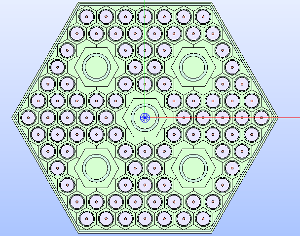

   Hexagonal lattice's technological geometry resulting by framing the cells
   into a box.

If the just built geometry layout of the assembly is exported to the output
*TDT* file by calling the function :py:func:`analyse_and_generate_tdt()<glow.main.analyse_and_generate_tdt>`,
the resulting surface representation will be characterised by ``typgeo=0``,
which implies a uniform tracking type (i.e. *TISO*) in the ``ALBE 1.0``
condition for its boundaries.
This requirement can be changed by assigning a lattice type of geometry that
results in a :py:attr:`TRANSLATION<glow.support.types.BoundaryType.TRANSLATION>`
BC type applied to the lattice's boundaries. To do so, the lattice's property
:py:attr:`type_geo<glow.geometry_layouts.lattices.Lattice.type_geo>` must be
set to :py:attr:`HEXAGON_TRAN<glow.support.types.LatticeGeometryType.HEXAGON_TRAN>`.
This setting generates a surface representation that must be tracked by a cyclic
method (i.e. *TSPC*).
After changing the lattice type of geometry, the output *TDT* file can be
generated.

.. code-block:: python

  # Change the lattice type of geometry to use 'TRANSLATION' BCs and cycling
  # tracking type
  lattice.type_geo = LatticeGeometryType.HEXAGON_TRAN
  # Perform the geometry analysis and export the TDT file of the surface
  # geometry
  analyse_and_generate_tdt([lattice], 'hexagonal_assembly')

Colorset
--------

The use case ``colorset.py`` shows the steps required to build the S30 portion
of a colorset made by two different hexagonal assemblies.
The layout of the colorset implies that the control rod assembly is surrounded
by six fuel assemblies. In the specific case of this example, given the
available symmetry of one twelfth of the colorset (i.e. *S30*), only
the two assemblies that concur in identifying the portion to study are built.

The first step in assembling the use case geometry is building the fuel assembly,
which is made by two hexagonal cells (i.e. the object of the class
:py:class:`HexCell<glow.geometry_layouts.cells.HexCell>`) with different layout.

The two hexagonal cells that characterise the lattice are built with the same
edge of ``1.0``, but different number of circular regions.
The cell which constitutes the main pattern of the geometry layout is subdivided
into five regions by means of four circles; the other cell, which is placed in
the lattice centre, is characterized by two circular regions.
In addition, both cells are rotated by 90° so that the final assembly is
enclosed in a X-oriented hexagonal box.
The type of property :py:attr:`MATERIAL<glow.support.types.PropertyType.MATERIAL>`
is assigned to the regions of each cell.

.. code-block:: python

  # Build the hexagonal cells of the fuel assembly
  fuel_cell = HexCell(name="Cartesian cell")
  fuel_cell.rotate(90)
  radii = [0.2, 0.6, 0.62, 0.68]
  for radius in radii:
      fuel_cell.add_circle(radius)
  # Assign the materials to each zone in the cell
  fuel_cell.set_properties(
        {PropertyType.MATERIAL: ["GAP", "FUEL", "GAP", "CLADDING", "COOLANT"]}
  )
  central_cell = HexCell(name="Central cell")
  central_cell.rotate(90)
  for radius in [0.6, 0.65]:
      central_cell.add_circle(radius)
  # Assign the materials to each zone in the cell
  central_cell.set_properties(
        {PropertyType.MATERIAL: ["GAP", "CLADDING", "COOLANT"]}
  )

The fuel assembly is built by instantianting an object of the class
:py:class:`Lattice<glow.geometry_layouts.lattices.Lattice>` and adding the cells
it is made of.
The central cell is provided when instantiating the lattice. Several rings of
the same cell are then added with the method
:py:meth:`add_rings_of_cells()<glow.geometry_layouts.lattices.Lattice.add_rings_of_cells>`:
the instance of the :py:class:`HexCell<glow.geometry_layouts.cells.HexCell>`
class, previously declared, is provided together with the number of rings to
add.
To complete the fuel assembly's geometry layout, the lattice is enclosed in a
box which overlaps the last ring of hexagonal cells without cutting the structural
parts of those cells (i.e. the circular regions remain untouched).
The method :py:meth:`build_lattice_box()<glow.geometry_layouts.lattices.Lattice.build_lattice_box>`
is used by providing a negative first value in the list of thicknesses.
The type of property :py:attr:`MATERIAL<glow.support.types.PropertyType.MATERIAL>`
is assigned to the different regions of the hexagonal box by means of the
method :py:meth:`set_lattice_box_properties()<glow.geometry_layouts.lattices.Lattice.set_lattice_box_properties>`
with the values assigned according to the distance of the regions from the
centre of the box.
The resulting assembly is shown in :numref:`fuel-assembly`.

.. code-block:: python

  # Build the fuel assembly lattice of the colorset
  fuel_assembly = Lattice([central_cell], "Fuel Assembly")
  fuel_assembly.add_rings_of_cells(fuel_cell, 5)
  # Build the fuel assembly box
  fuel_assembly.build_lattice_box([-0.1, 0.3, 0.3])
  fuel_assembly.set_lattice_box_properties(
      {PropertyType.MATERIAL: ["COOLANT", "CLADDING", "COOLANT"]}
  )
  # Display the fuel assembly with the MATERIAL color map
  fuel_assembly.show(PropertyType.MATERIAL)

.. _fuel-assembly:
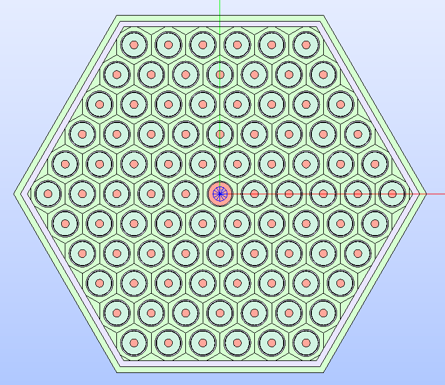

   The fuel assembly's technological geometry resulting by framing the cells
   into a box. Regions are displayed according to the
   :py:attr:`MATERIAL<glow.support.types.PropertyType.MATERIAL>` color map.

The second step in deriving the colorset layout is building the control rod
assembly. Its layout is characterised by control rod pins, modelled as circles,
placed within a central circular area.
The lattice that replicates this layout is considered to be made of circular
cells. Since there is not a pre-defined class for a circular cell, the user can
rely on the class :py:class:`GenericCell<glow.geometry_layouts.cells.GenericCell>`.
This class is meant to describe a cell with any given layout which is different
from the typical hexagonal or Cartesian ones.
In this sense, given a set of characteristic geometric data, the central cell
and the box cell (a :py:class:`HexCell<glow.geometry_layouts.cells.HexCell>`
instance) are built.

.. code-block:: python

  # Data
  pitch = fuel_assembly.lattice_box.figure.ly * 2
  edge_bypass = (pitch) / math.sqrt(3)
  edge_ext_wrap_o = (pitch - 0.4) / math.sqrt(3)
  edge_ext_wrap_i = (pitch - 0.6) / math.sqrt(3)
  r_cr_circles_i = 3.2
  r_cr_circles_o = 5.2
  cr_pin_radii = [0.68, 0.7, 0.78]
  cr_wrapper_radii = [7, 7.25]
  int_shaft_ir = 1.4
  int_shaft_or = 1.7

  # Build the central cell of the control rod assembly
  cr_cell = HexCell(edge_length=edge_ext_wrap_i, name= "Control Rod cell")
  # Add the circles representing the different zones
  for r in cr_wrapper_radii:
      cr_cell.add_circle(r)
  cr_cell.set_properties(
      {PropertyType.MATERIAL: ["COOLANT", "CR_CLADDING", "CR_MIX"]}
  )

To build and properly position the control rod pin cells, two functions are
included in the script: the `create_vertices_list` function produces a list
with a given number of vertex objects laying on the same circumference having
the given radius.
The `make_circular_cells_list` function creates a list of circular cells, as
:py:class:`GenericCell<glow.geometry_layouts.cells.GenericCell>` instances,
with centers provided by a list of vertex objects.

.. code-block:: python

  # Build the vertices at which the control rod cells are placed
  cr_vertices_i = create_vertices_list(r_cr_circles_i, 6)
  cr_vertices_o = create_vertices_list(r_cr_circles_o, 12)
  # Build the circular control rod cells placed along two circumferences
  cr_cells_i = make_circular_cells_list(cr_vertices_i, cr_pin_radii)
  cr_cells_o = make_circular_cells_list(cr_vertices_o, cr_pin_radii)

Lastly, the shaft cell is built; it is represented by a
:py:class:`GenericCell<glow.geometry_layouts.cells.GenericCell>` instance made
by three concentric circles.

.. code-block:: python

  # Build the central shaft cell as made by three concentric circles
  circle_shaft_i = Circle(
      radius=int_shaft_ir, name="Inner Shaft Circle"
  )
  circle_shaft_o = Circle(
      radius=int_shaft_or, name="Outer Shaft Circle"
  )
  shaft_compound = make_partition(
      [circle_shaft_o.face, circle_shaft_i.face], [], ShapeType.FACE)
  set_shape_name(shaft_compound, "Shaft Cell")
  shaft_cell = GenericCell(shaft_compound)
  shaft_cell.set_properties(
      {PropertyType.MATERIAL: ["COOLANT", "CR_CLADDING"]}
  )
  # Dummy assignement of the cell's type so that it can be added to a hexagonal
  # lattice
  shaft_cell.cell_type = CellType.HEX

The fuel assembly is built by instantianting an object of the class
:py:class:`Lattice<glow.geometry_layouts.lattices.Lattice>` and adding the cells
it is made of. In addition, the cell representing the assembly box is assigned
to the lattice's attribute
:py:attr:`lattice_box<glow.geometry_layouts.lattices.Lattice.lattice_box>`.
The resulting assembly is shown in :numref:`cr-assembly`.

.. code-block:: python

  # Build the control rod assembly
  cr_assembly = Lattice([cr_cell], "Control Rod Assembly")
  # Add the two rings of rod pin cells to the control rod assembly
  for cell in cr_cells_i + cr_cells_o:
      cr_assembly.add_cell(cell, ())
  # Add the shaft cell to the control rod assembly
  cr_assembly.add_cell(shaft_cell, ())
  # Assign the built box cell to the control rod assembly
  cr_assembly.lattice_box = box_cell

  # Display the control rod assembly
  cr_assembly.show(PropertyType.MATERIAL)

.. _cr-assembly:
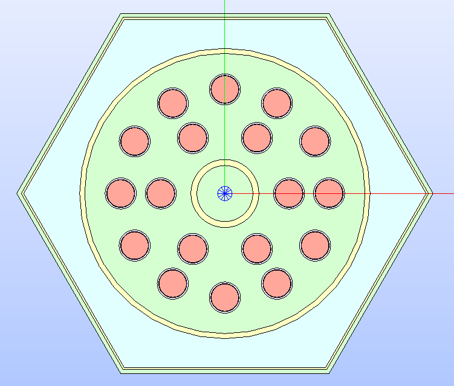

   The control rod assembly's technological geometry whose regions are
   displayed according to the :py:attr:`MATERIAL<glow.support.types.PropertyType.MATERIAL>`
   color map.

The layout of the *S30* colorset to replicate requires that the fuel assembly
is translated to the upper-right side of the control rod assembly.
The resulting compound made by the two assemblies and the portion identifying
the *S30* symmetry are built. The latter requires that a *common* operation
between the entire layout and the shape of the symmetry is performed.
The resulting *GEOM compound* object of the colorset portion is added to the
SALOME study.

.. code-block:: python

  # Translate the fuel assembly to the right of the control rod assembly
  fuel_assembly.translate((3/2*cr_assembly.lx, cr_assembly.ly, 0))

  # Build the colorset as a list of the two assemblies
  colorset = [cr_assembly, fuel_assembly]
  # Build the colorset compound and display it in the SALOME 3D viewer
  colorset_cmpd = make_compound([lattice.lattice_cmpd for lattice in colorset])

  # Extract the S30 symmetry portion out of the entire colorset
  edges = build_contiguous_edges(
      [
          make_vertex((0.0, 0.0, 0.0)),
          make_vertex((3/2*fuel_assembly.lx, fuel_assembly.ly, 0.0)),
          make_vertex((2*fuel_assembly.lx, 0.0, 0.0))
      ]
  )
  cutting_face = make_face(edges)
  colorset_portion = make_common(colorset_cmpd, cutting_face)
  add_to_study(colorset_portion, "Colorset - S30 Symmetry")

To enable the visualization of the regions of the colorset portion that belong
to the two assemblies at once with the same :py:attr:`MATERIAL<glow.support.types.PropertyType.MATERIAL>`
color map, the regions, and the names of the materials, are collected.
Given the number of unique materials, colors are generated and associated to
the regions.
The regions are then added to the SALOME study so that they can be displayed
in the 3D viewer of SALOME. The result is show in :numref:`colorset-regions`.

.. code-block:: python

  # Display all the regions of the two assemblies by using the same colormap
  colorset_regions: List[Region] = []
  material_names: List[str] = []
  for lattice in colorset:
      for region in lattice.regions:
          if get_min_distance(colorset_portion, region.face) > 1e-6:
              continue
          new_region = make_common(region.face, colorset_portion)
          # Continue with the next region if the common shape does not hold
          # any face, meaning that the region and the portion do not overlap
          if not extract_sub_shapes(make_compound([new_region]),
                                    ShapeType.FACE):
            continue
          # Store the material name, if not present
          mat_name = region.properties.get(PropertyType.MATERIAL)
          if mat_name is None:
              raise RuntimeError(f"No material for region {region}.")
          if mat_name not in material_names:
              material_names.append(mat_name)
          # If the result is a compound or a shell, extract the contained faces
          if get_shape_type(new_region) in [ShapeType.COMPOUND,
                                            ShapeType.SHELL]:
              for new_region in extract_sub_shapes(new_region, ShapeType.FACE):
                  colorset_regions.append(
                      Region(
                          new_region,
                          name=region.name,
                          properties=deepcopy(region.properties)
                      )
                  )
              continue
          colorset_regions.append(
              Region(
                  new_region,
                  name=region.name,
                  properties=deepcopy(region.properties)
              )
          )

  # Generate a specific amount of colors as the number of different
  # values for the same given property type
  colors = generate_unique_random_colors(len(material_names))
  # Join the material names with the colors
  materials_vs_color = dict(zip(material_names, colors))

  # Display the regions of the colorset portion with the material color map
  for region in colorset_regions:
      # Get the color according to the material name of the region
      region.color = materials_vs_color[
          region.properties[PropertyType.MATERIAL]
      ]
      set_color_face(region.face, region.color)
      add_to_study_in_father(colorset_portion, region.face, region.name)

.. _colorset-regions:
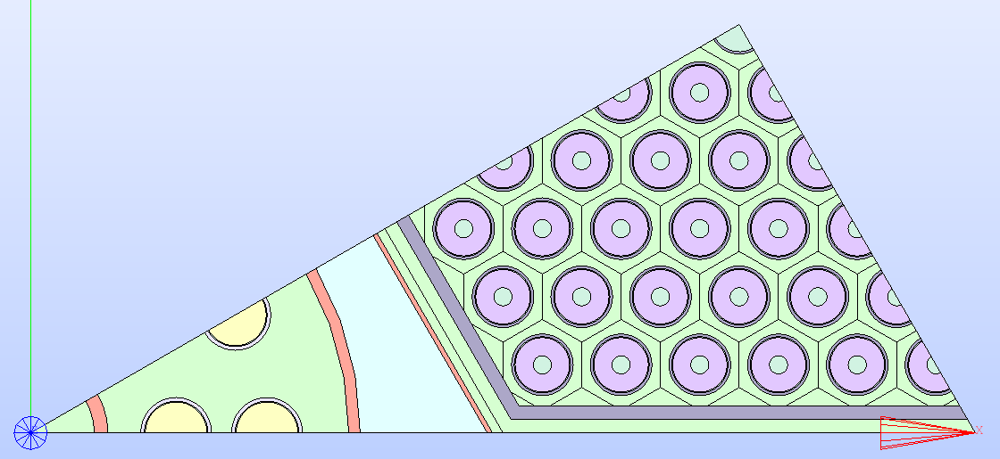

   The technological geometry of the colorset portion replicating the *S30*
   symmetry. Its regions are displayed according to the
   :py:attr:`MATERIAL<glow.support.types.PropertyType.MATERIAL>` color map.

Lastly, the surface geometry representation of the colorset portion is
exported to an output TDT file by setting the :py:class:`TdTSetup<glow.main.TdTSetup>`
attributes so that the TDT file describes an *S30* symmetry for an isotropic
tracking (*TISO*) in the *SALT* module of *DRAGON5*. In addition to the list
of :py:class:`Lattice<glow.geometry_layouts.lattices.Lattice>` objects belonging
to the colorset, the *GEOM compound* representing the *S30* symmetry of the
colorset is provided. The analysis and export functionalities will generate a
TDT file from this indicated layout.

.. code-block:: python

  # Generate the TDT file from the colorset portion using a specific typgeo and
  # symmetry type
  analyse_and_generate_tdt(
      colorset,
      "colorset_s30",
      tdt_config=TdtSetup(
          type_geo=LatticeGeometryType.SYMMETRIES_TWO,
          symmetry_type=SymmetryType.TWELFTH),
      compound_to_export=colorset_portion)
