.. _tutorials:

=========
Tutorials
=========

To fully exploit the functionalities offered by |TOOL|, several examples are
provided. They can be found in the ``tutorials`` folder. In the following,
they are presented and explained in detail, showing for each the resulting
geometry layout as displayed in the 3D viewer of *SALOME*.

Hexagonal Cell
--------------

The use case ``hexagonal_cell.py`` shows the steps required to declare a single
hexagonal cell and customise its geometry layout.

The goal is to instantiate a hexagonal cell whose edge is ``1.0`` long, having
three circles to delimit the different regions where each one is attributed to
a specific material.
The cell's technological geometry is built from a hexagonal cell with specified
material, onto which several circular ``Region`` objects are added.
Each ``Region`` object is added to a layer in the cell's hierarchical structure.
The order of insertions of the regions is from the outer to the inner region;
this allows for the correct overlapping of regions one onto the other.
Materials are assigned as values of the corresponding property type
:py:attr:`MATERIAL<glow.support.types.PropertyType.MATERIAL>` directly when
instantiating the circular regions.
The following code snippet shows the building steps:

.. code-block:: python

    # Intialise two lists, one storing the circular regions radii, the other
    # the names of the materials, sorted from the inner to the outer region
    radii = [0.25, 0.4, 0.6]
    materials = ["MAT_1", "MAT_2", "MAT_3"]
    # Build the cell's geometry layout by adding three circular regions from
    # the outer to the inner
    cell = HexCell(
        name="Hexagonal cell", base_props={PropertyType.MATERIAL: "MAT_4"}
    )
    for radius, mat in zip(radii[::-1], materials[::-1]):
        cell.add(
            Region(
                Circle(radius=radius),
                properties={PropertyType.MATERIAL: mat}
            )
        )

    # Show the regions according to the 'MATERIAL' colour map
    cell.show(PropertyType.MATERIAL)

The regions of the cell's technological geometry can be displayed in the *SALOME*
3D viewer with the :py:attr:`MATERIAL<glow.support.types.PropertyType.MATERIAL>`
color map by specifying it among the available arguments of the method
:py:meth:`show()<glow.geometry_layouts.cells.HexCell.show>`.
The result is shown in :numref:`cell-colormap`.

.. _cell-colormap:
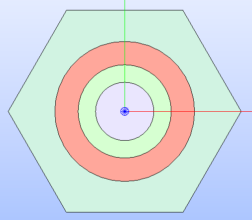

   Hexagonal cell's technological geometry shown by applying a color map that
   highlights the type of property :py:attr:`MATERIAL<glow.support.types.PropertyType.MATERIAL>`
   applied to the different regions.

Having a refined geometry layout can allow for capturing flux gradients arising
from geometric heterogeneities. Hence, a sectorisation can be applied with the
method :py:meth:`sectorize()<glow.geometry_layouts.cells.HexCell.sectorize>`.
It requires two lists, one with the number of sectors that each region is
subdivided into and one with the angle that each sectorisation starts from.
The refined geometry can be shown even with the :py:attr:`MATERIAL<glow.support.types.PropertyType.MATERIAL>`
colorset by specifying it among the arguments of the method
:py:meth:`show()<glow.geometry_layouts.cells.HexCell.show>`
together with the :py:attr:`SECTORIZED<glow.support.types.GeometryType.SECTORIZED>`
type of geometry (see :numref:`cell-sect`).

.. code-block:: python

    # Build the cell's sectorised geometry
    cell.sectorize([1, 1, 6, 6], [0]*4)
    # Show the cell's sectorised layout according to the 'MATERIAL' colour map
    cell.show(PropertyType.MATERIAL, GeometryType.SECTORIZED)

.. _cell-sect:
.. figure:: images/cell_sect_col.png
   :alt: Hexagonal cell's sectorised geometry with MATERIAL color map
   :width: 400px
   :align: center

   Hexagonal cell's sectorised geometry shown by applying a colour map that
   highlights the :py:attr:`MATERIAL<glow.support.types.PropertyType.MATERIAL>`
   property type applied to the different regions.

Cartesian Cell With Custom Refined Layout
-----------------------------------------

The use case ``cartesian_cell.py`` shows the steps required to declare a single
Cartesian cell and customize its sectorised layout by means of the functions
of the module :mod:`glow.interface.geom_interface` that wrap the ones of the
*GEOM* module of *SALOME*.

The goal is to instantiate a Cartesian cell with a square shape whose edge is
``1.0`` long. The cell is subdivided into four regions by means of three circles;
a specific material is assigned to each of the regions of the resulting
technological geometry.
The characterization of the cell's technological geometry follows the same
instructions as shown in the previous case with the instantiation of
:py:class:`Region<glow.geometry_layouts.layouts.Region>` objects, each with a
value for the :py:attr:`MATERIAL<glow.support.types.PropertyType.MATERIAL>`
property type.

.. code-block:: python

    # Intialise two lists, one storing the circular regions radii, the other
    # the names of the materials, sorted from the inner to the outer region
    radii = [0.2, 0.3, 0.4]
    materials = ["MAT_1", "MAT_2", "MAT_3"]
    # Build the cell's geometry layout by adding three circular regions from
    # theouter to the inner
    cell = CartesianCell(
        name="Cartesian cell", base_props={PropertyType.MATERIAL: "MAT_4"}
    )
    for radius, mat in zip(radii[::-1], materials[::-1]):
        cell.add(
            Region(
                Circle(radius=radius),
                properties={PropertyType.MATERIAL: mat}
            )
        )

To refine the geometry layout, a sectorisation can be applied with the method
:py:meth:`sectorize()<glow.geometry_layouts.cells.CartesianCell.sectorize>`.
In addition to the two lists indicating the number of sectors and the angle the
sectorisation starts from, a Cartesian cell can also receive the boolean flag
``windmill``. This last option generates a sectorised geometry where lines are
drawn between two adjacent border edges from points of intersection of the sector
edges with the cell's borders (see :numref:`cell-windmill`).

.. code-block:: python

  # Build the cell's sectorised geometry with 'windimill' option enabled
  cell.sectorize([1, 1, 4, 8], [0, 0, 0, 22.5], windmill=True)
  # Show the sectorised cell with regions colored according to the 'MATERIAL'
  # property
  cell.show(PropertyType.MATERIAL, GeometryType.SECTORIZED)

.. _cell-windmill:
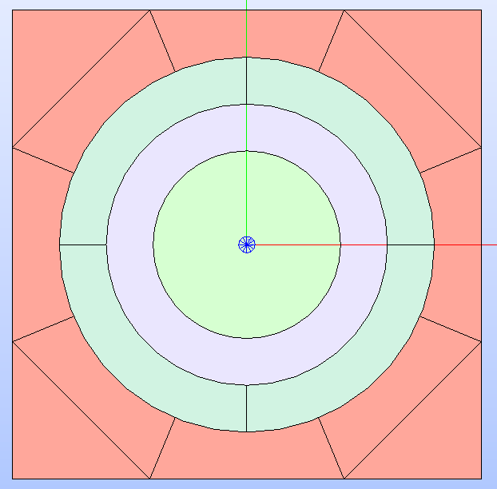

   Cartesian cell's refined geometry with `windmill` sectorisation enabled.
   It is shown according to the :py:attr:`MATERIAL<glow.support.types.PropertyType.MATERIAL>`
   colour map.

The method :py:meth:`sectorize()<glow.geometry_layouts.cells.CartesianCell.sectorize>`
only covers the subdivision of the technological geometry into sectors by
drawing edges that are stored in the :py:attr:`geometry_maps<glow.geometry_layouts.fillable_layouts.Fillable.geometry_maps>`
attribute of the subclass :py:class:`Fillable<glow.geometry_layouts.fillable_layouts.Fillable>`.
If a further customisation is needed, users can rely on the functions in the
:mod:`glow.interface.geom_interface` module to build the *GEOM compound* of
edges that further refines the geometry layout.
This tutorial demonstrates how to customise the cell by updating the sectorised
geometry with a *GEOM compound* containing more circles between two adjacent
regions of the technological geometry.
By updating the *GEOM compound* that corresponds to the :py:attr:`SECTORIZED<glow.support.types.GeometryType.SECTORIZED>`
geometry type, it is possible to have a custom refined layout.
The result of the following code is shown in :numref:`cell-update`.

.. code-block:: python

    # Build a compound from the edges of the circles
    circles_cmpd = make_compound([c.borders[0] for c in circles])
    # Update the cell's sectorised geometry with the compound of edges
    cell.geometry_maps[GeometryType.SECTORIZED] = wrap_shape(
        make_compound(
            [cell.geometry_maps[GeometryType.SECTORIZED], circles_cmpd]
        )
    )
    # Show the result in the 3D viewer
    cell.show(PropertyType.MATERIAL, GeometryType.SECTORIZED)

.. _cell-update:
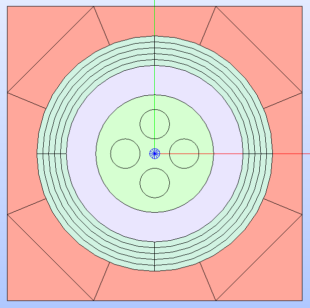

   Cartesian cell's sectorised geometry after updating it by adding several
   circles. It is shown by applying a colour map that highlights the type of
   property :py:attr:`MATERIAL<glow.support.types.PropertyType.MATERIAL>`.

.. _symmetry-example:

Cartesian Assembly With Symmetry
--------------------------------

The use case ``cartesian_assembly.py`` shows the steps required to declare an
assembly made by a central cell (of Cartesian type) around which several rings
of the same cell are placed.
This type of geometry layout can be tracked by the *SALT* module of *DRAGON5*
using a one eighth symmetry as this is the minimum portion of the geometry that
can describe the entire layout of the assembly.

The first step for assembling this use case geometry is to instantiate the
Cartesian cell (i.e. object of the class
:py:class:`CartesianCell<glow.geometry_layouts.cells.CartesianCell>`) which
constitutes the lattice.
The instructions that follow build a Cartesian cell with a square shape whose
edge is ``1.0`` long; the cell is subdivided into four regions by means of
three circles and the type of property
:py:attr:`MATERIAL<glow.support.types.PropertyType.MATERIAL>` is assigned to
each region. In addition, the regions are sectorised with the `windmill` option
enabled.

.. code-block:: python

    # Intialise three lists one storing the circular regions radii, the other the
    # names of the materials, sorted from the inner to the outer region
    radii = [0.2, 0.3, 0.4]
    materials = ["MAT_1", "MAT_2", "MAT_3"]
    # Build the geometry layout of the cell by adding three circular regions, from
    # external to internal
    cell = CartesianCell(
        name="Cartesian cell", base_props={PropertyType.MATERIAL: "MAT_4"}
    )
    for radius, mat in zip(radii[::-1], materials[::-1]):
        cell.add(
            Region(
                Circle(radius=radius),
                properties={PropertyType.MATERIAL: mat}
            )
        )
    # Apply the cell's sectorisation
    cell.sectorize([1, 1, 4, 8], [0, 0, 0, 22.5], windmill=True)

The subsequent step is to declare the instance of the class
:py:class:`CartesianLattice<glow.geometry_layouts.lattices.CartesianLattice>`
and add the cells it is made of.
A single cell is provided when instantiating the lattice; this cell is placed
at the centre of the lattice since the cell and the lattice share the same
coordinates for their centres.
To add several rings of the same cell, the method
:py:meth:`add_rings_of_cells()<glow.geometry_layouts.lattices.CartesianLattice.add_rings_of_cells>`
is provided with the instance of the :py:class:`CartesianCell<glow.geometry_layouts.cells.CartesianCell>`
class, previously declared, and the number of rings to add. Optionally, the
starting ring index can be specified as third argument (it defaults to `1`).
The lattice's technological geometry resulting from assembling all the
rings of cells is shown in :numref:`lattice-tech`.

.. code-block:: python

    # Build the lattice with several rings of the same Cartesian cell
    lattice = CartesianLattice([cell], name='Cartesian Lattice')
    lattice.add_rings_of_cells(cell, 4, 1)
    lattice.show(PropertyType.MATERIAL)

.. _lattice-tech:
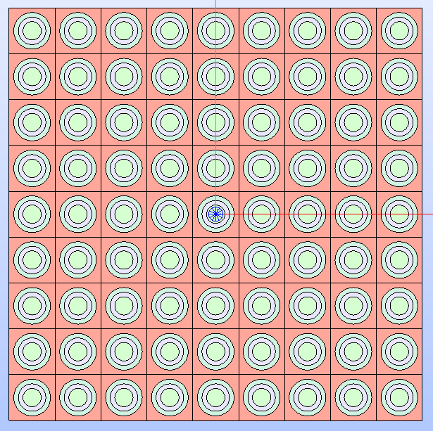

   Cartesian lattice's technological geometry resulting by adding several
   rings of cells. It is shown by applying a colour map that highlights the type
   of property :py:attr:`MATERIAL<glow.support.types.PropertyType.MATERIAL>`
   applied to the different regions of its cells.

To replicate a fuel assembly, the lattice needs to be framed into a box. This
can be performed by declaring an additional :py:class:`CartesianCell<glow.geometry_layouts.cells.CartesianCell>`
instance and adding the lattice and the :py:class:`Region<glow.geometry_layouts.layouts.Region>`
objects that represents the different box layers.
Given the characteristic dimensions of the lattice, the width and the height of
the cell is calculated and used to declare the assembly's cell.
To have the box cut the outmost ring of cells of the lattice, the rectangular
inner region is built starting from the lattice dimensions reduced by a specific
amount.
The box contour can then be determined as the result of a cutting operation between
the whole assembly and the inner region.
Users should note that |TOOL| overloads mathematical operators to perform specific
Boolean operations between subclasses of the :py:class:`GeomWrapper<glow.interface.geom_entities.GeomWrapper>`.
In this case, the ``-`` operator is used to determine a new :py:class:`Region<glow.geometry_layouts.layouts.Region>`
object from cutting the assembly with the inner region.
Both the lattice and the box contour are added to the hierarchical tree of the
assembly by calling the :py:meth:`add()<glow.geometry_layouts.fillable_layouts.Fillable.add>`
method.
To simplify the hierarchical structure of a :py:class:`Fillable<glow.geometry_layouts.fillable_layouts.Fillable>`
object, |TOOL| provides the method
:py:meth:`update_hierarchical_structure()<glow.geometry_layouts.fillable_layouts.Fillable.update_hierarchical_structure>`.
By default, this method collapses the layers of the layout by cutting those that
are overlapped by superior layers. In addition, it can receive a Boolean flag
that, if `True`, rebuilds the :py:attr:`layers<glow.geometry_layouts.fillable_layouts.Fillable.layers>`
attribute with a list of one element that contains the :py:class:`Region<glow.geometry_layouts.layouts.Region>`
objects belonging to the :py:class:`Fillable<glow.geometry_layouts.fillable_layouts.Fillable>`
objects of the layout, thus reducing the hierarchical tree to one constituted
only by the leaves (i.e. nodes are substituted by their leaves).
Lastly, the method :py:meth:`apply_symmetry()<glow.geometry_layouts.fillable_layouts.Fillable.apply_symmetry>`
is called by specifying the :py:attr:`EIGHTH<glow.support.types.SymmetryType.EIGHTH>`
type of symmetry.
In the following, the instructions for assembling the assembly layout are detailed.
The technological geometry resulting from assembling the box with the lattice
is shown in :numref:`lattice-boxed`.

.. code-block:: python

    # Build the cell representing the lattice's box so that it sligthly cuts
    # the outmost ring of cells
    assembly = CartesianCell(
        width_height=(box_w + 2*thickness, box_h + 2*thickness),
        base_props={PropertyType.MATERIAL: "MAT_2"}
    )
    # Build the inner region of the assembly that is cut out from the box shape
    inner_area = Rectangle(
        height=(box_h - thickness),
        width=(box_w - thickness)
    )
    # Build the box contour as a 'Region' obtained by cutting the entire assembly
    # with the inner region and assigning a material
    box_contour = Region(
        assembly - inner_area,
        properties={PropertyType.MATERIAL: "MAT_2"}
    )

    # Add the lattice to the assembly cell, then apply the assembly layer region
    assembly.add(lattice)
    assembly.add(box_contour)

    # Update the hierarchical tree of the layout and collapse all the layers into
    # one, while cutting the refined geometry due to the box layer overlapping
    # the outer cells
    assembly.update_hierarchical_structure(True)
    # Show the assembly technological layout with the property colour map
    assembly.show(PropertyType.MATERIAL)

.. _lattice-boxed:
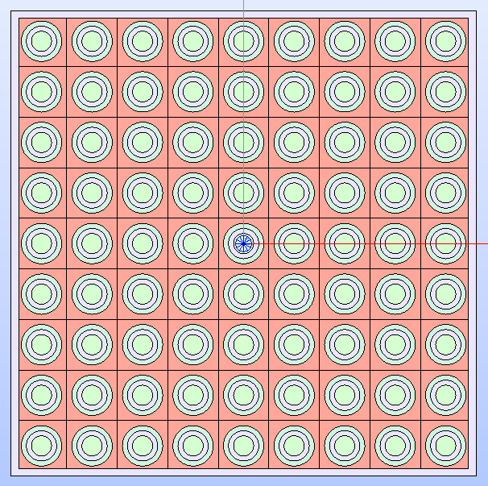

   Technological geometry layout of the assembly resulting by framing the
   cells in a box that sligthly cuts the outmost ring of cells.

A symmetry can be applied to the lattice's geometry layout. For the specific
layout of this use case, the :py:attr:`EIGHTH<glow.support.types.SymmetryType.EIGHTH>`
type of symmetry can be used in tracking calculations since it is the minimum
portion that can represent the entire geometry layout of the lattice.
The result of applying the above mentioned type of symmetry is shown in
:numref:`lattice-eighth`.

.. code-block:: python

    # Apply the eighth symmetry type to the assembly
    lattice.apply_symmetry(SymmetryType.EIGHTH)
    # Show the resulting layout with the 'MATERIAL' colour map
    lattice.show(PropertyType.MATERIAL)

.. _lattice-eighth:
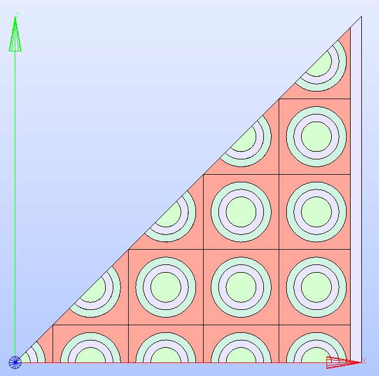

   Technological geometry layout of the assembly resulting by framing the lattice's
   cells in a box and applying the :py:attr:`EIGHTH<glow.support.types.SymmetryType.EIGHTH>`
   type of symmetry.

If the :py:attr:`SECTORIZED<glow.support.types.GeometryType.SECTORIZED>` geometry
type is specified when calling the :py:meth:`show()<glow.geometry_layouts.fillable_layouts.Fillable.show>`
method, the result is the technological layout with the edges resulting from the
sectorisation of its cells.
In case a further refinement is needed, users can rely on the specific functions
of the :mod:`glow.interface.geom_interface` module that
wrap the corresponding ones of the *GEOM* module of SALOME.
In this tutorial, it is shown how to build a Cartesian mesh only for the box
contour region.
Given the characteristic dimensions of the lattice and the box layer thickness,
two edges are built to represents the segments at the extrema of the mesh in
the upper part of the box contour layer.
Then, the subdivision edges of the mesh are built from the lattice's pitch. A
multi-translation of the built edge along the X-axis is performed so to build
all the needed edges at once. A compound object collecting all the edges is built
and rotated by 90° so that it is applied also to the right part of the box contour
layer.
The :py:attr:`SECTORIZED<glow.support.types.GeometryType.SECTORIZED>` geometry
type of the assembly is then updated by applying a partition operation between
the current compound stored in the :py:attr:`geometry_maps<glow.geometry_layouts.fillable_layouts.Fillable.geometry_maps>`
attribute of the assembly and the compound collecting the mesh edges.
The result is re-assigned to the same attribute and the assembly displayed
according to the :py:attr:`SECTORIZED<glow.support.types.GeometryType.SECTORIZED>`
geometry type with the :py:attr:`MATERIAL<glow.support.types.PropertyType.MATERIAL>`
colour map.
The following code snippet presents the steps to build and display the assembly's
refined layout. The result is shown in :numref::`assembly-refined`.

.. code-block:: python

    # Get the X dimension of the pitch
    pitch_x = cell.dimensions[0]
    # Build XYZ axis vectors
    o_x = make_vector((1, 0, 0))
    o_y = make_vector((0, 1, 0))
    o_z = make_vector((0, 0, 1))
    # Build the outer edges of the mesh along Y by relying on the min/max lattice
    # points
    x_min, x_max, y_min, y_max = get_bounding_box(lattice.shape)
    mesh_edge_outer_1 = make_edge(
        make_vertex((x_min + 0.5*thickness, y_min - thickness, 0.0)),
        make_vertex((x_min + 0.5*thickness, y_max + thickness, 0.0)),
    )
    mesh_edge_outer_2 = make_edge(
        make_vertex((x_max - 0.5*thickness, y_min - thickness, 0.0)),
        make_vertex((x_max - 0.5*thickness, y_max + thickness, 0.0)),
    )
    # Build the starting edges from which the Y-mesh is built with a 1D
    # multi-translation
    mesh_edge_1 = make_edge(
        make_vertex((x_min + pitch_x, y_min - thickness, 0.0)),
        make_vertex((x_min + pitch_x, y_max + thickness, 0.0)),
    )
    mesh_y = make_multi_translation_1d(mesh_edge_1, o_x, 1, 8)
    # Join the Y-mesh edges into a single compound
    mesh_y = make_compound([mesh_y, mesh_edge_outer_1, mesh_edge_outer_2])
    # Rotate Y-mesh compound to obtain the X-mesh and join both in a compound
    mesh_x = make_rotation(mesh_y, o_z, pi/2)
    mesh = make_compound([mesh_x, mesh_y])

    # Collect the refined geometry of the cells and join it with the built mesh
    # by performing a partition
    assembly.geometry_maps[GeometryType.SECTORIZED] = \
        assembly.get_geometry_map(GeometryType.SECTORIZED) // wrap_shape(mesh)

    # Show the resulting refined layout with the 'MATERIAL' colour map
    assembly.show(PropertyType.MATERIAL, GeometryType.SECTORIZED)

.. _assembly-refined:
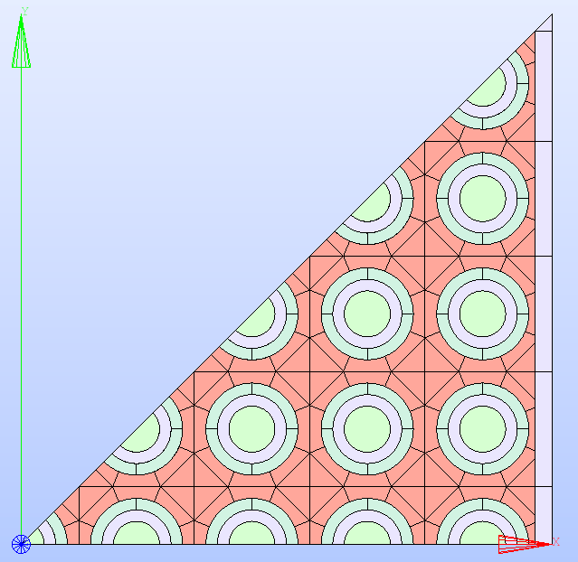

   One eighth of the assembly's refined geometry layout resulting by joining
   the :py:attr:`SECTORIZED<glow.support.types.GeometryType.SECTORIZED>` edges
   of the cells with the mesh built for the box contour layer.
   Regions are displayed according to the :py:attr:`MATERIAL<glow.support.types.PropertyType.MATERIAL>`
   colour map.

The geometry layout shown in :numref::`assembly-refined` can be exported to the
output *TDT* file by calling the function :py:func:`export_layout_to_tdt()<glow.main.export_layout_to_tdt>`.
It is possible to indicate which :py:class:`GeometryType<glow.support.types.GeometryType>`
to use in the analysis that |TOOL| performs to generate the output *TDT* file.
In the following, the instance of the dataclass :py:class:`TdtSetup<glow.main.TdtSetup>`
is provided specifying the :py:attr:`SECTORIZED<glow.support.types.GeometryType.SECTORIZED>`
type of geometry, the adopted ``type_geo`` and the type of symmetry.
The chosen value of ``type_geo`` allows for a *TSPC* type of tracking; the
:py:attr:`RECTANGLE_EIGHT<glow.support.types.LayoutGeometryType.RECTANGLE_EIGHT>`
value matches the applied symmetry type.

.. code-block:: python

    # Export the surface representation of the layout according to the TDT format
    export_layout_to_tdt(
        assembly,
        "cartesian_assembly",
        TdtSetup(
            geom_type=GeometryType.SECTORIZED,
            type_geo=LayoutGeometryType.RECTANGLE_EIGHT,
            symmetry_type=SymmetryType.EIGHTH
        )
    )

.. _tutorial-overlap:

Hexagonal Assembly With Different Cells
---------------------------------------

The use case ``hexagonal_assembly.py`` shows the steps required to declare an
assembly made by several rings of the same hexagonal cell framed in a hexagonal
box. In addition, a hexagonal cell having different dimension, layout and
materials is positioned at different XYZ coordinates within the lattice.

The first step to perform is creating the instances of the hexagonal cells
(i.e. the object of the class :py:class:`HexCell<glow.geometry_layouts.cells.HexCell>`)
the lattice is made of.
The two hexagonal cells are characterised by different length of their side edge
as one is ``1.0`` and the other ``2.0`` long.
The main pattern of the geometry layout is constituted by cells of the smaller
size; they are subdivided into five regions by means of four circular regions.
The cell with greater size, instead, has a different layout characterised by
two circular regions.
In addition, the first cell is rotated by 90° so that the final assembly is
enclosed in a X-oriented hexagonal cell, as requested by the *SALT* module of
*DRAGON5* when dealing with a full layout.
The type of property :py:attr:`MATERIAL<glow.support.types.PropertyType.MATERIAL>`
is assigned to the regions of each cell.
The following snippet shows the instantiation of the two cells of the assembly.
A dedicated function ``add_circular_regions()`` is included to handle the
addition of the circular regions to the two cells.

.. code-block:: python

    def add_circular_regions(
            cell: Cell, radii: List[float], materials: List[float]
        ) -> None:
        """
        Function that adds cell-centred circular ``Region`` objects to the given
        ``Cell`` instance. Regions are characterised in terms of the radius and
        the material property.

        Parameters
        ----------
        cell : Cell
            The ``Cell`` instance the circular regions are added to.
        radii : List[float]
            The list of radii of the circular regions in ascending order.
        materials : List[str]
            The list of material names of the circular regions ordered from the
            inner to the outer region.
        """
        for radius, mat in zip(radii[::-1], materials[::-1]):
            cell.add(
                Region(
                    Circle(radius=radius),
                    properties={PropertyType.MATERIAL: mat}
                )
            )
    # ----------------------------------------------------------------------
    # Build the hexagonal cell that constitutes the lattice.
    cell_1 = HexCell(
        name="Cell 1",
        base_props={PropertyType.MATERIAL: "COOLANT"}
    )
    cell_1.rotate(90)
    add_circular_regions(
        cell_1, [0.1, 0.6, 0.625, 0.70], ["GAP", "FUEL", "GAP", "CLADDING"]
    )

    # ----------------------------------------------------------------------
    # Build the second hexagonal cell
    cell_2 = HexCell(
        side=2.0,
        name="Cell 2",
        base_props={PropertyType.MATERIAL: "COOLANT"}
    )
    add_circular_regions(cell_2, [1.0, 1.25], ['COOLANT', 'CLADDING'])

The subsequent step is to declare the instance of the class
:py:class:`HexLattice<glow.geometry_layouts.lattices.HexLattice>` and add the
cells it is made of.
A single cell (the one with smaller size) is provided when instantiating the
lattice. This cell is placed at the centre of the lattice as they both have
the same coordinates of the centre.
Several rings of the same cell are then added with the method
:py:meth:`add_rings_of_cells()<glow.geometry_layouts.lattices.HexLattice.add_rings_of_cells>`:
the instance of the :py:class:`HexCell<glow.geometry_layouts.cells.HexCell>`
class, previously declared, is provided together with the number of rings to
add, and the starting ring index.
To complete the lattice's geometry layout, the cell with greater size is added
at specific coordinates using the method :py:meth:`add()<glow.geometry_layouts.lattices.HexLattice.add>`.
The resulting geometry layout (see :numref:`hex-lattice-overlap-cells`) shows
that larger cells overlap smaller cells because they have been placed in a
higher layer. Consequently, the layout of the cells being partially overlapped
is automatically modified by the result of a cut operation. Cells that are
completely overlapped, instead, are removed from the hierarchical tree of the
lattice.
The aforementioned operations are automatically performed by calling the
:py:meth:`show()<glow.geometry_layouts.fillable_layouts.Fillable>` method.

.. code-block:: python

    # Build the lattice and add both types of cells
    lattice = HexLattice(cells=[cell_1], name="HexLattice")
    lattice.add_rings_of_cells(cell_1, 6, 1)
    # XY coordinates of the centres of the cells with greater size
    x = 4.330127
    y = 4.5
    lattice.add(cell_2, ())
    lattice.add(cell_2, (x, y, 0.0))
    lattice.add(cell_2, (-x, y, 0.0))
    lattice.add(cell_2, (x, -y, 0.0))
    lattice.add(cell_2, (-x, -y, 0.0))
    # Show the lattice's technological geometry with the 'MATERIAL' colour map
    lattice.show(PropertyType.MATERIAL)

.. _hex-lattice-overlap-cells:
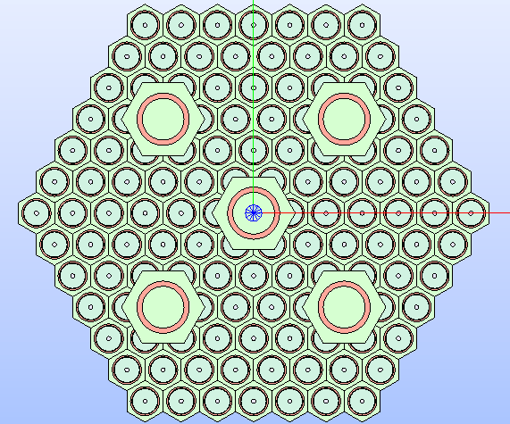

   Hexagonal lattice's technological geometry resulting by adding several
   rings of cells with smaller size and cells with a greater size at specific
   coordinates. The resulting geometry layout shows that the cells of the
   higher layer cut those of the layer below. The colour map that highlights
   the type of property :py:attr:`MATERIAL<glow.support.types.PropertyType.MATERIAL>`
   is applied to the different regions of the lattice's cells.

The current lattice's geometry layout shown in :numref:`hex-lattice-overlap-cells`
presents a situation where the structural parts (e.g. regions associated with
a fuel material) of the smaller cells are cut.
Since this scenario cannot happen in real-life situations, these cells need to
be restored by removing any circular region.
The :py:meth:`restore()<glow.geometry_layouts.fillable_layouts.Fillable.restore>`
method allows for resetting the cell's geometry layout to its characteristic
shape while clearing any associated properties.
To get from within a Python script the cells to restore, this tutorial includes
the function ``get_modified_cells()``. Given the :py:class:`HexLattice<glow.geometry_layouts.lattices.HexLattice>`
instance, this function returns a list of cells of the lattice that show a geometry
layout that differs from their characteristic shape.
For each of the returned cells, the :py:meth:`restore()<glow.geometry_layouts.fillable_layouts.Fillable.restore>`
method is called and then the :py:attr:`MATERIAL<glow.support.types.PropertyType.MATERIAL>`
property set to be `COOLANT`.
:numref:`hex-lattice-restored` shows the result of restoring the cut cells.

.. code-block:: python

    def get_modified_cells(lattice: Lattice) -> List[Cell]:
        """
        Function that returns a list of ``Cell`` objects belonging to the given
        ``Lattice`` instance. These cells have their geometry layout changed
        compared to their original one.
        For each cell in each layer, the current shape of the cell is built and
        its area compared with the area of its specific characteristic figure (as
        a ``Surface`` instance).
        Those showing a different value for the area indicates a change in their
        geometry layout has occurred and are collected into the returned list.

        This function retrieves cells that have been modified within the lattice,
        such as by overlap with a superior layer of cells.

        Parameters
        ----------
        lattice : Lattice
            The lattice instance to check for cells whose geometry layout has
            changed.

        Returns
        -------
        List[Cell]
            A list of ``Cell`` objects whose geometry layout differs from their
            original one.
        """
        cells = []
        lattice.update_hierarchical_structure()
        for layer in lattice.layers:
            for layout in layer:
                if isinstance(layout, Region):
                    continue
                # Build a face object over the borders of the cell
                cell_shape = make_face(build_compound_borders(layout))
                # Compare the area of the current cell's face with the one of its
                # original shape
                if not math.isclose(
                    get_basic_properties(cell_shape)[1],
                    get_basic_properties(layout.shape)[1],
                    abs_tol=1e-6
                ):
                    cells.append(layout)
        # Return the list of changed cells
        return cells

    # Get the cells whose geometry layout has been cut and restore them by
    # assigning a specific property type
    for cell in get_modified_cells(lattice):
        cell.restore()
        cell.regions[0].properties = {PropertyType.MATERIAL: 'COOLANT'}

.. _hex-lattice-restored:
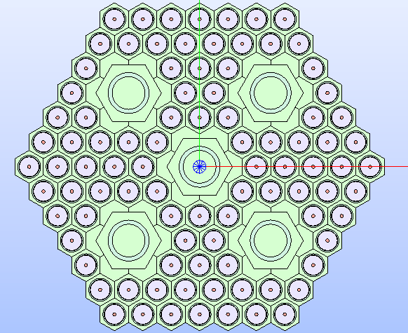

   Hexagonal lattice's technological geometry resulting by restoring the geometry
   layout of those cells that have been cut. The colour map that highlights
   the type of property :py:attr:`MATERIAL<glow.support.types.PropertyType.MATERIAL>`
   is applied to the different regions of the lattice's cells.

An assembly requires the lattice to be included in the hierarchical tree of a
cell, which represents the box.
A :py:class:`HexCell<glow.geometry_layouts.cells.HexCell>` object is then instantiated
by specifying, as the size of its edge, the length of the side edge of the
hexagon that encloses the lattice plus the sum of the thicknesses of the box
layers.
In this case, the box layers do not cut the outmost ring of cells, then, the
layout can be built by adding the two box layers first (defined as
:py:class:`Region<glow.geometry_layouts.layouts.Region>` instances), followed
by the :py:class:`HexLattice<glow.geometry_layouts.lattices.HexLattice>`
instance.
The resulting assembly is shown in :numref:`hex-lattice-boxed`.

.. code-block:: python

    # Build the assembly cell from the lattice's dimensions + the sum of the box's
    # layers thickness
    box_thicknesses = [0.15, 0.15]
    assembly = HexCell(
        side=lattice.dimensions[0] + sum(box_thicknesses),
        name="Hexagonal Assembly",
        base_props={PropertyType.MATERIAL: 'COOLANT'}
    )
    # Add the box layers first, then the lattice
    assembly.add(
        Region(
            Hexagon(edge_length=lattice.dimensions[0]+box_thicknesses[0]),
            properties={PropertyType.MATERIAL: 'CLADDING'}
        )
    )
    assembly.add(
        Region(
            Hexagon(edge_length=lattice.dimensions[0]),
            properties={PropertyType.MATERIAL: 'COOLANT'}
        )
    )
    assembly.add(lattice)
    # Show the lattice's technological geometry
    assembly.show(PropertyType.MATERIAL)

.. _hex-lattice-boxed:
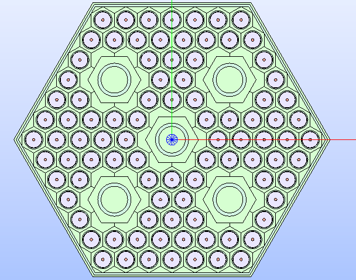

   Hexagonal lattice's technological geometry resulting by framing the lattice
   into a hexagonal cell.

The geometry layout shown in :numref::`hex-lattice-boxed` can be exported to the
output *TDT* file by calling the function :py:func:`export_layout_to_tdt()<glow.main.export_layout_to_tdt>`.
In this case, the layout is exported by indicating in the :py:class:`TdtSetup<glow.main.TdtSetup>`
dataclass a value of ``type_geo`` that results in a :py:attr:`TRANSLATION<glow.support.types.BoundaryType.TRANSLATION>`
BC type applied to the lattice's boundaries.

allows for a *TSPC* type of tracking
for a full geometry layout.
No values for the :py:class:`GeometryType<glow.support.types.GeometryType>` and
the :py:class:`SymmetryType<glow.support.types.SymmetryType>` are provided; this
means that the default :py:attr:`TECHNOLOGICAL<glow.support.types.GeometryType.TECHNOLOGICAL>`
and :py:attr:`FULL<glow.support.types.SymmetryType.FULL>` values are considered.
The adopted value of ``type_geo`` results in a :py:attr:`TRANSLATION<glow.support.types.BoundaryType.TRANSLATION>`
BC type applied to the lattice's boundaries.
This setting generates a surface representation that must be tracked by a cyclic
method (i.e. *TSPC*).

.. code-block:: python

    # ----------------------------------------------------------------------
    # Perform the geometry analysis and export the TDT file of the surface
    # geometry
    export_layout_to_tdt(
        assembly,
        'hexagonal_assembly',
        TdtSetup(type_geo=LayoutGeometryType.HEXAGON_TRAN)
    )

Colorset
--------

The use case ``colorset.py`` shows the steps required to build the S30 portion
of a colorset made by two different hexagonal assemblies.
The layout of the colorset presents a control rod assembly surrounded by six
fuel assemblies. In the specific case of this example, given the available
symmetry of one twelfth of the colorset (i.e. *S30*), only the two assemblies
that concur in identifying the portion to study are built.

The first step in assembling the geometry layout is building the fuel assembly,
which is made by two hexagonal cells (i.e. the object of the class
:py:class:`HexCell<glow.geometry_layouts.cells.HexCell>`) with different layouts.

The two hexagonal cells that characterise the lattice are built with the same
edge of ``1.0``, but different number of circular regions.
The cell which constitutes the main pattern of the geometry layout is subdivided
into five regions by means of four circles; the other cell, which is placed in
the lattice centre, is characterized by two circular regions.
In addition, both cells are rotated by 90° so that the final assembly is
enclosed in a X-oriented hexagonal cell.
The type of property :py:attr:`MATERIAL<glow.support.types.PropertyType.MATERIAL>`
is assigned to the regions of each cell.
A dedicated function ``add_circular_regions()`` is included to handle the
addition of the circular regions to the two cells.

.. code-block:: python

    def add_circular_regions(
            cell: Cell, radii: List[float], materials: List[float]
        ) -> None:
        """
        Function that adds cell-centred circular ``Region`` objects to the given
        ``Cell`` instance. Regions are characterised in terms of the radius and
        the material property.

        Parameters
        ----------
        cell : Cell
            The ``Cell`` instance the circular regions are added to.
        radii : List[float]
            The list of radii of the circular regions in ascending order.
        materials : List[str]
            The list of material names of the circular regions ordered from the
            inner to the outer region.
        """
        for radius, mat in zip(radii[::-1], materials[::-1]):
            cell.add(
                Region(
                    Circle(radius=radius),
                    properties={PropertyType.MATERIAL: mat}
                )
            )

    # -------------------------------------------------------------------------- #
    # FUEL ASSEMBLY CONSTRUCTION                                                 #
    # -------------------------------------------------------------------------- #
    # Build the hexagonal cells of the fuel assembly
    fuel_cell = HexCell(
        name="Fuel cell", base_props={PropertyType.MATERIAL: "COOLANT"}
    )
    fuel_cell.rotate(90)
    # Add the circular regions with their materials
    add_circular_regions(
        fuel_cell, [0.2, 0.6, 0.62, 0.68], ["GAP", "FUEL", "GAP", "CLADDING"]
    )

    central_cell = HexCell(
        name="Central cell", base_props={PropertyType.MATERIAL: "COOLANT"}
    )
    central_cell.rotate(90)
    add_circular_regions(central_cell, [0.6, 0.65], ["GAP", "CLADDING"])

The fuel assembly is built by instantianting an object of the class
:py:class:`HexLattice<glow.geometry_layouts.lattices.HexLattice>` and adding
the cells it is made of.
The central cell, which does not contain fuel material, is provided when
instantiating the lattice. Several rings of the same fuel cell are then added
with the method :py:meth:`add_rings_of_cells()<glow.geometry_layouts.lattices.HexLattice.add_rings_of_cells>`:
the instance of the :py:class:`HexCell<glow.geometry_layouts.cells.HexCell>`
class, previously declared, is provided together with the number of rings to
add.
To complete the fuel assembly's geometry layout, a new :py:class:`HexCell<glow.geometry_layouts.cells.HexCell>`
instance is created. The length of its edge derives from the one of the
characteristic shape of the lattice plus the sum of all the thicknesses of the
layers of the box cell.
The layer identifying the cladding is built as a :py:class:`Region<glow.geometry_layouts.layouts.Region>`
object resulting from cutting the :py:class:`Hexagon<glow.geometry_layouts.geometries.Hexagon>`
that corresponds to the region of cladding with another hexagon.
Both the lattice and the cladding layer region are added to the fuel assembly cell
resulting in the cells of the outmost ring to be cut by the box layer.
The resulting assembly is shown in :numref:`fuel-assembly`.

.. code-block:: python

    # -------------------------------------------------------------------------- #
    # FUEL ASSEMBLY CONSTRUCTION                                                 #
    # -------------------------------------------------------------------------- #
    # Build the fuel assembly lattice of the colorset
    fuel_lattice = HexLattice([central_cell], name="Fuel Assembly Lattice")
    fuel_lattice.add_rings_of_cells(fuel_cell, 5)
    # Build the cell framing the fuel lattice into a fuel assembly and add regions
    # for layers and the lattice
    layers_t = [-0.1, 0.3, 0.3]
    fuel_assembly = HexCell(
        side=fuel_lattice.dimensions[0] + sum(layers_t),
        base_props={PropertyType.MATERIAL: "COOLANT"}
    )
    cladding_layer = Region(
        Hexagon(edge_length=fuel_lattice.dimensions[0] + layers_t[1])
        - Hexagon(edge_length=fuel_lattice.dimensions[0] + layers_t[0]),
        properties={PropertyType.MATERIAL: "CLADDING"}
    )
    fuel_assembly.add(fuel_lattice)
    fuel_assembly.add(cladding_layer)

    # Display the fuel assembly with the MATERIAL colour map
    fuel_assembly.show(PropertyType.MATERIAL)

.. _fuel-assembly:
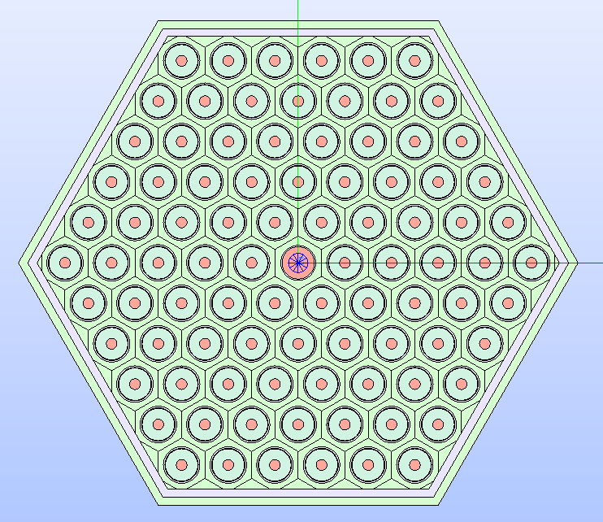

   The fuel assembly's technological geometry resulting by framing the lattice
   into a box cell. Regions are displayed according to the
   :py:attr:`MATERIAL<glow.support.types.PropertyType.MATERIAL>` colour map.

The second step in deriving the colorset layout is building the control rod
assembly. Its layout is characterised by control rod pins, modelled as circles,
placed within a central circular area.
A :py:class:`HexCell<glow.geometry_layouts.cells.HexCell>` object is adopted to
replicate the layout of the control rod assembly.
:py:class:`Region<glow.geometry_layouts.layouts.Region>` objects are created to
replicate the box layers (using hexagonal shapes), the cell-centred circular
regions, as well as the layout of the control rods (made by overlapping circular
regions).

.. code-block:: python

    # -------------------------------------------------------------------------- #
    # CONTROL ROD ASSEMBLY CONSTRUCTION                                          #
    # -------------------------------------------------------------------------- #
    # Data
    pitch = fuel_assembly.dimensions[1] * 2
    edge_bypass = (pitch) / math.sqrt(3)
    edge_ext_wrap_o = (pitch - 0.4) / math.sqrt(3)
    edge_ext_wrap_i = (pitch - 0.6) / math.sqrt(3)
    r_cr_circles_i = 3.2
    r_cr_circles_o = 5.2
    cr_pin_radii = [0.68, 0.7, 0.78]
    cr_wrapper_radii = [7, 7.25]
    int_shaft_ir = 1.4
    int_shaft_or = 1.7

    # Build the control rod assembly as a hexagonal cell
    cr_assembly = HexCell(
        side=edge_bypass,
        name= "Control Rod Assembly",
        base_props={PropertyType.MATERIAL: "COOLANT"}
    )
    # Add the box layers
    cr_assembly.add(
        Region(
            Hexagon(edge_length=edge_ext_wrap_o),
            properties={PropertyType.MATERIAL: "CR_CLADDING"}
        )
    )
    cr_assembly.add(
        Region(
            Hexagon(edge_length=edge_ext_wrap_i),
            properties={PropertyType.MATERIAL: "CR_MIX"}
        )
    )

    # Add the circles representing the different zones of the wrapper
    add_circular_regions(
        cr_assembly, cr_wrapper_radii, ["COOLANT", "CR_CLADDING"]
    )

To build and properly position the control rod pins, the ``create_vertices_list``
function is included in the script: it produces a list with a given number of
vertex objects laying on the same circumference with the given radius.
For each calculated vertex, the three :py:class:`Region<glow.geometry_layouts.layouts.Region>`
objects that characterise the control rod layout are built and added to the
assembly. To reduce the tree complexity, the same layer index is indicated when
calling the :py:meth:`add()<glow.geometry_layouts.fillable_layouts.Fillable.add>`
method. If not provided, each regions would have been added to a new layer.

.. code-block:: python

    def create_vertices_list(circle_radius: float, n_vertices: int) -> List[Any]:
        """
        Function that creates a list of vertex objects laying on the same
        circumference with the given radius. The number of vertices is provided
        as input.

        Parameters
        ----------
        circle_radius : float
            The radius of the circle on whose circumference the vertices are
            placed.
        n_vertices : int
            The number of vertices to build.

        Returns
        -------
        List[Any]
            The list of vertex objects laying on the same circumference.
        """
        # Build the circle
        circle = Circle(
            radius=circle_radius, name=f"Circle with radius {circle_radius}")
        vertices = []
        # Build the vertices on the circle's circumference
        for n in range(n_vertices):
            vertex = make_vertex_on_curve(circle.borders[0], n/n_vertices)
            vertices.append(vertex)
        return vertices

    # Build the vertices at which the control rod regions are placed
    cr_vertices_i = create_vertices_list(r_cr_circles_i, 6)
    cr_vertices_o = create_vertices_list(r_cr_circles_o, 12)
    # Build the circular control rod regions placed along two circumferences by
    # specifying the same layer index (the last one) to reduce tree complexity
    for v in cr_vertices_i + cr_vertices_o:
        cr_assembly.add(
            Region(
                Circle(radius=cr_pin_radii[2]),
                properties={PropertyType.MATERIAL: "CR_CLADDING2"}
            ),
            get_point_coordinates(v),
            len(cr_assembly.layers)
        )
        cr_assembly.add(
            Region(
                Circle(radius=cr_pin_radii[1]),
                properties={PropertyType.MATERIAL: "GAP"}
            ),
            get_point_coordinates(v),
            len(cr_assembly.layers)
        )
        cr_assembly.add(
            Region(
                Circle(radius=cr_pin_radii[0]),
                properties={PropertyType.MATERIAL: "ABSORBER"}
            ),
            get_point_coordinates(v),
            len(cr_assembly.layers)
        )

Lastly, the layout of the shaft is built; this is represented by two overlapping
circular regions added with the provided ``add_circular_regions`` function.
The resulting layout is shown in :numref:`cr-assembly`.

.. code-block:: python

    # Build the central shaft as made by two overlapping circular regions
    add_circular_regions(
        cr_assembly, [int_shaft_ir, int_shaft_or], ["COOLANT", "CR_CLADDING"]
    )
    # Display the control rod assembly
    cr_assembly.show(PropertyType.MATERIAL)

.. _cr-assembly:
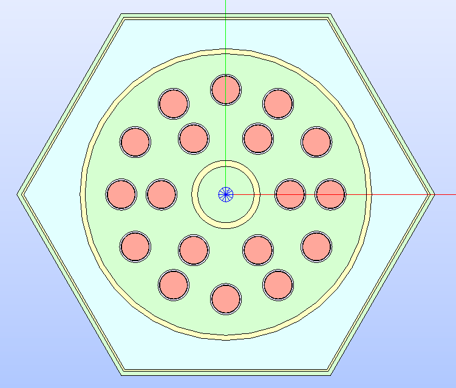

   The control rod assembly's technological geometry whose regions are
   displayed according to the :py:attr:`MATERIAL<glow.support.types.PropertyType.MATERIAL>`
   colour map.

To replicate the layout of the colorset, either a :py:class:`HexLattice<glow.geometry_layouts.lattices.HexLattice>`
or a :py:class:`Lattice<glow.geometry_layouts.lattices.Lattice>` instance could
be used. In this specific case, only two cells are needed and the :py:class:`Lattice<glow.geometry_layouts.lattices.Lattice>`
class is used. The fuel assembly cell is translated to the right of the control
rod assembly, which keeps its position in the XYZ origin.
Both :py:class:`HexCell<glow.geometry_layouts.cells.HexCell>` objects are
provided to the :py:class:`Lattice<glow.geometry_layouts.lattices.Lattice>`
class when it is instantiated.
A custom one twelfth symmetry is adopted by building the corresponding *GEOM*
face object and using it for extracting the layout to export. The latter
operation requires a *common* operation between the entire layout and the shape
of the symmetry. The corresponding :py:func:`make_common<glow.interface.geom_interface.make_common>`
function is used.
The resulting *GEOM compound* object of the colorset portion is added to the
SALOME study with the :py:func:`add_to_study<glow.interface.geom_interface.add_to_study>`
function.

.. code-block:: python

    # -------------------------------------------------------------------------- #
    # COLORSET CONSTRUCTION                                                      #
    # -------------------------------------------------------------------------- #
    # Translate the fuel assembly to the right of the control rod assembly
    fuel_assembly.translate(
        (3/2*cr_assembly.dimensions[0], cr_assembly.dimensions[1], 0)
    )

    # Build the colorset as a 'Lattice' with the two assembly cells
    colorset = Lattice([cr_assembly, fuel_assembly], (0.0, 0.0, 0.0), "Colorset")
    # Display the colorset
    colorset.show(PropertyType.MATERIAL)

    # -------------------------------------------------------------------------- #
    # COLORSET S30 SYMMETRY CONSTRUCTION                                         #
    # -------------------------------------------------------------------------- #
    # Extract the S30 symmetry portion out of the entire colorset
    edges = build_contiguous_edges(
        [
            make_vertex((0.0, 0.0, 0.0)),
            make_vertex((
                3/2*fuel_assembly.dimensions[0],
                fuel_assembly.dimensions[1],
                0.0
            )),
            make_vertex((2*fuel_assembly.dimensions[0], 0.0, 0.0))
        ]
    )
    cutting_face = make_face(edges)
    colorset_portion = make_common(colorset, cutting_face)
    add_to_study(colorset_portion, "Colorset - S30 Symmetry")

To enable the visualization of the regions of the colorset portion that belong
to the two assemblies at once with the same :py:attr:`MATERIAL<glow.support.types.PropertyType.MATERIAL>`
colour map, dedicated functions are called.
First, the :py:class:`Region<glow.geometry_layouts.layouts.Region>` objects that
correspond to the *GEOM* faces the built compound is made of are extracted with
the :py:func:`build_compound_regions()<glow.geometry_layouts.layouts.build_compound_regions>`
function. Then, a unique colour is associated to each region having the same
material name by means of the :py:func:`associate_colors_to_regions()<glow.geometry_layouts.layouts.associate_colors_to_regions>`
A loop through all the :py:class:`Region<glow.geometry_layouts.layouts.Region>`
objects is performed: the *GEOM* face each region corresponds to is coloured
with the :py:func:`set_color_face()<glow.interface.geom_interface.set_color_face>`
and added to the SALOME study with the :py:func:`add_to_study_in_father()<glow.interface.geom_interface.add_to_study_in_father>`
function so that each region is displayed as a children of the colorset compound.
The result is show in :numref:`colorset-regions`.

.. code-block:: python

    # -------------------------------------------------------------------------- #
    # COLORSET REGIONS VISUALIZATION                                             #
    # -------------------------------------------------------------------------- #
    # For each face in the colorset compound, recover the corresponding 'Region'
    # in the colorset 'Lattice' and build the corresponding region to display
    colorset_regions = build_compound_regions(colorset_portion, colorset.regions)
    # Associate a unique colour to each region according to the material name
    associate_colors_to_regions(PropertyType.MATERIAL, colorset_regions)
    # Display the regions of the colorset portion with the material colour map
    for region in colorset_regions:
        set_color_face(region, region.color)
        add_to_study_in_father(colorset_portion, region, region.name)

    update_salome_study()

.. _colorset-regions:
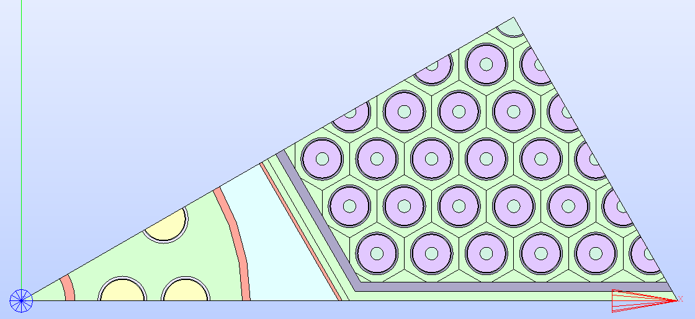

   The technological geometry of the colorset portion replicating the custom
   *S30* symmetry. Its regions are displayed according to the
   :py:attr:`MATERIAL<glow.support.types.PropertyType.MATERIAL>` colour map.

Lastly, the surface geometry representation of the colorset portion is
exported to an output TDT file using the :py:func:`export_layout_to_tdt()<glow.main.export_layout_to_tdt>`
function by providing the *GEOM* compound object of the colorset portion
directly.
The :py:class:`TdTSetup<glow.main.TdTSetup>` instance is configured so that
the *SALT* module of *DRAGON5* considers the exported layout to be one twelfth
of the full layout to which isotropic tracking (*TISO*) must be applied.

.. code-block:: python

    # -------------------------------------------------------------------------- #
    # COLORSET S30 PORTION TDT EXPORT                                            #
    # -------------------------------------------------------------------------- #
    # Generate the TDT file from the colorset portion using a specific typgeo and
    # symmetry type
    export_layout_to_tdt(
        colorset,
        "colorset_s30",
        tdt_setup=TdtSetup(
            type_geo=LayoutGeometryType.SYMMETRIES_TWO,
            symmetry_type=SymmetryType.TWELFTH
        ),
        compound_to_export=colorset_portion
    )
