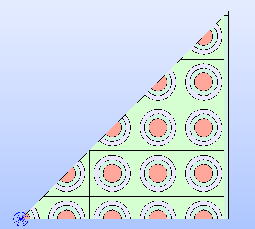

.. _tutorials:

=========
Tutorials
=========

To fully exploit the functionalities offered by |TOOL|, several examples are
provided. They can be found in the ``tutorials`` folder. In the following,
they are presented and detailed showing for each the resulting geometry layout.

Hexagonal Cell
--------------

The use case ``hexagonal_cell.py`` shows the steps required to declare a single
hexagonal cell and customize its geometry layout.

The goal is to instantiate a hexagonal cell whose edge is ``1.0`` long, having
three circles to delimit the different regions where each one is attributed to
a specific material.
The cell's technological geometry is declared as follows:

.. code-block:: python

  # Build the cell's geometry layout by adding three circular regions
  cell = HexCell(name="Hexagonal Cell")
  radii = [0.25, 0.4, 0.6]
  for radius in radii:
        cell.add_circle(radius)
  # Show the cell's technological geometry in the SALOME 3D viewer
  cell.show()

By calling the method :py:meth:`show()<glow.geometry_layouts.cells.Cell.show>`,
the cell's technological geometry is shown in the *SALOME* viewer (see
:numref:`cell-tech`).

.. _cell-tech:

   Hexagonal cell's technological geometry built by adding three circular
   regions.

Materials can be assigned to the four regions of the cell by setting the
:py:attr:`MATERIAL<glow.support.types.PropertyType.MATERIAL>` type of property,
using the method :py:meth:`set_properties()<glow.geometry_layouts.cells.Cell.set_properties>`
by keeping in mind to provide the names of the materials in order from the region
closest to the cell's centre to the farthest one.
Regions can now be shown with the :py:attr:`MATERIAL<glow.support.types.PropertyType.MATERIAL>`
colorset by specifying it in the arguments of the method :py:meth:`show()<glow.geometry_layouts.cells.Cell.show>`
(see :numref:`cell-colorset`).

.. code-block:: python

  # Assign the materials to each zone in the cell
  cell.set_properties(
      {PropertyType.MATERIAL: ["MAT_1", "MAT_2", "MAT_3", "MAT_4"]}
  )
  # Show the regions by applying a colorset
  cell.show(PropertyType.MATERIAL)

.. _cell-colorset:

   Hexagonal cell's technological geometry shown by applying a colorset that
   highlights the type of property :py:attr:`MATERIAL<glow.support.types.PropertyType.MATERIAL>`
   applied to the different regions.

Having a refined geometry layout can provide better tracking results; hence, a
sectorization can be applied with the method :py:meth:`sectorize()<glow.geometry_layouts.cells.Cell.sectorize>`.
It requires two lists, the number of sectors to subdivide each region into and
the angle the sectorization starts from.
The refined geometry can be shown even with the :py:attr:`MATERIAL<glow.support.types.PropertyType.MATERIAL>`
colorset by specifying it among the arguments of the method :py:meth:`show()<glow.geometry_layouts.cells.Cell.show>`
together with the :py:attr:`SECTORIZED<glow.support.types.GeometryType.SECTORIZED>`
type of geometry (see :numref:`cell-sect`).

.. code-block:: python

  # Build the cell's sectorized geometry
  cell.sectorize([1, 1, 6, 6], [0]*4)
  # Show the sectorized cell with regions colored according to the 'MATERIAL'
  # property
  cell.show(PropertyType.MATERIAL, GeometryType.SECTORIZED)

.. _cell-sect:
.. figure:: images/cell_sect_col.png
   :alt: Hexagonal cell's sectorized geometry with MATERIAL colorset
   :width: 400px
   :align: center

   Hexagonal cell's sectorized geometry shown by applying a colorset that
   highlights the type of property :py:attr:`MATERIAL<glow.support.types.PropertyType.MATERIAL>`
   applied to the different regions resulting from the sectorization.

Cartesian Cell With Custom Geometry Layout
------------------------------------------

The use case ``cartesian_cell.py`` shows the steps required to declare a single
rectangular cell and customize its geometry layout by means of the functions
of the module :mod:`glow.interface.geom_interface` that wrap the ones of the
*GEOM* module of *SALOME*.

The goal is to instantiate a cartesian cell with a square shape whose edge is
``1.0`` long. The cell is subdivided into four regions by means of three circles
to delimit the different regions, each attributed to a specific material.
The cell's technological geometry definition follows the same instructions
shown in the previous case. In addition, the type of property
:py:attr:`MATERIAL<glow.support.types.PropertyType.MATERIAL>` is assigned to
the different regions of the cartesian cell.

.. code-block:: python

  # Build the cell's geometry layout by adding three circular regions
  cell = RectCell(name="Cartesian cell")
  radii = [0.2, 0.3, 0.4]
  for radius in radii:
        cell.add_circle(radius)
  # Assign the materials to each zone in the cell
  cell.set_properties(
      {PropertyType.MATERIAL: ["MAT_1", "MAT_2", "MAT_3", "MAT_4"]}
  )

To further refine the geometry layout, a sectorization can be applied with the method :py:meth:`sectorize()<glow.geometry_layouts.cells.Cell.sectorize>`.
In addition to the two lists indicating the number of sectors and the angle the
sectorization starts from, a cartesian cell can also receive the boolean flag
``windmill``. This option generates a sectorized geometry where lines are drawn
between two successive intersection points between the lines of the sectors and
the borders of the cell (see :numref:`cell-windmill`).

.. code-block:: python

  # Build the cell's sectorized geometry with 'windimill' option enabled
  cell.sectorize([1, 1, 4, 8], [0, 0, 0, 22.5], windmill=True)
  # Show the sectorized cell with regions colored according to the 'MATERIAL'
  # property
  cell.show(PropertyType.MATERIAL, GeometryType.SECTORIZED)

.. _cell-windmill:
.. figure:: images/cell_windmill.png
   :alt: Cartesian cell's sectorized geometry with MATERIAL colorset
   :width: 400px
   :align: center

   Cartesian cell's sectorized geometry with `windmill` sectorization enabled.
   It is shown by applying a colorset that highlights the type of property
   :py:attr:`MATERIAL<glow.support.types.PropertyType.MATERIAL>`
   applied to the different regions resulting from the sectorization.

The methods offered by the subclasses of :py:class:`Cell<glow.geometry_layouts.cells.Cell>`
for setting up the technological geometry cover the addition and removal of
circular regions only; the sectorization subdivides the technological geometry
into sectors by drawing lines.
When a specific customization of the geometry is needed, users can make full use
of the functions in the :mod:`glow.interface.geom_interface` module to build
the layout of need and then update the cell's one with the methods
:py:meth:`update_geometry()<glow.geometry_layouts.cells.Cell.update_geometry>`
and :py:meth:`update_geometry_from_face()<glow.geometry_layouts.cells.Cell.update_geometry_from_face>`.
These functions in the :mod:`glow.interface.geom_interface` module wrap the
corresponding ones of the *GEOM* module of *SALOME*.
Here, a customization of the cell is provided by updating the sectorized geometry
with one costituted by more circles between the regions of the technological
geometry. Users should note that the previously set sectorization geometry is
substituted by the new one. The result of the following code is shown in
:numref:`cell-update`.

.. code-block:: python

  # Setup the XYZ coordinates of the centres of the circles
  centres = [(0, 0.1, 0), (0, -0.1, 0), (0.1, 0, 0), (-0.1, 0, 0)]
  # Build the corresponding 'Circle' objects, all with the same radius
  circles = [Circle(centre, radius=0.05) for centre in centres]
  # Build circles positioned in the cell centre
  center_circles = [Circle(radius=r) for r in [0.32, 0.34, 0.36, 0.38]]
  # Update the list of 'Circle' objects
  circles += center_circles

  # Partition the original cell's technological geometry with all the circles
  updated_face = make_partition(
      [cell.face], [c.face for c in circles], ShapeType.FACE)
  # Update the cell's sectorized geometry with the just built shape
  cell.update_geometry_from_face(GeometryType.SECTORIZED, updated_face)
  # Show the result in the 3D viewer
  cell.show(PropertyType.MATERIAL, GeometryType.SECTORIZED)

.. _cell-update:

   Cartesian cell's sectorized geometry after updating it by adding several
   circles. It is shown by applying a colorset that highlights the type of
   property :py:attr:`MATERIAL<glow.support.types.PropertyType.MATERIAL>`
   applied to the different regions resulting from the updated sectorized
   geometry.

Cartesian Assembly With Symmetry
--------------------------------

The use case ``cartesian_assembly.py`` shows the steps required to declare an
assembly made by several rings of the same cartesian cell.
This type of geometry layout can be tracked by the *SALT* module of *DRAGON5*
using an eighth symmetry as this is representative enough for the entire
layout of the assembly.

The first step for assembling this use case geometry is to instantiate the
cartesian cell (i.e. object of the class
:py:class:`RectCell<glow.geometry_layouts.cells.RectCell>`) the lattice is made
by.
The instructions that follow build a cartesian cell with a square shape whose
edge is ``1.0`` long; the cell is subdivided into four regions by means of
three circles and the type of property
:py:attr:`MATERIAL<glow.support.types.PropertyType.MATERIAL>` is assigned to
each. In addition, the regions are sectorized with the `windmill` option
enabled.

.. code-block:: python

  # Build the cell's geometry layout by adding three circular regions
  cell = RectCell(name="Cartesian cell")
  radii = [0.2, 0.3, 0.4]
  for radius in radii:
        cell.add_circle(radius)
  # Assign the materials to each zone in the cell
  cell.set_properties(
      {PropertyType.MATERIAL: ["MAT_1", "MAT_2", "MAT_3", "MAT_4"]}
  )
  # Apply the cell's sectorization
  cell.sectorize([1, 1, 4, 8], [0, 0, 0, 22.5], windmill=True)

The successive step is to declare the instance of the class
:py:class:`Lattice<glow.geometry_layouts.lattices.Lattice>` and add the cells
it is made by.
The following code shows that a single cell is provided when instantiating the
lattice; this cell is placed at the centre of the lattice as both the cell and
the lattice share the same coordinates of their centres.
To add several rings of the same cell, the method
:py:meth:`add_rings_of_cells()<glow.geometry_layouts.lattices.Lattice.add_rings_of_cells>`
is used: the instance of the :py:class:`RectCell<glow.geometry_layouts.cells.RectCell>`
class, previously declared, is provided together with the number of rings to
add. The lattice's technological geometry resulting from assembling all the
rings of cells is shown in :numref:`lattice-tech`.

.. code-block:: python

  # Build the lattice with several rings of the same cartesian cell
  lattice = Lattice([cell], 'Cartesian Lattice')
  lattice.add_rings_of_cells(cell, 4)
  lattice.show(PropertyType.MATERIAL)

.. _lattice-tech:

   Cartesian lattice's technological geometry resulting by adding several
   rings of cells. It is shown by applying a colorset that highlights the type
   of property :py:attr:`MATERIAL<glow.support.types.PropertyType.MATERIAL>`
   applied to the different regions of its cells.

An assembly requires the lattice to be framed into a box. This can be performed
in different ways in |TOOL|, either by calling the method
:py:meth:`build_lattice_box()<glow.geometry_layouts.lattices.Lattice.build_lattice_box>`
that automatically builds a rectangular box with layers of the indicated
thicknesses or by instantiating a :py:class:`RectCell<glow.geometry_layouts.cells.RectCell>`
object and assigning it to the
:py:attr:`lattice_box<glow.geometry_layouts.lattices.Lattice.lattice_box>`
property.
In the following, the second option is shown; the cell is build from the XY
dimensions of the lattice and the thickness of the layers so that the box
cuts the outmost ring of cells. In addition, the box is subdivided by means
of squares placed at the corners of the box, having the length of their edges
equal to the thickness of the box layer.
The lattice's technological geometry resulting from assembling the box with the
cells is shown in :numref:`lattice-boxed`.

.. code-block:: python

  # Build the cell representing the lattice's box so that it sligthly cuts
  # the outmost ring of cells; the box is subdivided by means of squares at
  # its corners. The dimensions of the lattice are extracted to get the box
  # dimensions.
  x_min, x_max, y_min, y_max = get_bounding_box(lattice.lattice_cmpd)
  thickness = 0.1
  box = RectCell(
      height_x_width=((y_max-y_min) + thickness, (x_max-x_min) + thickness)
  )
  box.set_properties({PropertyType.MATERIAL: ["MAT_2"]})
  # Build the characteristic shapes that subdivide the box
  layer_1 = Rectangle(
      height=(y_max-y_min) - thickness,
      width=(x_max-x_min) - thickness
  )
  corners = [
      Rectangle((x_max, y_max, 0.0), thickness, thickness),
      Rectangle((x_max, y_min, 0.0), thickness, thickness),
      Rectangle((x_min, y_min, 0.0), thickness, thickness),
      Rectangle((x_min, y_max, 0.0), thickness, thickness),
  ]
  # Assemble all the geometric shapes together
  box_face = make_partition(
      [box.face],
      [layer.face for layer in [layer_1] + corners],
      ShapeType.COMPOUND
  )
  # Update the box cell's technological geometry with the assembled one
  box.update_geometry_from_face(GeometryType.TECHNOLOGICAL, box_face)

  # Assemble the box's cell with the whole lattice and show the result in the
  # SALOME 3D viewer
  lattice.lattice_box = box
  lattice.show(PropertyType.MATERIAL)

.. _lattice-boxed:
.. figure:: images/cartesian_lattice_boxed.png
   :alt: Cartesian lattice's technological geometry framed in a box
   :width: 400px
   :align: center

   Cartesian lattice's technological geometry resulting by framing the cells
   in a box that sligthly cuts the outmost ring of cells.

A symmetry can be applied to the lattice's geometry layout. For the specific
layout of this use case, the :py:attr:`EIGHTH<glow.support.types.SymmetryType.EIGHTH>`
type of symmetry can be used in tracking calculations as representative of the
whole geometry.
The result of applying the above mentioned type of symmetry is shown in
:numref:`lattice-eighth`.

.. code-block:: python

  # Apply the eighth symmetry type to the cartesian lattice
  lattice.apply_symmetry(SymmetryType.EIGHTH)
  # Show the resulting layout with the 'MATERIAL' colorset
  lattice.show(PropertyType.MATERIAL)

.. _lattice-eighth:

   Cartesian lattice's technological geometry resulting by framing the cells
   in a box and applying the :py:attr:`EIGHTH<glow.support.types.SymmetryType.EIGHTH>`
   type of symmetry.

The just built geometry layout of the assembly can be exported to the output
TDT file by calling the function :py:func:`analyse_and_generate_tdt<glow.main.analyse_and_generate_tdt>`.
It is possible to indicate which type of geometry of the cells to use in the
analysis that |TOOL| performs to generate the output TDT file. In the following,
the instance of the dataclass :py:class:`TdtSetup<glow.main.TdtSetup>` is provided
specifying the :py:attr:`SECTORIZED<glow.support.types.GeometryType.SECTORIZED>`
type of geometry. The resulting geometry upon which the *SALT* module of *DRAGON5*
will perform the tracking calculations is shown in :numref:`lattice-g2s`.

.. code-block:: python

  # Perform the geometry analysis and export the TDT file of the surface
  # geometry
  analyse_and_generate_tdt(
      lattice, "cartesian_lattice", TdtSetup(GeometryType.SECTORIZED))

.. _lattice-g2s:
.. figure:: images/cartesian_lattice_g2s.png
   :alt: Cartesian lattice's geometry used for tracking
   :width: 400px
   :align: center

   Cartesian lattice's geometry layout that the *SALT* module of *DRAGON5*
   uses to perform the tracking analysis.

Hexagonal Assembly With Different Cells
---------------------------------------

The use case ``hexagonal_assembly.py`` shows the steps required to declare an
assembly made by several rings of the same hexagonal cell.
In addition, a hexagonal cell having different dimension, layout and materials
combination is positioned in different XYZ coordinates in the lattice.

The first step for assembling the use case geometry is to instantiate the
hexagonal cell (i.e. object of the class
:py:class:`HexCell<glow.geometry_layouts.cells.HexCell>`) the lattice is made
by.
The instructions that follow build the two hexagonal cells that characterise
the lattice, whose edges are ``1.0`` and ``2.0`` long respectively.
The former cell, which constitutes the main pattern of the geometry layout,
is subdivided into five regions by means of four circles; the latter has a
different layout characterized by two circular regions.
In addition, the first cell is rotated by 90° so that the final assembly is
enclosed in a X-oriented hexagonal box, as requested by the *SALT* module of
*DRAGON5*.
The type of property :py:attr:`MATERIAL<glow.support.types.PropertyType.MATERIAL>`
is assigned to the regions of each cell.

.. code-block:: python

  # Build the hexagonal cell that constitutes the lattice. It is rotated
  # by 90° as needed for tracking
  cell_1 = HexCell(name="Cell 1")
  cell_1.rotate(90)
  radii = [0.1, 0.6, 0.625, 0.70]
  for radius in radii:
      cell_1.add_circle(radius)
  cell_1.set_properties(
      {PropertyType.MATERIAL: [
          "GAP", "FUEL", "GAP", "CLADDING", "COOLANT"]}
  )
  # Build the second hexagonal cell
  cell_2 = HexCell(edge_length=2.0, name="Cell 2")
  radii = [1.0, 1.25]
  for radius in radii:
      cell_2.add_circle(radius)
  cell_2.set_properties(
      {PropertyType.MATERIAL: ['COOLANT', 'CLADDING', 'COOLANT']}
  )

The successive step is to declare the instance of the class
:py:class:`Lattice<glow.geometry_layouts.lattices.Lattice>` and add the cells
it is made by.
The following code shows that a single cell (the one with smaller size) is
provided when instantiating the lattice; this cell is placed at the centre of
the lattice as they both have the same coordinates of the centre.
Several rings of the same cell are then added with the method
:py:meth:`add_rings_of_cells()<glow.geometry_layouts.lattices.Lattice.add_rings_of_cells>`:
the instance of the :py:class:`HexCell<glow.geometry_layouts.cells.HexCell>`
class, previously declared, is provided together with the number of rings to
add.
To complete the lattice's geometry layout, the cell with greater size is added
at specific coordinates using the method
:py:meth:`add_cell()<glow.geometry_layouts.lattices.Lattice.add_cell>`.
The resulting geometry layout (see :numref:`hex-lattice-overlap-cells`) shows
that cells of greater size overlap the others, as they have been placed into a
higher layer than the smaller cells. As a consequence, the layout of the
overlapped cells appears cut by the layer above.

.. code-block:: python

  # Build the lattice with several rings of the same cartesian cell
  lattice = Lattice([cell_1])
  lattice.add_rings_of_cells(cell_1, 6)
  # XY coordinates of the centres of the cells with greater size
  x = 4.330127
  y = 4.5
  lattice.add_cell(cell_2, ())
  lattice.add_cell(cell_2, (x, y, 0.0))
  lattice.add_cell(cell_2, (-x, y, 0.0))
  lattice.add_cell(cell_2, (x, -y, 0.0))
  lattice.add_cell(cell_2, (-x, -y, 0.0))
  # Show the lattice's technological geometry with the 'MATERIAL' colorset
  lattice.show(PropertyType.MATERIAL)

.. _hex-lattice-overlap-cells:
.. figure:: images/hex_lattice_overlap.png
   :alt: Hexagonal lattice's technological geometry with MATERIAL colorset
   :width: 400px
   :align: center

   Hexagonal lattice's technological geometry resulting by adding several
   rings of cells with smaller size and cells with a greater size at
   different coordinates. The resulting geometry layout shows that the cells of
   the higher layer cut those of the layer below. The colorset that highlights
   the type of property :py:attr:`MATERIAL<glow.support.types.PropertyType.MATERIAL>`
   is applied to the different regions of the lattice's cells.

The current lattice's geometry layout shown in :numref:`hex-lattice-overlap-cells`
presents a situation where the physical part of the smaller cells is cut.
Since this scenario cannot happen in real-life situations, these cells need to
be restored by removing any circular region associated with physical elements.
This is done by using in conjunction the function
:py:func:`get_changed_cells()<glow.geometry_layouts.lattices.get_changed_cells>`,
to retrieve the cut cells, and the method
:py:meth:`restore_cells()<glow.geometry_layouts.lattices.Lattice.restore_cells>`,
to restore the geometry layout and assign a value for the provided types of
property. :numref:`hex-lattice-restored` shows the result of restoring the
cut cells.

.. code-block:: python

  # Get the cells whose geometry layout has been cut and restore them by
  # assigning a specific property type
  lattice.restore_cells(
      get_changed_cells(lattice),
      {PropertyType.MATERIAL: 'COOLANT'}
  )

.. _hex-lattice-restored:
.. figure:: images/hex_lattice_restore.png
   :alt: Hexagonal lattice's technological geometry after restoring the cut cells
   :width: 400px
   :align: center

   Hexagonal lattice's technological geometry resulting by restoring the geometry
   layout of those cells that have been cut. The colorset that highlights
   the type of property :py:attr:`MATERIAL<glow.support.types.PropertyType.MATERIAL>`
   is applied to the different regions of the lattice's cells.

An assembly requires the lattice to be framed into a box. In this use case
the method :py:meth:`build_lattice_box()<glow.geometry_layouts.lattices.Lattice.build_lattice_box>`
is used: it automatically builds an X-oriented hexagonal box with layers of
the indicated thicknesses.
The the type of property :py:attr:`MATERIAL<glow.support.types.PropertyType.MATERIAL>`
is assigned to the different regions of the hexagonal box by means of the
method :py:meth:`set_lattice_box_properties()<glow.geometry_layouts.lattices.Lattice.set_lattice_box_properties>`;
the values are assigned according to the distance of the regions from the
centre of the box.
The resulting assembly made by assembling the lattice's cells with the box is
show in :numref:`hex-lattice-boxed` .

.. code-block:: python

  # Add a container for the assembly and assign properties
  lattice.build_lattice_box([0.15, 0.15])
  lattice.set_lattice_box_properties(
      {PropertyType.MATERIAL: ['COOLANT', 'CLADDING', 'COOLANT']})
  # Show the lattice's technological geometry
  lattice.show(PropertyType.MATERIAL)

.. _hex-lattice-boxed:
.. figure:: images/hex_lattice_boxed.png
   :alt: Hexagonal lattice framed in a box shown with the MATERIAL colorset
   :width: 400px
   :align: center

   Hexagonal lattice's technological geometry resulting by framing the cells
   into a box.

If the just built geometry layout of the assembly is exported to the output
TDT file by calling the function :py:func:`analyse_and_generate_tdt<glow.main.analyse_and_generate_tdt>`,
the resulting surface representation will be characterised by ``typgeo=0``,
which implies a uniform tracking type (i.e. *TISO*) in the ``ALBE 1.0``
condition for its boundaries.
This requirement can be changed by assigning a lattice type of geometry that
results in a :py:attr:`TRANSLATION<glow.support.types.BoundaryType.TRANSLATION>`
BC type applied to the lattice's boundaries. To do so, the lattice's property
:py:attr:`type_geo<glow.geometry_layouts.lattices.Lattice.type_geo>` must be
set to :py:attr:`HEXAGON_TRAN<glow.support.types.LatticeGeometryType.HEXAGON_TRAN>`.
This setting generates a surface representation that must be tracked by a cyclic
method (i.e. *TSPC*).
After changing the lattice type of geometry, the output TDT file can be
generated.

.. code-block:: python

  # Change the lattice type of geometry to use 'TRANSLATION' BCs and cycling
  # tracking type
  lattice.type_geo = LatticeGeometryType.HEXAGON_TRAN
  # Perform the geometry analysis and export the TDT file of the surface
  # geometry
  analyse_and_generate_tdt(lattice, 'hexagonal_assembly')
